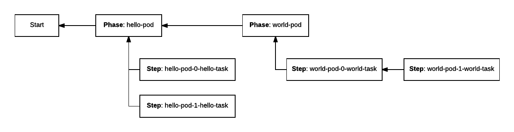

<!-- Generate TOC. Both of the following lines are required: https://kramdown.gettalong.org/converter/html.html#toc -->
* LOOKING FOR THE DEVELOPER GUIDE? [GO HERE](https://mesosphere.github.io/dcos-commons/developer-guide.html). (THIS LINE IS A STUB FOR RENDERING THE TOC AUTOMATICALLY)
{:toc}

<!--  disable mustache templating in this file: retain templated examples as-is -->

This developer guide explains how to create a stateful DC/OS service using the DC/OS SDK. The DC/OS SDK is a collection of tools, libraries, and documentation that facilitates the creation of DC/OS services. For information about running DC/OS SDK services in an operational context, look at the [Operations Guide](operations-guide.html).

# DC/OS Component Overview

The four major components are Mesos, Marathon, Universe, and ZooKeeper. These components have different responsibilities and must cooperate. To develop a service, you should have a high level understanding of these components and their responsibilities.

## Mesos

DC/OS is modeled on an operating system with Mesos as its kernel. Mesos provides an abstraction to enable consumption of the resources a datacenter provides.  In a typical case, these resources are CPU, memory, disk space, and ports. Tasks are launched in the datacenter and consume particular subsets of resources. The programs that can receive resource offers and launch tasks that consume are called **frameworks**. The component of a framework that receives offers and launches tasks is called the **scheduler**.

Mesos determines which frameworks should be offered resources at any given time. It sends update events regarding the status of those tasks. These events include *staging, running, failed*,* *etc.  To learn more about Mesos, consult the  "[Mesos Advanced Course](https://open.mesosphere.com/advanced-course/)".

## Marathon

The scheduler is the  entity that can launch tasks on DC/OS.  The role of Marathon is to launch Mesos tasks and to restart them if they crash.  In the context of the SDK, the tasks that Marathon launches are schedulers.  These schedulers in turn launch the tasks necessary for the operation of a DC/OS service. Therefore, if a scheduler crashes, it is Marathon’s responsibility to restart the scheduler.

If we consider Mesos to be DC/OS’ kernel, then Marathon is its init system. It launches and keeps up the software that should be running on the operating system.

Marathon is itself a Mesos framework. Some of the tasks it launches are the schedulers written with the SDK described here. Application and pod definitions are declarative JSON representations of a task or tasks that Marathon should run. To learn more, consult the [Marathon documentation](https://mesosphere.github.io/marathon/).

## Universe

A package specification provides a uniform way to define Marathon applications.  Those packages are stored in the Universe so end-users can easily install these DC/OS services in their datacenters..

Every DC/OS service must provide a package definition in the format expected by the Universe. [Learn more about creating Universe packages](https://github.com/mesosphere/universe).

## ZooKeeper

Several DC/OS components, including Mesos and Marathon, require a persistent metadata store. ZooKeeper fulfills this role for those components as well as for services written using the SDK. As noted previously, any service written using the SDK is a Mesos scheduler. In order to accurately communicate with Mesos, every scheduler must keep a record of the state of its tasks. ZooKeeper provides persistent storage for this information.

Although all SDK services written today store metadata in ZooKeeper, this is an implementation detail. The [ConfigStore](https://github.com/mesosphere/dcos-commons/blob/master/sdk/scheduler/src/main/java/com/mesosphere/sdk/config/ConfigStore.java) and [StateStore](https://github.com/mesosphere/dcos-commons/blob/master/sdk/scheduler/src/main/java/com/mesosphere/sdk/state/StateStore.java) interfaces are generic and unopinionated about the backing persistent metadata store.

They store the desired configuration of a service and all relevant information regarding Mesos tasks, respectively, but the precise format or location of the underlying data may be customized.  For example, the data may be stored in ZooKeeper, but in a different format, or the data may be stored in a different persistent storage like etcd.  The defaults should be reasonable for most developers, however. Support for optional customization via drop-in replacement is a common pattern throughout the SDK.

# Pre-requisites

1. `dcos-commmons` checked out locally on your machine.

  ```bash
  $ git clone git@github.com:mesosphere/dcos-commons.git
  $ cd dcos-commons
  ```

1. Access to a DC/OS 1.8 (or newer) cluster.

1. The DC/OS CLI [installed](https://docs.mesosphere.com/latest/cli/install/) and [configured](https://docs.mesosphere.com/latest/cli/configure/) to point to your cluster.

1. [Required AWS credentials set in your environment](https://github.com/mesosphere/dcos-commons/blob/master/tools/README.md#environment-variables).

1. The [AWS CLI](https://aws.amazon.com/cli/) and [Go (1.8 or newer)](https://golang.org/dl/) installed.

# Getting Started


1. Create your framework.

   ```bash
   $ ./new-framework.sh frameworks/myframework
   $ cd frameworks/myframework
   ```

   `new-framework.sh` creates a skeleton framework.  You will extend
   this skeleton.

1. View `svc.yml`.

   Take a look at `src/main/dist/svc.yml`.  This is the YAML file that defines your framework.  You will be editing this file.

1. View `Main.java`.

   Take a look at `src/main/java/com/mesosphere/sdk/myframework/scheduler/Main.java`.  This is the main method for your scheduler, which will be run in DC/OS via Marathon.  It reads `svc.yml`, which defines its behavior.  If you need any advanced functionality not provided by YAML, such as complex deployment plans, you will write it here.

1. Build a [package](#packaging). You must run the build.sh that is within `frameworks/myframework` directory that was just generated.

   ```bash
   $ ./build.sh aws
   ```

   You will deploy your framework to DC/OS as a
   [package](#packaging).  `build.sh` creates this package and uploads it to an AWS S3 bucket that is used to make it available to a DC/OS cluster.

1. Install your package.

   `build.sh` prints instructions for installing the package that look something like this:

   ```bash
   $ dcos package repo remove myframework-aws
   $ dcos package repo add --index=0 myframework-aws https://mybucket.s3.amazonaws.com/stub-universe-myframework.zip
   $ dcos package install --yes myframework
   ```

   Navigate to the [DC/OS Services UI](https://docs.mesosphere.com/latest/gui/#services) to view the deployment.

1. Uninstall your package.

   ```
   $ dcos package uninstall myframework
   $ dcos node ssh --master-proxy --leader "docker run mesosphere/janitor /janitor.py -r myframework-role -p myframework-principal -z dcos-service-myframework"
   ```

   The second command above runs the **janitor** script.  The janitor
   script runs inside the DC/OS cluster, cleaning up ZooKeeper state
   and resource reservations made by a framework.  DC/OS will soon
   support uninstall hooks so this can happen automatically, but for
   now, you must manually run the janitor script as shown above.

# Introduction to DC/OS Service Definitions

At the highest level of abstraction, a DC/OS service breaks down into *which* tasks to launch and *how* to launch them. The [ServiceSpec](https://github.com/mesosphere/dcos-commons/blob/master/sdk/scheduler/src/main/java/com/mesosphere/sdk/specification/ServiceSpec.java) defines what a service is and [Plan](#plans)[s] define how to control it in deployment, update, and failure scenarios. The [ServiceSpec](https://github.com/mesosphere/dcos-commons/blob/master/sdk/scheduler/src/main/java/com/mesosphere/sdk/specification/ServiceSpec.java) and [Plan](#plans)[s] are [packaged](#packaging) so that the service can be deployed on a DC/OS cluster from Universe.

<a name="service-spec"></a>
## ServiceSpec

There are two ways to generate a valid `ServiceSpec`: creating a YAML file or writing Java code. Both produce a valid implementation of the Java `ServiceSpec` interface.  A `ServiceSpec` may be used to launch one or more instances of the same service within a DC/OS cluster.

For example, one could write a `ServiceSpec` that describes a DC/OS service that deploys a Kafka cluster. One could then install one or more instances of a Kafka cluster in a DC/OS cluster. A `ServiceSpec` is in this sense similar to a class definition, which may be used to create many objects that are instances of the class.

### Annotated Example of a `ServiceSpec`

This simple YAML definition of a DC/OS service that prints "hello world" to stdout in a container sandbox every 1000 seconds.

```yaml
name: "hello-world"
scheduler:
  principal: "hello-world-principal"
  user: {{SERVICE_USER}}
pods:
  hello-world-pod:
    count: 1
    tasks:
      hello-world-task:
        goal: RUNNING
        cmd: "echo hello world && sleep 1000"
        cpus: 0.1
        memory: 512
```

* **name**:  This is the name of an instance of a DC/OS service. No two instances of any service may have the same name in the same cluster.

* **scheduler**: The Scheduler manages the service and keeps it running. This section contains settings which apply to the Scheduler. The `scheduler` section may be omitted to use reasonable defaults for all of these settings.

    * **principal**: This is the DC/OS service account used when registering the framework. In secure Enterprise clusters, this account must have the necessary permission to perform the actions of a scheduler. This setting may be omitted in which case it defaults to `<svcname>-principal`.

    * **user** This is the account used when running the processes on the host.  The recommended default is `nobody`.

* **Pods**: A pod is simply a set of tasks.

    * **hello-world-pod**: This is the name of a type of a pod. You can choose any name for a pod type  In this example, we have one kind of pod defined and its name is `hello-world-pod`.

        * **count**: The number of instances of the pod.

        * **tasks**: The list of tasks in the pod.

        * **hello-world-task**: In this example, the single pod definition is composed of a single task. The name of this task is "hello-world-task".

* **goal**: Every task must have a goal state. There are three possible goal states: `RUNNING`, `FINISH` and `ONCE`. `RUNNING` indicates that a task should always be running, so if it exits, it should be restarted. `FINISH` indicates that if a task finishes successfully it does not need to be restarted unless its configuration is updated. `ONCE` indicates that if a task finishes successfully it does not need to be restarted for the duration of the pod's lifetime.

            * **cmd**: The command to run to start a task. Here, the task will print "hello world" to stdout and sleep for 1000 seconds. Because its goal state is `RUNNING`, it will be started again upon exit.

            * **cpus**: This entry defines how many CPUs will be allocated to the task’s container.  For discussion of how resources are isolated and allocate [see the Mesos documentation here](http://mesos.apache.org/documentation/latest/containerizer/).

            * **memory**: This entry defines how much memory will be allocated to the task’s container.

For a full listing of available fields and what they mean, see the [YAML Reference](reference/yaml-reference.html).

### Summary

A set of pods defines *what* your service is. Pods are composed of task definitions.

In the example, we have only defined types of pods and tasks. When the service is deployed and instantiated into instances of these types, we get a Mesos task like the following:

<table>
  <tr>
    <td>Task Name</td>
    <td>Task ID</td>
    <td>Task Status</td>
  </tr>
  <tr>
    <td>hello-world-pod-0-hello-world-task</td>
    <td>hello-world-pod-0-hello-world-task__c111c97e-7236-4fea-b06f-0216c93b853b</td>
    <td>TASK_RUNNING</td>
  </tr>
</table>


Since a single pod instance was requested via the *count* element, only a single task was launched. Its index (0) was injected into the task name and ID. If we had defined a count higher than one, more tasks with incremental indices would have been launched.

## Plans

In the simple example above, it is obvious *how* to deploy this service.  It consists of a single task that launches . For more complex services with multiple pods, the SDK allows the definition of *plans* to orchestrate the deployment of tasks. You can learn more about the full capabilities of plans [here](#plan-execution) and [here](#custom-plans-java).

### Default Deployment Plan

The example below defines a service with two types of pods, each of which deploys two instances.

```yaml
name: "hello-world"
pods:
  hello-pod:
    count: 2
    tasks:
      hello-task:
        goal: RUNNING
        cmd: "echo hello && sleep 1000"
        cpus: 0.1
        memory: 512
  world-pod:
    count: 2
    tasks:
      world-task:
        goal: RUNNING
        cmd: "echo world && sleep 1000"
        cpus: 0.1
        memory: 512
```

There are a number of possible deployment strategies: In parallel or serially, and with or without one pod type waiting for the other’s successful deployment before deploying.

By default, the SDK will deploy all instances of pods serially.  In the example above, the default deployment order would be:

1. `hello-pod-0-hello-task`
1. `hello-pod-1-hello-task`
1. `world-pod-0-world-task`
1. `world-pod-1-world-task`

Each pod’s task must reach its goal of `RUNNING` before the next pod is launched. This is the simplest and safest possible approach as a default deployment strategy.

However, this default deployment strategy does not provide the flexibility you need to write rich services. The SDK therefore also allows you to define *plans* that orchestrate task deployment.

In this section we focus on using plans to define the initial deployment of a service. However, you can also use plans to orchestrate configuration updates, software upgrades, and recovery from complex, service-specific failure scenarios.

As an example, let’s consider the scenario where we wish to deploy the hello-pods in parallel, wait for them to reach a `RUNNING` state and then deploy the world-pods serially.  We could amend our YAML file to look like the following:

```yaml
name: "hello-world"
pods:
  hello-pod:
    count: 2
    tasks:
      hello-task:
        goal: RUNNING
        cmd: "echo hello && sleep 1000"
        cpus: 0.1
        memory: 512
  world-pod:
    count: 2
    tasks:
      hello-task:
        goal: RUNNING
        cmd: "echo world && sleep 1000"
        cpus: 0.1
        memory: 512
plans:
  deploy:
    strategy: serial
    phases:
      hello-phase:
        strategy: parallel
        pod: hello-pod
      world-phase:
        strategy: serial
        pod: world-pod
```

A plan is a simple three layer hierarchical structure.  A plan is composed of phases, which in turn are composed of steps.  Each layer may define a strategy for how to deploy its constituent elements. The strategy at the highest layer defines how to deploy phases. Each phase’s strategy defines how to deploy steps. The default strategy if none is specified is serial.


A phase encapsulates a pod type and a step encapsulates an instance of a pod.  So in this case we have two phases: hello-phase and world-phase.  They are clearly associated with their particular pod definitions from the ServiceSpec. In the example above, we do not need to specifically define steps to accomplish our deployment strategy goal, so they are omitted.

The hello-phase of the example has two elements: a strategy and a pod.

```yaml
plans:
  deploy:
    strategy: serial
    phases:
      hello-phase:
        strategy: parallel
        pod: hello-pod
      world-phase:
        strategy: serial
        pod: world-pod
```

The pod parameter references the pod definition earlier in the `ServiceSpec`. The strategy declares how to deploy the instances of the pod. Here, they will be deployed in parallel. The world-phase section is identical, except that its elements will be deployed serially.

The strategy associated with the deployment plan as a whole is serial, so the phases should be deployed one at a time. This dependency graph illustrates the deployment.



The dependency of the `world-pod` phase on the `hello-pod` phase serializes those two phases as described at the top level strategy element. Since both `hello` steps depend on a the` hello-pod` phase, and not each other, they are executed in parallel. The second `world-pod` instance depends on the first, so they are launched serially.

### Custom Deployment Plan

More powerful custom plans can also be written. Consider the case in which a pod requires an initialization step to be run before the main task of a pod is run. One could define the tasks for such a pod as follows:

```yaml
name: "hello-world"
pods:
  hello:
    count: 2
    resource-sets:
      hello-resources:
        cpus: 1.0
        memory: 256
        volume:
          path: hello-data
          size: 5000
          type: ROOT
    tasks:
      init:
        goal: ONCE
        cmd: "./init"
        resource-set: hello-resources
      main:
        goal: RUNNING
        cmd: "./main"
        resource-set: hello-resources
```

By default, the plan generated from such a service definition would only deploy the `main` task because when the `init` task should be run is undefined.  In order to run the init task and then the main task for each instance of the `hello` pod one could write a plan as follows:

```yaml
pods:
  hello:
    [...]
    tasks:
      init:
        [...]
      main:
        [...]
plans:
  deploy:
    strategy: serial
    phases:
      hello-phase:
        strategy: serial
        pod: hello
        steps:
          - default: [[init], [main]]
```

This plan indicates that by default, every instance of the hello pod should have two steps generated: one representing the `init` task and another representing the `main` task. The ServiceSpec indicates that two `hello` pods should be launched so the following tasks would be launched by steps serially:

1. `hello-0-init`
1. `hello-0-main`
1. `hello-1-init`
1. `hello-1-main`

Consider the case where the init task should only occur once for the first pod, and all subsequent pods should just launch their `main` task. Such a plan could be written as follows:

```yaml
pods:
  hello:
    [...]
    tasks:
      init:
        [...]
      main:
        [...]
plans:
  deploy:
    strategy: serial
    phases:
      hello-phase:
        strategy: serial
        pod: hello
        steps:
          - 0: [[init], [main]]
          - default: [[main]]
```

This plan would result in steps generating the following tasks:

1. `hello-0-init`
1. `hello-0-main`
1. `hello-1-main`

#### Removal From Deployment Plans

If your custom deployment plan is later updated to no longer reference pods or tasks which are still listed in your pod spec, the affected tasks will be killed but their resources will not be returned to the cluster. **Note:** If you instead wish to kill tasks _and_ release their resources back to the cluster, you may do so through the [pod decommission](#pods) process.

For example, updating a `ServiceSpec` from:

```yaml
name: "hello-world"
pods:
  hello:
    [...]
  world:
    [...]
plans:
  deploy:
    strategy: serial
    phases:
      hello-phase:
        strategy: serial
        pod: hello
      world-phase:
        strategy: serial
        pod: world
```

to:

```yaml
name: "hello-world"
pods:
  hello:
    [...]
  world:
    [...]
plans:
  deploy:
    strategy: serial
    phases:
      hello-phase:
        strategy: serial
        pod: hello
```

would result in all tasks in the `world-<index>` pod instances being killed, but their resources would not be returned to the cluster. To unreserve resources associated with the `world` pod instances, a [decommission operation](#pods) would need to be performed.

This behavior can also function at per-task granularity when custom `steps` are being specified. For example, updating a `ServiceSpec` from:

```yaml
pods:
  hello:
    [...]
    tasks:
      monitor:
        [...]
      main:
        [...]
plans:
  deploy:
    strategy: serial
    phases:
      hello-phase:
        strategy: serial
        pod: hello
        steps:
          - default: [[monitor, main]]
```

to:

```yaml
pods:
  hello:
    [...]
    tasks:
      monitor:
        [...]
      main:
        [...]
plans:
  deploy:
    strategy: serial
    phases:
      hello-phase:
        strategy: serial
        pod: hello
        steps:
          - default: [[main]]
```

would result in all `hello-<index>-monitor` tasks being killed without their resources being returned to the cluster, while the `hello-<index>-main` tasks would continue running. To unreserve resources associated with the `monitor` tasks, a [decommission operation](#pods) would need to be performed.

### Custom Update Plans

When a configuration change is being rolled out, the Scheduler will by default use the current Deploy plan, whether that's a custom plan named `deploy` or the default deployment plan. Some services require additional logic when performing configuration or software updates, in which case a plan named `update` may be provided. The `update` plan, if defined, will be used instead of the `deploy` plan when rolling out a configuration change. It's otherwise functionally similar to the custom `deploy` logic described above.

### Custom Auxiliary Plans

Finally, you may define entirely custom plans which are meant to be invoked by operators. These may define the steps required to perform a backup or restore operation of the service. They may even take additional parameters as input. For example, here is an example plan which will back up a data store to S3:

```yaml
pods:
  node:
    [...]
    tasks:
      [...]
      backup-schema:
        [...]
      snapshot:
        [...]
      upload-s3:
        [...]
      cleanup-snapshot:
        [...]
plans:
  [...]
  backup-s3:
    strategy: serial
    phases:
      backup-schema:
        strategy: serial
        pod: node
        steps:
          - default: [[backup-schema]]
      create-snapshots:
        strategy: parallel
        pod: node
        steps:
          - default: [[snapshot]]
      upload-backups:
        strategy: serial
        pod: node
        steps:
          - default: [[upload-s3]]
      cleanup-snapshots:
        strategy: serial
        pod: node
        steps:
          - default: [[cleanup-snapshot]]
```

In this example, four Tasks were defined in the `node` pod to perform the four steps necessary to back up this service. These tasks were named `backup-schema`, `snapshot`, `upload-s3`, and `cleanup-snapshot`. These Tasks are then listed in the `backup-s3` Plan as Steps. Each of the Tasks has a shell script which performs the work, optionally using environment variables provided by the operator. The operator invokes the `backup-s3` plan and provides any such parameters via repeated `-p` arguments:

```
$ dcos myservice plan start backup-s3 \
    -p BACKUP_NAME=mybackup \
    -p BACKUP_TABLES=criticaldata \
    -p AWS_ACCESS_KEY_ID=$AWS_ACCESS_KEY_ID \
    -p AWS_SECRET_ACCESS_KEY=$AWS_SECRET_ACCESS_KEY \
    -p AWS_REGION=$AWS_REGION \
    -p S3_BUCKET_NAME=$S3_BUCKET_NAME
```

Any parameters passed via `-p` are automatically passed though to the invoked Tasks as environment variables. Service developers must separately document any such parameters so that users know what to provide.

## Packaging

A DC/OS service must provide a package definition in order to be installed on a DC/OS cluster. At a minimum, a package definition is composed of four files: `marathon.json.mustache`, `config.json`, `resource.json`, and `package.json`. [Examples of all these files](https://github.com/mesosphere/dcos-commons/tree/master/frameworks/helloworld/universe) are provided in the example helloworld DC/OS service.  A detailed explanation of the format and purpose of each of these files is [available here](https://github.com/mesosphere/universe#creating-a-package).

### Universe Package Files At-a-Glance

For a fully detailed explanation of service packaging [see here](https://dcos.io/docs/1.8/development/create-package/); below we provide a brief introduction to the required files.

* `marathon.json.mustache` - A mustache-templated file that provides a Marathon application definition.  Its mustache elements are rendered by the values present in the config.json and resource.json files.

* `resource.json` - A list of URIs of all downloaded elements. Any artifacts needed by your service _must_ be listed here, or else your service will fail to install to airgapped clusters. When an airgapped cluster installs your package, only the files listed here will be available. This list contains some items required in order for the service to run, such as `bootstrap.zip` (bootstrap utility described elsewhere in this guide) and `executor.zip` (custom executor for DC/OS 1.9 compatibility).

* `command.json` - This file contains elements specific to a CLI for your service if you want to provide one.

* `package.json` - This file contains metadata of interest to the Universe, including the minimum version of DC/OS on which the service may be deployed.

The SDK provides utilities for building a package definition and deploying it to a DC/OS cluster for development purposes.  An example build.sh script constructs a package and provides instructions for the deployment.  The helloworld framework’s build.sh script provides the following output:

```bash
$ ./build.sh aws
<snip>
Install your package using the following commands:
dcos package repo remove hello-world-aws
dcos package repo add --index=0 hello-world-aws https://infinity-artifacts.s3.amazonaws.com/autodelete7d/hello-world/20161212-160559-ATLFk70vPlo45X4a/stub-universe-hello-world.zip
dcos package install --yes hello-world
```

The build.sh script takes an optional argument of aws or local:

* `./build.sh aws`: The package definition and build artifacts are uploaded to an S3 bucket in AWS. If you would like to override the S3 bucket location where the packages are uploaded, please add S3_BUCKET environment variable with the bucket name. For example:

```bash
$ export S3_BUCKET=my_universe_s3_bucket
```

* `./build.sh local`: The package definition and build artifacts are served by a local HTTP server.

Executing the final command, `dcos package install --yes hello-world` deploys the service to a DC/OS cluster.

# Basic Operations

You can perform three fundamental operations on any instance of a DC/OS service: install, update, and uninstall.  With the exception of uninstall, they all follow a fundamental design principle.

All services written with the SDK determine what actions to take based on a target configuration they are trying to reach.  The `ServiceSpec` defines the target configuration. When installing for the first time, a service is going from nothing to the target configuration. When performing a configuration update, a service is going from the current configuration to the target configuration. A software update is identical to a configuration update except that that the software artifacts to be deployed are changed, not just the configuration. The path a service takes to a new target configuration is always defined by a plan.

The following events occur to select a target configuration and move a service from its current configuration to the target.

1. Define a target configuration
    a. Deploy a Marathon application definition for your service’s scheduler.
    b. The scheduler renders the `ServiceSpec` and Plan definitions in the service’s YAML definition.
1. Plan Execution
    a. The scheduler compares previous and current `ServiceSpec`s:
        i. Validate the `ServiceSpec`.
        ii. Determine scenario (install, update or no change).
    b. The plan is chosen and executed.

These steps are discussed in more detail below.

## Defining a Target Configuration

We previously described how a DC/OS service’s scheduler is a Marathon application.  Marathon applications define a particular declarative application definition, and DC/OS services constructed with the SDK define another, the `ServiceSpec`s and plans.

This nested structure of declarative interfaces requires two layers of template rendering. First, the Marathon application definition must be rendered at initial install time from the combination of the marathon.json.mustache, config.json, and resource.json files. Then, the service’s YAML template is rendered using the environment variables presented to the scheduler. Let’s walk through the [checked-in helloworld example](https://github.com/mesosphere/dcos-commons/tree/master/frameworks/helloworld).  Pay particular attention to the templated values surrounded in curly braces, as in `{{value}}`.

helloworld has a [marathon.json.mustache template](https://github.com/mesosphere/dcos-commons/blob/master/frameworks/helloworld/universe/marathon.json.mustache) which, in part, looks as follows:

```
{
    "env": {
        "FRAMEWORK_NAME": "{{service.name}}",
        "HELLO_COUNT": "{{hello.count}}",
        "HELLO_CPUS": "{{hello.cpus}}",
        "...": "..."
    },
    "uris": [
        "{{resource.assets.uris.scheduler-zip}}",
        "..."
    ],
    "portDefinitions": [
        {
            "port": 0,
            "protocol": "tcp",
            "name": "api",
            "labels": { "VIP_0": "/api.{{service.name}}:80" }
        }
    ],
    "...": "..."
}
```

The [config.json](https://github.com/mesosphere/dcos-commons/blob/master/frameworks/helloworld/universe/config.json) file is in part:

```
{
    "type":"object",
    "properties":{
        "service":{
            "type":"object",
            "description": "DC/OS service configuration properties",
            "properties":{
                "name" : {
                    "description":"The name of the service instance",
                    "type":"string",
                    "default":"hello-world"
                },
                "...": "..."
            }
        },
        "hello":{
            "type":"object",
            "description":"Hello Pod configuration properties",
            "properties":{
                "cpus":{
                    "description":"Hello Pod cpu requirements",
                    "type":"number",
                    "default":0.1
                },
                "count":{
                    "description":"Number of Hello Pods to run",
                    "type":"integer",
                    "default":1
                },
                "...": "..."
            }
        }
    }
}
```

The [resource.json](https://github.com/mesosphere/dcos-commons/blob/master/frameworks/helloworld/universe/resource.json) file is in part:

```
{
  "assets": {
    "uris": {
      "scheduler-zip": "{{artifact-dir}}/hello-world-scheduler.zip",
      "...": "..."
    }
  },
  "...": "..."
}
```

The `marathon.json.mustache` template pulls values from `config.json` and `resource.json` and creates an initial Marathon application definition. This application definition can be deployed on Marathon, which installs a DC/OS service’s scheduler. You can [override the initial config.json values when installing via the command line](https://docs.mesosphere.com/1.9/deploying-services/config-universe-service/).

**Important:** The environment variable field of the Marathon application definition defines values specific to the helloworld service.

The following is the typical flow of configuration values as represented by environment variables:


Once Marathon deploys your scheduler, the service’s YAML specification can be rendered by the environment variables you provided. The helloworld’s service definition is in part:

```yaml
// ...
pods:
    hello:
        count: {{HELLO_COUNT}}
        tasks:
            server:
                // ...
                cpus: {{HELLO_CPUS}}
                // ...
```

The port definition in `marathon.json.mustache` makes the `PORT0` environment variables available to the scheduler. The `HELLO_COUNT` and `HELLO_CPUS` environment variables are provided by the env field of the Marathon application definition, which is provided by the rendered `marathon.json.mustache` template.

<a name="rendered-spec"></a>
The final rendered `ServiceSpec` is:

```yaml
name: "hello-world"
pods:
  hello:
    count: 1
    tasks:
      server:
        goal: RUNNING
        cmd: "echo hello >> hello-container-path/output && sleep 1000"
        cpus: 0.1
        memory: 256
        volume:
          path: "hello-container-path"
          type: ROOT
          size: 50
```

## Plan Execution

### Plan Acceptance or Rejection

Once a proposed target configuration has been defined in the form of a `ServiceSpec`, and, optionally, a deployment plan, the scheduler must decide  what course of action to take. At the outset, a scheduler may choose to accept or reject a proposed target configuration. When a scheduler rejections a proposed target configuration the target configuration does  not change and the previous target configuration remains the target. The scheduler may reject a target configuration because it is malformed, or violates a business logic or other constraint.

### Executing a Plan

Once a proposed target configuration is accepted as the target configuration, the scheduler must determine which plan to execute to reach the target. By default, if no overriding deployment plan is provided, the pods defined in the `ServiceSpec` will be rolled out serially.

There are two fundamental plan execution scenarios: **install** and **update**.  Let’s first walk through the deployment of the [hello world service](https://github.com/mesosphere/dcos-commons/blob/master/frameworks/helloworld/src/main/dist/svc.yml) in the install case.

### Install

Recall the [rendered `ServiceSpec` from above](#rendered-spec). A single pod containing a single task is defined generating the following plan:

```
{
    "phases": [{
        "id": "8ee5b023-066e-4ef7-a2c9-5fdfc00a50e5",
        "name": "hello",
        "steps": [{
            "id": "2e3dde39-3ea3-408b-8e00-3346bef93054",
            "status": "COMPLETE",
            "name": "hello-0:[server]",
            "message": "'hello-0:[server]' has status: 'COMPLETE'."
        }],
        "status": "COMPLETE"
    }],
    "errors": [],
    "status": "COMPLETE"
}
```

Each pod is deployed with a phase, so we have a single phase named after the pod "hello".  Each instance of a pod is deployed with a step within that phase. Since there is a single pod instance, we have a single step named “hello-0:[server]”.  The name of the step indicates that it is deploying instance 0 of the pod “hello” with a single task named “server”.

Every element of the plan has an associated status with the following possible values: PENDING, PREPARED, STARTING, COMPLETE, WAITING, and ERROR.

Normally, steps progress through statuses in the following order:

PENDING → PREPARED → STARTING → COMPLETE

The status of a phase or a plan is determined by examination of the step elements.  A step may enter an ERROR state when its construction is malformed or whenever the service author determines it to be appropriate. The WAITING state occurs when the operator of the service indicates that an element should be paused. An operator might want to pause a deployment for a multitude of reasons, including unexpected failures during an update.

### Update

In the update case, a scheduler goes from one target configuration to the next. The two examples below show how pods are only restarted to consume new configuration information when that information is relevant to the pod.

#### Vertical Scale Example

This example updates the target configuration we defined in the install above. The new target configuration below increases the amount of CPU consumed by the server task.

In the `marathon.json.mustache` template we defined an environment variable named `HELLO_CPUS`. Below, we update this value in Marathon from `0.1` to `0.2`.

```
{
    "id": "/hello-world",
    "env": {
        "HELLO_CPUS": "0.2",
        "HELLO_COUNT": "1",
        "SLEEP_DURATION": "1000",
        "...": "..."
    },
    "...": "..."
}
```

This will result in restarting the scheduler and re-rendering the `ServiceSpec` template. The new template is shown below, with the value of `cpus` changed to `0.2`.

```yaml
name: "hello-world"
pods:
  hello:
    count: 1
    tasks:
      server:
        goal: RUNNING
        cmd: "echo hello >> hello-container-path/output && sleep 1000"
        cpus: 0.2
        memory: 256
        volume:
          path: "hello-container-path"
          type: ROOT
          size: 50
```

This generates the following `deploy` Plan:

```
{
    "phases": [{
        "id": "ce7bf2e6-857d-4188-a21c-6469c2db92fb",
        "name": "hello",
        "steps": [{
            "id": "c47bf620-9cd7-4bae-b9d0-f56ca00e26ce",
            "status": "STARTING",
            "name": "hello-0:[server]",
            "message": "'hello-0:[server]' has status: 'STARTING'."
        }],
        "status": "STARTING"
    }],
    "errors": [],
    "status": "STARTING"
}
```

In this case, we have changed the resources consumed for a running task. The task must be killed and then restarted with an updated resource reservation. When the Step for a task is in the `PREPARED` state, the task has been killed and will be restarted as soon as the appropriate resources are available. Once the task is successfully relaunched with the increased resource allocation to reflect the new target configuration, the `deploy` Plan will be in a `COMPLETE` state.

#### Horizontal Scale Example

In the previous example, the change in target configuration affected currently running tasks, so they had to be restarted. In this example, we are changing the number of pod instances to be launched, which should have no effect on currently running pods and therefore will not trigger a restart. The example below increases `HELLO_COUNT` to `2`, adding an additional instance of the hello pod.

```
{
    "id": "/hello-world",
    "env": {
        "HELLO_CPUS": "0.2",
        "HELLO_COUNT": "2",
        "SLEEP_DURATION": "1000",
        "...": "..."
    },
    "...": "..."
}
```

This generates the following `deploy` Plan:

```
{
    "phases": [{
        "id": "25e741c8-a775-481e-9247-d9073002bb3d",
        "name": "hello",
        "steps": [{
            "id": "6780372e-9154-419b-91c4-e0347ca961af",
            "status": "COMPLETE",
            "name": "hello-0:[server]",
            "message": "'hello-0:[server]' has status: 'COMPLETE'."
        }, {
            "id": "6e519f31-8e2d-41ea-955d-85fdd7e1d624",
            "status": "PENDING",
            "name": "hello-1:[server]",
            "message": "'hello-1:[server]' has status: 'PENDING'."
        }],
        "status": "STARTING"
    }],
    "errors": [],
    "status": "STARTING"
}
```

Because instance 0 of the hello pod is unaffected by the increase in pod count, we see that `hello-0` is never restarted and its step is initialized as `COMPLETE`. Another step named `hello-1` has been generated for instance 1. Once `hello-1` has been deployed, the service will have transitioned from its previous configuration to the new target configuration, and the above `deploy` Plan will be in a `COMPLETE` state. **Note:** By default, pods can be scaled up but not scaled down. Decreasing the number of pods will result in a validation error when the Scheduler is restarted. As a safety measure, if you wish to allow scale-in of your pods, you must specify `allow-decommission: true` for each applicable pod.

### Rollback

A special rollback operation is not defined. To roll back a given deployment, deploy the previous configuration as the new target.

### Software Upgrade

Like rollback, a special software upgrade operation is not defined. To perform an upgrade, just specify a new target configuration. When performing an upgrade, you are probably creating a target configuration that refers to new URIs with new software to launch tasks. This target configuration change is rolled out like any other update.

### API

#### View

You can view the deployment plan via a REST endpoint your scheduler provides. The plans shown in the examples above were accessed by:

```bash
$ curl -k -H "Authorization: token=$AUTH_TOKEN" http://<dcos_url>/service/hello-world/v1/plans/deploy
```

#### Interrupt

You can interrupt the execution of a plan by issuing a `POST` request to the appropriate endpoint:

```bash
$ curl -k -X POST -H "Authorization: token=$AUTH_TOKEN" http://<dcos_url>/service/hello-world/v1/plans/deploy/interrupt
```

Interrupting a plan stops any steps that were not being processed from being processed in the future. Any steps that were actively being processed at the time of an interrupt call will continue.

The interrupt may also be issued against a specific phase within the plan:

```bash
$ curl -k -X POST -H "Authorization: token=$AUTH_TOKEN" http://<dcos_url>/service/hello-world/v1/plans/deploy/interrupt?phase=data-nodes
```

Interrupting a phase of a plan only stops the steps within that phase, without affecting other phases.

#### Continue

Continue plan execution by issuing a `POST` request to the continue endpoint:

```bash
$ curl -k -X POST -H "Authorization: token=$AUTH_TOKEN" http://<dcos_url>/service/hello-world/v1/plans/deploy/continue
```

Continue may also be issued on a per-phase basis:

```bash
$ curl -k -X POST -H "Authorization: token=$AUTH_TOKEN" http://<dcos_url>/service/hello-world/v1/plans/deploy/continue?phase=data-nodes
```

# Service Discovery

There are two service discovery options that are relevant to the SDK: mesos-dns and VIPs.  Mesos-dns provides a stable, predictable address for individual Mesos tasks.  VIPs provide a load balancing mechanism across multiple instances of a class of tasks.

## [Mesos-DNS](https://github.com/mesosphere/mesos-dns)

All tasks launched in DC/OS receive a DNS address. It is of the form:

```
<task-name>.<framework-name>.autoip.dcos.thisdcos.directory
```

So a service defined as follows:

```yaml
name: "hello-world"
pods:
  hello:
    count: 1
    tasks:
      server:
        goal: RUNNING
        cmd: "echo hello >> hello-container-path/output && sleep 1000"
        cpus: 0.2
        memory: 256
        volume:
          path: "hello-container-path"
          type: ROOT
          size: 50
```

would generate a single task named "hello-0-server".  The framework’s name is "hello-world".  The Mesos-DNS address for this task would be "hello-0-server.hello-world.autoip.dcos.thisdcos.directory". Tasks may also specify their own prefixes for the first component of their mesos-dns names using the `discovery` section in each task definition. In the following example, two tasks within the same pod share a prefix:

```yaml
name: "hello-world"
pods:
  hello:
    count: 1
    resource-sets:
      pod-resources:
        cpus: 0.2
        memory: 256
        volume:
          path: "hello-container-path"
          type: ROOT
          size: 50
    tasks:
      init:
        goal: ONCE
        resource-set: pod-resources
        cmd: "echo init >> hello-container-path/output && sleep 1000"
        discovery:
          prefix: hello
      server:
        goal: RUNNING
        resource-set: pod-resources
        cmd: "echo hello >> hello-container-path/output && sleep 1000"
        discovery:
          prefix: hello
```

In this case, while running, both the `init` and `server` tasks would be addressable at "hello-0.hello-world.autoip.dcos.thisdcos.directory", with the "-0" being added automatically to indicate which pod instance to route to. Tasks belonging to different pods may not share the same prefix, and YAML validation will fail if this is found to be the case.

**Important:** As with resource sets, only a single process at point in time may use a given prefix, meaning that `init` may not run at the same time as `server`. A complete service definition would have a deploy plan that ensures this.

## [VIP](https://github.com/dcos/minuteman)

You can also perform service discovery by defining named virtual IP addresses. VIPs load balance, so every task associated with the same prefix and external port pair will be part of a load-balanced set of tasks.

```yaml
name: "hello-world"
pods:
  hello:
    count: 1
    tasks:
      server:
        goal: RUNNING
        cmd: "echo hello >> hello-container-path/output && sleep 1000"
        cpus: 0.2
        memory: 256
        ports:
            http:
                port: 8080
                advertise: true
                vip:
                    prefix: server-lb
                    port: 80
```

Defining a VIP is additional information that can be applied to a port. VIPs are defined by a prefix, an internal port, and an external port. The internal port in this example is 8080 and the external port is 80. The prefix is automatically expanded to become an address of the form:

```
<prefix>.<framework-name>.l4lb.thisdcos.directory
```

In the example above, a server task can be accessed through the address:

```
server-lb.hello-world.l4lb.thisdcos.directory:80
```

## Virtual networks

The SDK allows pods to join virtual networks, with the `dcos` virtual network available by defualt. You can specify that a pod should join the virtual network by adding the following to your service spec YAML:

```yaml
pods:
  pod-on-virtual-network:
    count: {{COUNT}}
    # join the 'dcos' virtual network
    networks:
      dcos:
    tasks:
      ...
  pod-on-host:
    count: {{COUNT}}
    tasks:
      ...
```

You can also pass arguments when invoking CNI plugins, by adding labels in your virtual network definition. These labels are are free-form key-value pairs that are passed in the format of `key0:value0,key1:value1`. Refer to [Mesos CNI Configuration](http://mesos.apache.org/documentation/latest/cni/#mesos-meta-data-to-cni-plugins) for more information about CNI labels. Here is a sample YAML definition with labels:

```yaml
pods:
  pod-on-virtual-network:
    count: {{COUNT}}
    # join the 'dcos' virtual network
    networks:
      dcos:
        labels: "key0:val0, key1:val1"
    tasks:
      ...
  pod-on-host:
    count: {{COUNT}}
    tasks:
      ...
```

When a pod is on a virtual network such as the `dcos`:
  * Every pod gets its own IP address and its own array of ports.
  * Pods do not use the ports on the host machine.
  * Pod IP addresses can be resolved with the DNS: `<task_name>.<service_name>.autoip.dcos.thisdcos.directory`.
  * You can pass network labels to CNI plugins.

Specifying that pods join a virtual network has the following indirect effects:
  * The `ports` resource requirements in the service spec will be ignored as resource requirements, as each pod has their own dedicated IP namespace.
    * This was done so that you do not have to remove all of the port resource requirements just to deploy a service on the virtual network.
  * A caveat of this is that the SDK does not allow the configuation of a pod to change from the virtual network to the host network or vice-versa.

# Metrics
## Default
Schedulers generate a set of default metrics.  Metrics are reported in three main categories: offers, operations, and status messages.

##### Offers
1. Received.
1. Processed.
1. Decline (long/short).

Offers are counted as received as soon as they are offered to the scheduler by Mesos. They are counted as processed after they have been compared against the current work the scheduler needs to do, and then either accepted or rejected.

Declined offers fall into two categories: those that are declined for a long time (e.g., 2 weeks) and those that are declined for a short time (e.g., 5 seconds). In general, offers are declined for a short time when the offer queue is full. They are declined for a long time when they fail to match any of the current work requirements.

The `offers.process` timer reports statistics about how long it takes the scheduler to process all offers in the offer queue.

##### Operations
Mesos has a set of operations that can be performed on offers. These include, for example, `RESERVE` and `LAUNCH_GROUP`.
The count of all operations is reported.

##### Status
Mesos has a set of TaskStatus messages that schedulers receive. These include, for example, `TASK_RUNNING` and `TASK_FAILED`.
The count of all TaskStatus messages is reported.

##### Reporting
The scheduler's metrics are reported via three different mechanisms: `JSON`, [prometheus](https://prometheus.io/) and [StatsD](https://github.com/etsy/statsd). The StatsD metrics are pushed to the address defined by the environment variables `STATSD_UDP_HOST` and `STATSD_UDP_PORT`. See the [DC/OS Metrics documentation](https://dcos.io/docs/1.10/metrics/) for more details.

The JSON representation of the metrics is available at the `/v1/metrics` endpoint`.

###### JSON
```json
{
	"version": "3.1.3",
	"gauges": {},
	"counters": {
		"declines.long": {
			"count": 15
		},
		"offers.processed": {
			"count": 18
		},
		"offers.received": {
			"count": 18
		},
		"operation.create": {
			"count": 5
		},
		"operation.launch_group": {
			"count": 3
		},
		"operation.reserve": {
			"count": 20
		},
		"revives": {
			"count": 3
		},
		"task_status.task_running": {
			"count": 6
		}
	},
	"histograms": {},
	"meters": {},
	"timers": {
		"offers.process": {
			"count": 10,
			"max": 0.684745927,
			"mean": 0.15145255818999337,
			"min": 5.367950000000001E-4,
			"p50": 0.0035879090000000002,
			"p75": 0.40317217800000005,
			"p95": 0.684745927,
			"p98": 0.684745927,
			"p99": 0.684745927,
			"p999": 0.684745927,
			"stddev": 0.24017017290826104,
			"m15_rate": 0.5944843686231079,
			"m1_rate": 0.5250565015924039,
			"m5_rate": 0.583689104996544,
			"mean_rate": 0.3809369986002824,
			"duration_units": "seconds",
			"rate_units": "calls/second"
		}
	}
}
```

The Prometheus representation of the metrics is available at the `/v1/metrics/prometheus` endpoint.
###### Prometheus
```
# HELP declines_long Generated from Dropwizard metric import (metric=declines.long, type=com.codahale.metrics.Counter)
# TYPE declines_long gauge
declines_long 20.0
# HELP offers_processed Generated from Dropwizard metric import (metric=offers.processed, type=com.codahale.metrics.Counter)
# TYPE offers_processed gauge
offers_processed 24.0
# HELP offers_received Generated from Dropwizard metric import (metric=offers.received, type=com.codahale.metrics.Counter)
# TYPE offers_received gauge
offers_received 24.0
# HELP operation_create Generated from Dropwizard metric import (metric=operation.create, type=com.codahale.metrics.Counter)
# TYPE operation_create gauge
operation_create 5.0
# HELP operation_launch_group Generated from Dropwizard metric import (metric=operation.launch_group, type=com.codahale.metrics.Counter)
# TYPE operation_launch_group gauge
operation_launch_group 4.0
# HELP operation_reserve Generated from Dropwizard metric import (metric=operation.reserve, type=com.codahale.metrics.Counter)
# TYPE operation_reserve gauge
operation_reserve 20.0
# HELP revives Generated from Dropwizard metric import (metric=revives, type=com.codahale.metrics.Counter)
# TYPE revives gauge
revives 4.0
# HELP task_status_task_finished Generated from Dropwizard metric import (metric=task_status.task_finished, type=com.codahale.metrics.Counter)
# TYPE task_status_task_finished gauge
task_status_task_finished 1.0
# HELP task_status_task_running Generated from Dropwizard metric import (metric=task_status.task_running, type=com.codahale.metrics.Counter)
# TYPE task_status_task_running gauge
task_status_task_running 8.0
# HELP offers_process Generated from Dropwizard metric import (metric=offers.process, type=com.codahale.metrics.Timer)
# TYPE offers_process summary
offers_process{quantile="0.5",} 2.0609500000000002E-4
offers_process{quantile="0.75",} 2.2853200000000001E-4
offers_process{quantile="0.95",} 0.005792643
offers_process{quantile="0.98",} 0.005792643
offers_process{quantile="0.99",} 0.111950848
offers_process{quantile="0.999",} 0.396119612
offers_process_count 244.0
```

## Custom Metrics
A service author may choose to expose custom metrics by using the metrics registry. The popular [dropwizard metrics library](http://metrics.dropwizard.io) is used.  An instance of a [MetricsRegistry](http://metrics.dropwizard.io/3.1.0/apidocs/com/codahale/metrics/MetricRegistry.html) can be acquired in the following way.

```java
MetricsRegistry registry = Metrics.getRegistry();
```

Use of this registry will guarantee that metrics are reported on all the appropriate interfaces.

# Secrets

Enterprise DC/OS provides a secrets store to enable access to sensitive data such as database passwords, private keys, and API tokens. DC/OS manages secure transportation of secret data, access control and authorization, and secure storage of secret content.

**Note:** The SDK supports secrets in Enterprise DC/OS 1.10 onwards (not in Enterprise DC/OS 1.9). [Learn more about the secrets store](https://docs.mesosphere.com/1.10/security/secrets/).

The SDK allows secrets to be exposed to pods as a file and/or as an environment variable. The content of a secret is copied and made available within the pod.

You can reference the secret as a file if your service needs to read secrets from files mounted in the container. Referencing a file-based secret can be particularly useful for:
* Kerberos keytabs or other credential files.
* SSL certificates.
* Configuration files with sensitive data.

For the following example, a file with path `data/somePath/Secret_FilePath1` relative to the sandbox will be created. Also, the value of the environment variable `Secret_Environment_Key1` will be set to the content of this secret. Secrets are referenced with a path, i.e. `secret-svc/SecretPath1`, as shown below.

```yaml
name: secret-svc/instance1
pods:
  pod-with-secret:
    count: {{COUNT}}
    # add secret file to pod's sandbox
    secrets:
      secret_name1:
        secret: secret-svc/Secret_Path1
        env-key: Secret_Environment_Key
        file: data/somePath/Secret_FilePath1
      secret_name2:
        secret: secret-svc/instance1/Secret_Path2
        file: data/somePath/Secret_FilePath2
      secret_name3:
        secret: secret-svc/Secret_Path3
        env-key: Secret_Environment_Key2
    tasks:
      ....
```

All tasks defined in the pod will have access to secret data. If the content of the secret is changed, the relevant pod needs to be restarted so that it can get updated content from the secret store.

`env-key` or `file` can be left empty. The secret file is a tmpfs file; it disappears when the executor exits. The secret content is copied securely by Mesos if it is referenced in the pod definition as shown above. You can make a secret available as an environment variable, as a file in the sandbox, or you can use both.

**Note:** Secrets are available only in Enterprise DC/OS, not in OSS DC/OS.

Refer to the [Secrets Tutorial](tutorials/secrets-tutorial.md) for an
SDK-based example service using DC/OS secrets.

### Authorization for Secrets

The path of a secret defines which service IDs can have access to it. You can think of secret paths as namespaces. _Only_ services that are under the same namespace can read the content of the secret.

For the example given above, the secret with path `secret-svc/Secret_Path1` can only be accessed by a services with ID `/secret-svc` or any service with  ID under `/secret-svc/`. Servicess with IDs `/secret-svc/dev1` and `/secret-svc/instance2/dev2` all have access to this secret, because they are under `/secret-svc/`.

On the other hand, the secret with path `secret-svc/instance1/Secret_Path2` cannot be accessed by a service with ID `/secret-svc` because it is not _under_ this secret's namespace, which is `/secret-svc/instance1`. `secret-svc/instance1/Secret_Path2` can be accessed by a service with ID `/secret-svc/instance1` or any service with ID under `/secret-svc/instance1/`, for example `/secret-svc/instance1/dev3` and `/secret-svc/instance1/someDir/dev4`.


| Secret                               | Service ID                          | Can service access secret? |
|--------------------------------------|-------------------------------------|----------------------------|
| `secret-svc/Secret_Path1`            | `/user`                             | No                         |
| `secret-svc/Secret_Path1`            | `/user/dev1`                        | No                         |
| `secret-svc/Secret_Path1`            | `/secret-svc`                       | Yes                        |
| `secret-svc/Secret_Path1`            | `/secret-svc/dev1`                  | Yes                        |
| `secret-svc/Secret_Path1`            | `/secret-svc/instance2/dev2`        | Yes                        |
| `secret-svc/Secret_Path1`            | `/secret-svc/a/b/c/dev3`            | Yes                        |
| `secret-svc/instance1/Secret_Path2`  | `/secret-svc/dev1`                  | No                         |
| `secret-svc/instance1/Secret_Path2`  | `/secret-svc/instance2/dev3`        | No                         |
| `secret-svc/instance1/Secret_Path2`  | `/secret-svc/instance1`             | Yes                        |
| `secret-svc/instance1/Secret_Path2`  | `/secret-svc/instance1/dev3`        | Yes                        |
| `secret-svc/instance1/Secret_Path2`  | `/secret-svc/instance1/someDir/dev3`| Yes                        |


**Note:** Absolute paths (paths with a leading slash) to secrets are not supported. The file path for a secret must be relative to the sandbox.

Below is a valid secret definition with a Docker `image`. The `$MESOS_SANDBOX/etc/keys` and `$MESOS_SANDBOX/data/keys/keyset` directories will be created if they do not exist.
  * Supported: `etc/keys/Secret_FilePath1`
  * Not supported: `/etc/keys/Secret_FilePath1`

```yaml
name: secret-svc/instance2
pods:
  pod-with-image:
    count: {{COUNT}}
    image: ubuntu:14.04
    user: nobody
    secrets:
      secret_name4:
        secret: secret-svc/Secret_Path1
        env-key: Secret_Environment_Key
        file: etc/keys/Secret_FilePath1
      secret_name5:
        secret: secret-svc/instance1/Secret_Path2
        file: data/keys/keyset/Secret_FilePath2
    tasks:
      ....
```

# Regions and Zones

Mesos allows agents to expose fault domain information in the form of a region and zone. A region is larger than a zone and should be thought of as containing zones. For example, a region could be a particular datacenter and the racks within that datacenter could be its zones. When this information is provided by Mesos, it is injected into each task's environment. For example:

```
REGION: us-west-2
ZONE: us-west-2a
```

Services may choose to use this information to enable rack awareness. Users may then configure [placement rules](#placement-rules) to ensure that their pods are appropriately placed within specific regions and zones, or distributed across those regions and zones. Apply placement constraints against regions and zones by referencing `@region` and `@zone` keys.  For example:

```
[["@zone", "GROUP_BY", "2"]]
```

The placement rule above would apply the `GROUP_BY` operator to zones.

## Regions (beta)

The SDK allows region-aware scheduling as a beta feature.  Enable it by setting the environment variable `ALLOW_REGION_AWARENESS` to `true`.  Once enabled, placement rules can be written that reference the `@region` key.

```
[["@region", "IS", "us-west-2"]]
```

Any placement rules that do *not* reference the `@region` key require placement in the local region.


# TLS

**This feature works only on Mesosphere DC/OS Enterprise and is not supported on Open Source DC/OS.**

The SDK provides an automated way of provisioning X.509 certificates and private keys for tasks. These TLS artifacts can be consumed by tasks to create encrypted TLS connections.

One or more TLS artifacts can be requested by adding the `transport-encryption` key to the `task` level YAML definition.

```yaml
name: "hello-world"
pods:
  hello:
    count: 1
    tasks:
      server:
        goal: RUNNING
        cmd: "./service-with-tls --private-key=server.key --certificate=server.crt --ca-bundle=server.ca"
        cpus: 0.2
        memory: 256
        transport-encryption:
          - name: server
            type: TLS
        ports:
            http:
                port: 8080
                vip:
                    prefix: server-lb
                    port: 80
```

Every item under `transport-encryption` must have a unique `name`. The `type` field defines the serialization format with which the private key and certificate will be delivered into the task sandbox. Currently, there are two supported formats - `TLS` and `KEYSTORE`. Each item will result in a unique private key and the corresponding certificate.

The TLS artifacts within a single task will be unique for a task instance and won't be shared across all instances of the pod task. Different tasks can request TLS artficats with the same name, but each task will get unique private key and certificate, and they won't get shared across different tasks.

In the above example, the `$MESOS_SANDBOX` directory would contain following files:

```
$MESOS_SANDBOX/
               ...
               server.key
               server.crt
               server.ca
               ...
```

Here, the file `server.crt` contains an end-entity certificate in the OpenSSL PEM format (if applicable, this file also includes corresponding intermediate CA certificates). The `server.key` contains the private key corresponding to the end-entity certificate, in the PKCS#8 PEM format. The file `server.ca` contains the root CA certificate in the OpenSSL PEM format.

## Provisioning

TLS artifacts are provisioned by the **scheduler** based on the service configuration. Generated artifacts are stored as secrets in the `default` secrets store. The scheduler stores each artifact (private key, certificate, CA bundle, keystore, and truststore) as a separate secret under the task's `DCOS_SPACE` path. This approach ensures that tasks launched by the scheduler [will get access](operations-guide.html#authorization-for-secrets) to all necessary secrets. If the secret exists for a single artifact, then it is **not** overwritten and the existing value is used. Currently there is no exposed automated way of regenerating TLS artifacts. The operator can delete secrets from DC/OS secret store which will trigger generating new TLS artifacts.

The scheduler will generate and store TLS artfiacts for both possible formats (`TLS`, `KEYSTORE`). Changing the format will not create a new private key.

Generated artifacts are stored as secrets with the following naming scheme:

```
[DCOS_SPACE]/[hash]__[pod-index-taskname]__[transport-encryption-name]__[artifact-type]
```

The `[hash]` represents a `SHA1` hash of all Subject Alternative Names that the certificate contains concatenated by `;` character. This hash will change every time if operator changes ports `vip` or `discovery` task configuration. See the [certificate details](#x509.certificate) section.

Example of secrets that would get created based on YAML configuration above:

```
hello-world/c099361a4cf931ed3a7532a6d7bf9194f35a981e__hello-0-server__server__certificate
hello-world/c099361a4cf931ed3a7532a6d7bf9194f35a981e__hello-0-server__server__private-key
hello-world/c099361a4cf931ed3a7532a6d7bf9194f35a981e__hello-0-server__server__root-ca-certificate
hello-world/c099361a4cf931ed3a7532a6d7bf9194f35a981e__hello-0-server__server__keystore
hello-world/c099361a4cf931ed3a7532a6d7bf9194f35a981e__hello-0-server__server__truststore
```

### Lifetime of secrets containing the TLS artifacts

When a `transport-encryption` item is removed from the service configuration (i.e. YAML file), it is **not** removed from the secret store. If the same `transport-encryption` configuration is added back to the service configuration, the existing TLS artifact will be used.

The `UninstallScheduler` responsible for cleaning up service installation will try to remove all TLS artifact secrets previously provisioned by the scheduler.

### Task artifacts access

Each task that requests one or more TLS artifacts will get artifacts delivered to the task sandbox directory (`$MESOS_SANDBOX`) as a file-based secret. This feature ensures that data aren't stored on disk and are held only in memory on the virtual filesystem. The secret appears as a normal file that can be used by an application. A task will only get TLS artifacts that are declared in the service configuration file.

## Private key and certificate details

The scheduler provisions the *private key* and `X.509` *certificate* and exposes them to the task in various serialization formats.

### Private key

The private key is generated by using Java [`KeyPairGenerator`](https://docs.oracle.com/javase/7/docs/api/java/security/KeyPairGenerator.html) initialized with `RSA` algorithm. The `RSA` key is generated with `2048` bit size based on [NIST recommnedations](https://www.keylength.com/en/4/).

### X.509 certificate

An `X.509` end-entity certificate corresponding to the private key is generated with the help of the [DC/OS certificate authority](https://docs.mesosphere.com/1.9/networking/tls-ssl/ca-api/) by sending it a certificate signing request (CSR, built from the public key). The returned end-entity certificate is signed with the private key corresponding to the signing CA certificate that the DC/OS CA is configured with. That signing CA certificate can either be a root CA certificate automatically created during DC/OS cluster installation or a user-provided (custom) CA certificate.

A certificate has the following subject information:

```
CN=[pod-index-task].[service-name]
O=Mesosphere, Inc
L=San Francisco
ST=CA
C=US
```

Additional X.509 `Subject Alternative Names`, based on the pod `discovery` and `vip` confiagurations, are encoded into the certificate. If no `discovery` or port exposed over VIP is configured, the single the certificate comes with a single SAN.

```
DNSName([pod-index-task].[service-name].autoip.dcos.thisdcos.directory)
```

Each VIP-exposed port creates in a new SAN entry:

```
DNSName([port-0-vip-prefix].[service-name].l4lb.thisdcos.directory)
DNSName([port-1-vip-prefix].[service-name].l4lb.thisdcos.directory)
```

Providing a custom `prefix` under the `discovery` replaces the default SAN `DNSName([pod-index-task].[service-name].autoip.dcos.thisdcos.directory)` with the configured name and pod index, i.e.:

```
DNSName([discovery-prefix-index].[service-name].autoip.dcos.thisdcos.directory)
```

This certificate configuration allows the client to run proper TLS hostname verification when the task is accessed by one of the [internal DNS names](https://docs.mesosphere.com/1.9/networking/dns-overview/).

Each certificate is valid for **10 years**.

### Artifacts format

TLS artifacts can be provided to a task in two different formats:

#### PEM

Standard [PEM encoded](https://en.wikipedia.org/wiki/Privacy-enhanced_Electronic_Mail) certificate, private key and root CA certificate. Based on a file extension name it is possible to tell which artifact is in the file.

A certificate file with **.crt** extension contains an end-entity certificate with optional chain of certificates leading to the root CA certificate. The root CA certificate is not part of end-entity certificate file.

A **.key** file contains the PEM encoded private key.

A file with **.crt** extension contains the root CA certificate without the certificate chain.

#### Java Keystore

The [Java Keystore (JKS)](https://en.wikipedia.org/wiki/Keystore) is a repository of various certificates and private keys. When a private key and certificate is requested, a task will get 2 JKS format files.

A **.keystore** is a JKS file that contains a private key with an end-entity certificate and a complete certificate chain, including the root CA certificate. The certificate is stored under the alias name **`default`**. The keystore and key are protected by the password **`notsecure`**.

A **.truststore** is a JKS file that contains the DC/OS root CA certificate stored as a trust certificate. The certificte is stored under alias **`dcos-root`**. The keystore is protected by **`notsecure`** password.

The password **`notsecure`** that protects both JKS files (containing an end-entity certificate with private key and root CA certificate) has been selected because most Java tools and libraries require a password. It is not to meant to provide any additional protection. Security of both files is achieved by using DC/OS secrets store with file-based in-memory secrets. No other schedulers or tasks can access TLS artifacts provisioned by a scheduler.

## Installation requirements

To enable TLS support a `Mesosphere DC/OS Enterprise` cluster must be installed in `permissive` or `strict` security mode.

A scheduler must run with a `service account` that has permission to access:

- `DC/OS CA` - requires `full` permission to [`dcos:adminrouter:ops:ca:rw`](https://docs.mesosphere.com/1.9/security/perms-reference/#admin-router) resource

- Secrets store - requires `full` permission [`dcos:secrets:default:<service-name>/`](https://docs.mesosphere.com/1.9/security/perms-reference/#secrets) and `full` permission on `dcos:secrets:list:default:<service-name>`

  The secrets store authorizer supports only permissions on explicit secrets paths. Since SDK provisions many secrets for TLS artifacts it is necessary to give a `service account` broad `dcos:superuser`.

  This is a known limitation and it will get addressed in the future releases of the DC/OS.

# Testing

The SDK provides assistance for writing both unit and integration tests.

## Unit tests

Unit tests enable you to make sure that changes to your dependencies do not result in breaking changes to your frameworks. The SDK uses the standard JUnit testing system. The hello-world framework provides [some example unit tests](https://github.com/mesosphere/dcos-commons/blob/master/frameworks/helloworld/src/test/java/com/mesosphere/sdk/helloworld/scheduler/ServiceSpecTest.java).

**Important:** In order to avoid unintentional execution of other framework tests, you must include [a test filter similar to the one defined by the hello-world framework](https://github.com/mesosphere/dcos-commons/blob/master/frameworks/helloworld/build.gradle#L40-L45).

Unit tests that follow the pattern described above will be automatically run on all pull requests, and test failures will block merges. Unit tests can be manually executed either through standard IDE test integrations or through standard gradle commands.

* All tests: `gradlew check`

* Individual framework: `gradlew check -p frameworks/<framework-name>`

## Integration tests

Within the context of the SDK, integration tests validate expected service behavior in a DC/OS cluster. The library that provides the majority of the functionality required to write such tests is called [shakedown](https://github.com/dcos/shakedown). Shakedown provides capabilities that make it easy to perform service operations such as install, uninstall, configuration update, software upgrade, rollback, and pod restart. As with unit tests, these tests are run against every pull request and failures blocks merges. The hello-world framework provides [some example integration tests](https://github.com/mesosphere/dcos-commons/blob/master/frameworks/helloworld/tests/test_sanity.py).

You can run integration tests manually using `py.test`.  The
integration tests assume you have a running DC/OS cluster, and have
installed the
[DC/OS CLI](https://docs.mesosphere.com/1.8/usage/cli/install/).

Here's an example of running the tests for the `helloworld` framework:

```bash
$ tools/venvutil.py create venv
$ source venv/bin/activate
$ py.test frameworks/helloworld/
```

# Advanced DC/OS Service Definition

## `ServiceSpec` (YAML)

The most basic set of features present in the YAML representation of the `ServiceSpec` are [presented above](#service-spec). The remaining features are introduced below.

### Pods

You may specify the number of pod instances to be run for every pod. As a safety measure, after initial install, users can increase but not decrease this value. If you wish to allow scale-in of your pods, you must specify `allow-decommission: true` for each applicable pod:

```yaml
name: "hello-world"
pods:
  hello:
    count: 3
    allow-decommission: true
    ...
```

You should only enable this option if it is safe for the pod's tasks be destroyed without needing to perform additional rebalancing or drain operations beforehand.

Pods removed from a service specification entirely will be decommissioned.  All instances of undefined pods will have their tasks killed and all their resources released back to the cluster.  **Note:** If you instead wish to kill tasks _without_ releasing their resources back to the cluster, you may do this using a [custom deployment plan](#custom-deployment-plan).

For example, updating a `ServiceSpec` from:

 ```yaml
name: "hello-world"
pods:
  hello:
    count: 1
    allow-decommission: true
    tasks:
      server:
        goal: RUNNING
        cmd: "echo hello"
        cpus: 1.0
        memory: 256
  world:
    count: 1
    tasks:
      server:
        goal: RUNNING
        cmd: "echo world"
        cpus: 1.0
        memory: 256
```

to:

```yaml
name: "hello-world"
pods:
  world:
    count: 1
    tasks:
      server:
        goal: RUNNING
        cmd: "echo world"
        cpus: 1.0
        memory: 256
```

would result in all `hello-<index>-server` tasks being killed and their resources unreserved. **Note:** In order for the pod to be removed, it _must_ have specified `allow-decommission: true` before the removal. If you wish to decommission a pod which doesn't currently allow decommissioning, two configuration updates must be performed: one to add `allow-decommission: true` to the pod specification and another to remove the pod specification.

### Non-essential tasks

When multiple `goal: RUNNING` tasks are defined in a single pod and one of those tasks has exited, the default behavior is to relaunch _all_ of the `goal: RUNNING` tasks in the pod. To change this behavior, tasks may be marked "non-essential" by specifying `essential: false` in their `TaskSpec`. When a non-essential task exits, it will be automatically relaunched without disturbing other tasks in the pod. For an example, see the following `ServiceSpec`:

 ```yaml
name: "hello-world"
pods:
  hello:
    count: 1
    allow-decommission: true
    tasks:
      server:
        goal: RUNNING
        cmd: "echo hello"
        cpus: 1.0
        memory: 256
      monitor:
        goal: RUNNING
        cmd: "echo monitor"
        cpus: 1.0
        memory: 256
        essential: false
```

In this example, the `monitor` task is marked as non-essential, while the `server` task continues to be essential. If the `monitor` task exits, it will be automatically relaunched without disturbing the `server` task. However if the `server` task exits, then both the `server` task and the `monitor` task will both be relaunched.

This option is only relevant for pods containing multiple `goal: RUNNING` tasks.

### Containers

Each pod runs inside a single container. The `ServiceSpec` specifies the following:
  * We can specify the `image` that we want to use, for example, a Docker image. The image is run in the Mesos [Universal Container Runtime](https://dcos.io/docs/latest/deploying-services/containerizers/ucr/).
  * The `networks` field specifies the virtual networks to join. For a container to have its own IP address, it must join a virtual network. One example of a supported virtual network is the `dcos` overlay network.
  * The `rlimits` field allows you to set POSIX resource limits for every task that runs inside the container.

The example `ServiceSpec` below specifies:
  * The `ubuntu` container image.
  * The soft limit for number of open file descriptors for any task in the `hello` pod as 1024, and the hard limit to 2048.
  * That the pod should join the `dcos` virtual network.


In the example below, we're specifying that we want to run the `ubuntu` image, the soft limit for number of open file descriptors for any task in the "hello" pod is set to 1024, the hard limit to 2048 and we're specifying that the pod joins the `dcos` virtual network:

```yaml
name: "hello-world"
pods:
  hello:
    count: 1
    image: ubuntu
    networks:
      dcos:
    rlimits:
      RLIMIT_NOFILE:
        soft: 1024
        hard: 2048
    tasks:
      server:
        goal: RUNNING
        cmd: "echo hello"
        cpus: 1.0
        memory: 256
```

For a full list of which rlimits are supported, refer to [the Mesos documentation on rlimits](https://github.com/apache/mesos/blob/master/docs/posix_rlimits.md).

**Virtual networks**
The SDK supports having pods join virtual neworks (including the `dcos` overlay network). For an in-depth explanation of how virtual networks work on DC/OS see the [documentation](https://docs.mesosphere.com/latest/networking/virtual-networks/#virtual-network-service-dns). When a pod joins a virtual network it gets its own IP address and has access to its own array of ports. Therefore when a pod specifies that it is joining `dcos` we ignore the `ports` resource requirements, because the pod will not consume the ports on the host machine. The DNS for pods on this virtual network is `<task_name>.<framework_name>.autoip.dcos.thisdcos.directory`. Note that this DNS will also work for pods on the host network. **Because the `ports` resources are not used when a pod is on the virtual network, we do not allow a pod to be moved from a virtual network to the host network or vice-versa**. This is to prevent potential starvation of the task when the host with the reserved resources for the task does not have the available ports required to launch the task.

### Placement Rules

Pods specifications may be configured with placement rules which describe where and how those pods may be deployed in the cluster. This setting supports all [Marathon-style placement operators](https://mesosphere.github.io/marathon/docs/constraints.html), using either of the following formats: `["field", "operator"[, "parameter"]]`, or `field:operator[:parameter]`. If you require placement logic that isn’t offered by the default Marathon-style placement operators, you should consider using [PlacementRules in Java](#placement-rules).

We recommend exposing placement constraints as templated out configuration settings, so that they may be easily customized by end-users. For example, your YAML specification may contain the following:

```yaml
name: "hello-world"
pods:
  hello:
    count: 3
    placement: '{{{HELLO_PLACEMENT}}}'
    tasks:
      server:
        goal: RUNNING
        cmd: "echo hello"
        cpus: 1.0
        memory: 256
```


In this example your configuration would expose a `HELLO_PLACEMENT` configuration setting with some default value. You may then provide a default value for that setting, such as `"hostname:UNIQUE"` to ensure that no two hello instances are on the same agent at a time, or `“rack_id:LIKE:rack-foo-.*”` to ensure that hello instances are only placed on agents with a `rack_id` that starts with `“rack-foo-”`. Multiple placement rules may be ANDed together by separating them with a comma, e.g. `“hostname:UNIQUE,rack_id:LIKE:rack-foo-.*”`.

### Resource Sets

A Mesos task is always a process that consumes some resources. In the example below, the server task is a command that prints "hello" to a file while consuming 1.0 CPUs, 256 MB of memory, and 50 MB of disk space for its volume.

```yaml
name: "hello-world"
pods:
  hello:
    count: 1
    tasks:
      server:
        goal: RUNNING
        cmd: "echo hello >> hello-container-path/output && sleep 1000"
        cpus: 1.0
        memory: 256
        volume:
          path: "hello-container-path"
          type: ROOT
          size: 50
```

An equivalent way to define the same task is as follows:

```yaml
name: "hello-world"
pods:
  hello:
    count: 1
    resource-sets:
      hello-resources:
        cpus: 1.0
        memory: 256
        volume:
          path: "hello-container-path"
          type: ROOT
          size: 50
    tasks:
      server:
        goal: RUNNING
        cmd: "echo hello >> hello-container-path/output && sleep 1000"
        resource-set: hello-resources/
```

In this case, the resources are declared separately from the server task in a resource set named `hello-resources`. They are referenced by a `resource-set` element in the task definition. A task continues to be defined as the combination of a process to run and resources to consume. This alternate formulation provides you with increased  flexibility:  you can now define multiple processes that can consume the same resources.

Pods can also define volumes at the pod level, allowing volumes to be shared between every task in a pod. Although volumes defined on individual tasks are currently visible between tasks in a pod, this will change with the introduction of pods based on [Mesos Task Groups](https://github.com/apache/mesos/blob/master/docs/nested-container-and-task-group.md). Once this change is made, pods will need to define volumes at the pod level if they are intended to be shared across tasks, as in the following example:

```yaml
name: "hello-world"
pods:
  hello:
    count: 1
    volume:
      path: "shared-container-path"
      type: ROOT
      size: 50
    tasks:
      server:
        goal: RUNNING
        cmd: "echo hello >> shared-container-path/output && sleep 1000"
        cpus: 1.0
        memory: 256
```

**Important:** At any given point in time, only a single process may be consuming a given set of resources. **Resources may never be shared simultaneously by multiple tasks**.  Any attempt to launch a task consuming an already consumed resource-set will result in the killing of the task which is currently running and the launch of the new task.

This alternative formulation of tasks is useful when several tasks should be sequenced in the same container and have a cumulative effect on data in a volume. For example, if you want to initialize something before running the long running server task, you could write the following:

```yaml
name: "hello-world"
pods:
  hello:
    count: 1
    resource-sets:
      hello-resources:
        cpus: 1.0
        memory: 256
        volume:
          path: "hello-container-path"
          type: ROOT
          size: 50
    tasks:
      initialize:
        goal: ONCE
        cmd: "echo initialize >> hello-container-path/output"
        resource-set: hello-resources
      server:
        goal: RUNNING
        cmd: "echo hello >> hello-container-path/output && sleep 1000"
        resource-set: hello-resources
```

Both tasks now refer to the same resource set. However, since they cannot consume this resource simultaneously we must impose an ordering. We want to run the initialize task, allow it to finish, and then start the long running server task, which produces the following output in the hello-container-path/output file:

```
initialize
hello
```

Provide an ordering by specifying a custom deployment plan. The final YAML file would be:

```yaml
name: "hello-world"
pods:
  hello:
    count: 1
    resource-sets:
      hello-resources:
        cpus: 1.0
        memory: 256
        volume:
          path: "hello-container-path"
          type: ROOT
          size: 50
    tasks:
      initialize:
        goal: ONCE
        cmd: "echo initialize >> hello-container-path/output"
        resource-set: hello-resources
      server:
        goal: RUNNING
        cmd: "echo hello >> hello-container-path/output && sleep 1000"
        resource-set: hello-resources
plans:
  deploy:
    strategy: serial
    phases:
      hello-deploy:
        strategy: serial
        pod: hello
        steps:
          - default: [[initialize], [server]]
```

The plan defined above, the instance of the hello pod with index 0 should first have the initialize task run, followed by the server task. Because they refer to the same resource set and their commands print to the same file in the same volume, the sequencing of tasks has a cumulative effect on the container context. For a fully featured practical example of this pattern, [see the HDFS service here](https://github.com/mesosphere/dcos-commons/blob/master/frameworks/hdfs/src/main/dist/hdfs_svc.yml).

### Sidecar Plans

You can include arbitrary additional plans beyond the deploy plan.  These may be executed at runtime to perform, for example, maintenance operations like backup.  Below we have an example describing how to declare a sidecar plan.

```yaml
name: "hello-world"
pods:
  hello:
    count: 1
    resource-sets:
      hello-resources:
        cpus: 1
        memory: 256
      sidecar-resources:
        cpus: 0.1
        memory: 256
    tasks:
      server:
        goal: RUNNING
        cmd: "echo hello >> output && sleep $SLEEP_DURATION"
        resource-set: hello-resources
        env:
          SLEEP_DURATION: 1000
      sidecar:
        goal: ONCE
        cmd: "echo $PLAN_PARAMETER1 $PLAN_PARAMETER2 >> output"
        resource-set: sidecar-resources
plans:
  sidecar-example:
    strategy: serial
    phases:
      sidecar-deploy:
        strategy: parallel
        pod: hello
        steps:
          - default: [[sidecar]]
```

The command definition for the sidecar task includes environment variables, `PLAN_PARAMETER1` and `PLAN_PARAMETER2`, that are not defined elsewhere in the service definition. You can supply these parameters when the plan is initiated.  The parameters will be propagated to the environment of every task launched by the plan.

To initiate the plan, execute an HTTP POST request against the `/v1/plans/sidecar-example/start` endpoint with the header `Content-Type: application/json` set and a JSON body consisting of environment variable name/value pairs. For example:

```bash
$ curl -k -X POST -H "Authorization: token=$AUTH_TOKEN" -H "Content-Type: application/json" --data '{"PLAN_PARAMETER1": "sidecar", "PLAN_PARAMETER2": "plan"}' http://<dcos_url>/service/hello-world/v1/plans/sidecar-example/start
```

You can also use the DC/OS CLI:
```bash
$ dcos $FRAMEWORK_NAME plan start sidecar-example -p PLAN_PARAMETER1=sidecar -p PLAN_PARAMETER2=plan
```

When no parameters are specified, the body of the POST request must be an empty JSON object (`{}`). Supply default values with standard Bash syntax. In the above case, you can declare the default value of `PLAN_PARAMETER1` to be `sidecar` by changing the task's command string to `echo ${PLAN_PARAMETER1:-sidecar} >> output`.

Monitor sidecar plan progress like any other plan: by issuing GET requests against the `/v1/plans/sidecar-example` endpoint.

Because the sidecar task is defined inside the hello pod, it will run inside the hello pod when the sidecar-example plan is started.  This gives it access to all the resources in the hello pod, including any persistent volumes that may be present.  In this way, a backup plan could be constructed and executed on demand.

### URIs

You can include an arbitrary list of URIs to download before launching a task or before launching a pod. The Mesos fetcher automatically extracts and caches the URIs. To attach URIs to the context of a task, modify the YAML as below:

```yaml
name: "hello-world"
pods:
  hello:
    count: 1
    tasks:
      server:
        goal: RUNNING
        cmd: "echo hello"
        cpus: 1.0
        memory: 256
        uris:
          - https://foo.bar.com/package.tar.gz
          - https://foo.bar.com/bundle.tar.gz
```

To add URIs to a pod, modify the YAML as below:

```yaml
name: "hello-world"
pods:
  hello:
    count: 1
    uris:
      - https://foo.bar.com/package.tar.gz
      - https://foo.bar.com/bundle.tar.gz
    tasks:
      server:
        goal: RUNNING
        cmd: "echo hello"
        cpus: 1.0
        memory: 256
```

URIs included in a pod are accessible to all its tasks.

### Configuration Templates

It is common for a service to require configuration files to be present in the context of a task.  The SDK provides a method for defining and placing task-specific configuration files. A configuration file is template that can be dynamically rendered by environment variables. Add a configuration file to a task in the following way:

```yaml
name: "hello-world"
pods:
  hello:
    count: 1
    tasks:
      server:
        goal: RUNNING
        cmd: "echo hello && sleep 1000"
        cpus: 0.1
        memory: 256
        configs:
          config.xml:
            template: config.xml.mustache
            dest: etc/config.xml
```

The template content may be templated using the [mustache format](https://mustache.github.io/mustache.5.html). Any templated parameters in the file may be automatically populated with environment variables _from within the task_, by including the `bootstrap` utility in your tasks. See [Bootstrap Tool](#task-bootstrap) for more information. at the beginning of the task.

For example, say you had a container with the following environment variables:

```bash
PORT_FOO=1984
FRAMEWORK_NAME=mysvc
```

And a `config.xml.mustache` template like this:

```xml
<config>
  <port>{{PORT_FOO}}</port>
  <service>{{FRAMEWORK_NAME}}</service>
  <!-- ... -->
</config>
```

When the `bootstrap` helper is run, it would automatically create a populated version of that file in `etc/config.xml`:

```xml
<config>
  <port>1984</port>
  <game>mysvc</game>
  <!-- ... -->
<config>
```

To be clear, the config templating provided by the `bootstrap` tool may be applied to _any text format_, not just XML as in this example. This makes it a powerful tool for handling any config files your service may need. Read more about setting this up in the [Bootstrap Tool](#bootstrap) section.

### Task Environment

Task configuration is generally exposed using environment variables. A number of environment variables that describe the task and/or cluster environment are provided automatically, while the developer can manually specify others.

#### Included Values

The following environment values are automatically injected into all tasks as a convenience. These typically provide some additional context about the container.

* `TASK_NAME=hello-3-server`

The name of the task, such as `hello-3-server`.

* `<task-name>=true`

The name of the task as the environment variable, with a value of `true`. Useful in mustache templating.

* `POD_INSTANCE_INDEX=3`

The index of the pod instance, starting at zero. For example a task named `hello-3-server` would have a `POD_INSTANCE_INDEX` of `3`.

* `REGION=us-west-2` / `ZONE=us-west-2a`

The Region and Zone of the machine running the task. For more information about these values, see [Regions and Zones](#regions-and-zones).

* `FRAMEWORK_NAME=/folder/servicename`

The name of the service as configured by the user. May contain slashes if the service is in a folder.

* `FRAMEWORK_HOST=folderservicename.autoip.thisdcos.directory`

The TLD for accessing tasks within the service. To address a given task, one could construct a hostname as `<taskname>.FRAMEWORK_HOST`. This varies according to the service name as configured by the user.

* `FRAMEWORK_VIP_HOST=folderservicename.l4lb.thisdcos.directory`

The TLD for VIPs advertised by the service. To address a given VIP, one could construct a hostname as `<vipname>.FRAMEWORK_VIP_HOST`. This varies according to the service name as configured by the user.

* `SCHEDULER_API_HOSTNAME=api.folderservicename.marathon.l4lb.thisdcos.directory`

The hostname where the Scheduler can be reached. Useful when tasks need to make API calls to a custom endpoint that's being run by the Scheduler.

#### Specifying Values

You can define the environment of a task in a few different ways. In the YML `ServiceSpec`, it can be defined in the following way.

```yaml
name: "hello-world"
pods:
  hello:
    count: 1
    tasks:
      server:
        goal: RUNNING
        cmd: "echo hello && sleep 1000"
        cpus: 0.1
        memory: 256
        env:
          FOO: bar
          BAZ: {{BAZ}}
```

As in any other case, environment variables may be templated values. Schedulers written using the SDK also detect particular formats of environment. To inject a common set of environment variables into the contexts of all tasks, you can add environment variables to the scheduler’s context in the form below:

    TASKCFG_ALL_<KEY>: <VALUE>

For example:

    TASKCFG_ALL_FOO: BAR → FOO: BAR

To inject environment variables into the contexts of all instances of a particular pod type, define environment variables of the form below to the scheduler’s context.

    TASKCFG_<POD-NAME>_<KEY>: <VALUE>

For example:

    TASKCFG_HELLO_BAZ: BAZ → BAZ: BAZ

### Task Bootstrap

The `cmd` in each task defines what's run for the lifetime of that task. A common problem when defining tasks is providing some sort of initial configuration, waiting for hosts to resolve, and other up-front work.

The `bootstrap` utility executable is available for running at the start of your tasks to perform these common task operations, including:

- Logging `env` (useful for debugging)
- Rendering any `configs` provided in the task definition and writing the result to the configured `dest`s.
- Waiting for the task's own hostname to be resolvable, or optionally wait for other custom hostnames to be resolvable, before exiting

These operations may be enabled, disabled, and customized via `bootstrap`s commandline arguments in your `cmd`. See the [source code](https://github.com/mesosphere/dcos-commons/blob/master/sdk/bootstrap/main.go) for more details on what specific options are available.

Including `bootstrap` in your tasks is a manual but straightforward operation. First, you should to add it to the package definition (`resources.json` and `marathon.json.mustache`), then include it in the service definition (`svc.yml`):

`resources.json`:

```json
{
  "assets": {
    "uris": {
      "...": "...",
      "bootstrap-zip": "{{artifact-dir}}/bootstrap.zip",
      "...": "..."
    }
  }
}
```

`marathon.json.mustache`:

```json
{
  "id": "{{service.name}}",
  "cpus": 1.0,
  "mem": 2048,
  "env": {
    "BOOTSTRAP_URI": "{{resource.assets.uris.bootstrap-zip}}",
    "...": "..."
  }
}
```

`svc.yml`:

```yaml
name: "hello-world"
pods:
  hello:
    count: 1
    uris:
      - {{BOOTSTRAP_URI}} # fetch/unpack bootstrap.zip into this pod
    tasks:
      server:
        goal: RUNNING
        cmd: "./bootstrap && echo hello && sleep 1000" # run 'bootstrap' before 'hello'
        cpus: 0.1
        memory: 256
        configs:
          config.xml:
            template: "config.xml.mustache"
            dest: etc/config.xml
```

Now the `bootstrap` executable will automatically be run at the start of `hello` tasks. By default it will first print the `env`, then will handle rendering the `config.xml.mustache` template to `etc/config.xml`, then wait for the hello task's hostname to be locally resolvable.

### Health Checks

If a task is unhealthy, the scheduler will kill and restart it.  You may define a health check for a task by adding a `health-check` parameter to its `TaskSpec`:

```yaml
name: "hello-world"
pods:
  hello:
    count: 1
    tasks:
      server:
        goal: RUNNING
        cmd: "echo hello && sleep 1000"
        cpus: 0.1
        memory: 256
        health-check:
          cmd: "./check-up"
          interval: 5
          grace-period: 30
          max-consecutive-failures: 3
          delay: 0
          timeout: 10
```

The interval, grace-period, delay, and timeout elements are denominated in seconds. If the maximum consecutive number of failures is exceeded, the task will be killed.

### Readiness Checks

Use a readiness check when a task must perform some initialization before subsequent steps run.  By default, a [step](#plans) will be `COMPLETE` when its task reaches its goal state (`RUNNING` or `COMPLETED`), but if the task has a **readiness check**, its step won't be `COMPLETE` until its readiness check passes.  You may define a readiness check for a task by adding a `readiness-check` parameter to its `TaskSpec`:

```yaml
name: "hello-world"
pods:
  hello:
    count: 1
    tasks:
      server:
        goal: RUNNING
        cmd: "echo hello && sleep 1000"
        cpus: 0.1
        memory: 256
        readiness-check:
          cmd: "./readiness-check"
          interval: 5
          delay: 0
          timeout: 10
```

The interval, delay, and timeout elements are denominated in seconds.

### Volumes

Persistent volumes allow data to be stored on disks and survive.

```yaml
name: "hello-world"
pods:
  hello:
    count: 3
    tasks:
      server:
        goal: RUNNING
        cmd: "echo hello >> hello-container-path/output && sleep $SLEEP_DURATION"
        cpus: 1.0
        memory: 256
        volume:
          path: "hello-container-path"
          type: ROOT
          size: 5000
```

The path is relative to the sandbox path if not preceded by a leading "/". The sandbox path is always available in the environment variable MESOS_SANDBOX.  The different between ROOT and MOUNT volumes is [documented here](http://mesos.apache.org/documentation/latest/multiple-disk/). The PATH type is not currently supported.

<a name="proxy-fallback"></a>
### Proxy Fallback

Applications may not work properly behind adminrouter. In that case, one may use [Repoxy](https://gist.github.com/nlsun/877411115f7e3b885b5e9daa8821722f).
