<!-- Generate TOC. Both of the following lines are required: https://kramdown.gettalong.org/converter/html.html#toc -->
* LOOKING FOR THE OPERATIONS GUIDE? [GO HERE](https://mesosphere.github.io/dcos-commons/operations-guide.html). (THIS LINE IS A STUB FOR RENDERING THE TOC AUTOMATICALLY)
{:toc}

<!--  disable mustache templating in this file: retain templated examples as-is -->

This operations guide describes how to manage stateful DC/OS services that are based on the DC/OS SDK. Consult the [Developer Guide](developer-guide.html) to learn how to build DC/OS SDK services.

This guide is structured into four major sections:
- Overview of components architecture.
- List of the available tools and how to use them.
- How to perform and monitor common operations in the cluster using the available tools.
- How to use the tools to troubleshoot.

# DC/OS SDK Service Overview

## Components

The following work together to deploy and maintain the service.

- Mesos

  Mesos is the foundation of the DC/OS cluster. Everything launched within the cluster is allocated resources and managed by Mesos. A typical Mesos cluster has one or three Masters that manage resources for the entire cluster. On DC/OS, the machines running the Mesos Masters will typically run other cluster services as well, such as Marathon and Cosmos, as local system processes. Separately from the Master machines are the Agent machines, which are where in-cluster processes are run. For more information on Mesos architecture, see the [Apache Mesos documentation](https://mesos.apache.org/documentation/latest/architecture/). For more information on DC/OS architecture, see the [DC/OS architecture documentation](https://docs.mesosphere.com/1.9/overview/architecture/).

- Zookeeper

  Zookeeper is a common foundation for DC/OS system components, like Marathon and Mesos. It provides distributed key-value storage for configuration, synchronization, name registration, and cluster state storage. DC/OS comes with Zookeeper installed by default, typically with one instance per DC/OS master.

  SDK Schedulers use the default Zookeeper instance to store persistent state across restarts (under ZK nodes named `dcos-service-<svcname>`). This allows Schedulers to be killed at any time and continue where they left off.

  **Note:** SDK Schedulers currently require Zookeeper, but any persistent configuration storage (such as etcd) could fit this role. Zookeeper is a convenient default because it is always present in DC/OS clusters.

- Marathon

  Marathon is the "init system" of a DC/OS cluster. Marathon launches tasks in the cluster and keeps them running. From the perspective of Mesos, Marathon is itself another Scheduler running its own tasks. Marathon is more general than SDK Schedulers and mainly focuses on tasks that don't require managing local persistent state. SDK services rely on Marathon to run the Scheduler and to provide it with a configuration via environment variables. The Scheduler, however, maintains its own service tasks without any direct involvement by Marathon.

- Scheduler

  The Scheduler is the "management layer" of the service. It launches the service nodes and keeps them running. It also exposes endpoints to allow end users to control the service and diagnose problems. The Scheduler is kept online by the cluster's "init system", Marathon. The Scheduler itself is effectively a Java application that is configured via environment variables provided by Marathon.

- Packaging

  SDK services are packaged for deployment on DC/OS. DC/OS packages follow the [Universe schema](https://github.com/mesosphere/universe), which defines how packages expose customization options at initial installation. When a package is installed on the cluster, the packaging service (named 'Cosmos') creates a Marathon app that contains a rendered version of the `marathon.json.mustache` template provided by the package. For an SDK service, this Marathon app is the Scheduler for the service.

For further discussion of DC/OS components, see the [architecture documentation](https://docs.mesosphere.com/1.9/overview/architecture/components/).

## Deployment

Internally, the SDK treats "Deployment" as moving from one state to another state. By this definition, "Deployment" applies to many scenarios:

- When a service is first installed, deployment is moving from a null configuration to a deployed configuration.
- When the deployed configuration is changed by editing an environment variable in the Scheduler, deployment is moving from an initial running configuration to a new proposed configuration.

In this section, we'll describe how these scenarios are handled by the Scheduler.

### Initial Install

This is the flow for deploying a new service:

#### Steps handled by the DC/OS cluster

1. The user runs `dcos package install <package-name>` in the DC/OS CLI or clicks `Install` for a given package on the DC/OS Dashboard.

1. A request is sent to the Cosmos packaging service to deploy the requested package along with a set of configuration options.

1. Cosmos creates a Marathon app definition by rendering the package's `marathon.json.mustache` with the configuration options provided in the request. In the case of an SDK service, this app represents the service's Scheduler. Cosmos queries Marathon to create the app.

1. Marathon launches the service's Scheduler somewhere in the cluster using the rendered app definition provided by Cosmos.

1. The service Scheduler is launched. From this point onwards, the SDK handles deployment.

#### Steps handled by the Scheduler

The service Scheduler's `main()` function is run like any other Java application. The Scheduler starts with the following state:

- A `svc.yml` template that represents the service configuration.
- Environment variables provided by Marathon, to be applied onto the `svc.yml` template.
- Any custom logic implemented by the service developer in their Main function (we'll be assuming this is left with defaults for the purposes of this explanation).

1. The `svc.yml` template is rendered using the environment variables provided by Marathon.

1. The rendered `svc.yml` "Service Spec" contains the host/port for the Zookeeper instance, which the Scheduler uses for persistent configuration/state storage. The default is `master.mesos:2181`, but may be manually configured to use a different Zookeeper instance. The Scheduler always stores its information under a ZK node named `dcos-service-<svcname>`.

1. The Scheduler connects to that Zookeeper instance and checks to see if it has previously stored a Mesos Framework ID for itself.

  - If the Framework ID is present, the Scheduler will attempt to reconnect to Mesos using that ID. This may result in a "Framework has been removed" error if Mesos doesn't recognize that Framework ID, indicating an incomplete uninstall.

  - If the Framework ID is not present, the Scheduler will attempt to register with Mesos as a Framework. Assuming this is successful, the resulting Framework ID is then immediately stored.

1. Now that the Scheduler has registered as a Mesos Framework, it is able to start interacting with Mesos and receiving offers. When this begins, Schedulers using the SDK will begin running the [Offer Cycle](#offer-cycle) and deploying the service. See that section for more information.

1. The Scheduler retrieves its deployed task state from Zookeeper and finds that there are tasks that should be launched. This is the first launch, so all tasks need to be launched.

1. The Scheduler deploys those missing tasks through the Mesos offer cycle using a [Deployment Plan](#plans) to determine the ordering of that deployment.

1. Once the Scheduler has launched the missing tasks, its current configuration should match the desired configuration defined by the "Service Spec" extracted from `svc.yml`.

    1. When the current configuration matches the desired configuration, the Scheduler will tell Mesos to suspend sending new offers, as there's nothing to be done.
    1. The Scheduler idles until it receives an RPC from Mesos notifying it of a task status change, it receives an RPC from an end user against one of its HTTP APIs, or until it is killed by Marathon as the result of a configuration change.

### Reconfiguration

#### Steps handled by the DC/OS cluster

1. The user edits the Scheduler's environment variables either via the DC/OS Dashboard's Services section or via Marathon directly (at `<dcos-url>/marathon`).

1. Marathon kills the current Scheduler and launches a new Scheduler with the updated environment variables.

As with initial install above, at this point the Scheduler is re-launched with the same three sources of information it had before:
- `svc.yml` template.
- New environment variables.
- Custom logic implemented by the service developer (if any).

In addition, the Scheduler now has a fourth piece:
- Preexisting state in Zookeeper

Scheduler reconfiguration is slightly different from initial deployment because the Scheduler is now comparing its current state to a non-empty prior state and determining what needs to be changed.

1. After the Scheduler has rendered its `svc.yml` against the new environment variables, it has two Service Specs, reflecting two different configurations.
    1. The Service Spec that was just rendered, reflecting the configuration change.
    1. The prior Service Spec (or "Target Configuration") that was previously stored in ZK.
1. The Scheduler automatically compares the changes between the old and new Service Specs.
    1. __Change validation__: Certain changes, such as editing volumes and scale-down, are not currently supported because they are complicated and dangerous to get wrong.
        - If an invalid change is detected, the Scheduler will send an error message and refuse to proceed until the user has reverted the change by relaunching the Scheduler app in Marathon with the prior config.
        - If the changes are valid, the new configuration is stored in ZK as the new Target Configuration and the change deployment proceeds as described below.
    1. __Change deployment__: The Scheduler produces a `diff` between the current state and some future state, including all of the Mesos calls (reserve, unreserve, launch, destroy, etc.) needed to get there. For example, if the number of tasks has been increased, then the Scheduler will launch the correct number of new tasks. If a task configuration setting has been changed, the Scheduler will deploy that change to the relevant affected tasks by relaunching them. Tasks that aren't affected by the configuration change will be left as-is.

## Offer Cycle

The Offer Cycle is a core Mesos concept and often a source of confusion when running services on Mesos.

Mesos will periodically notify subscribed Schedulers of resources in the cluster. Schedulers are expected to either accept the offered resources or decline them. In this structure, Schedulers never have a complete picture of the cluster, they only know about what's being explicitly offered to them. This allows Mesos the option of only advertising certain resources to specific Schedulers, without requiring any changes on the Scheduler's end.

Schedulers written using the SDK perform the following operations as Offers are received from Mesos:

1. __Task Reconciliation__: Mesos is the source of truth for what is running on the cluster. Task Reconciliation allows Mesos to convey the status of all tasks being managed by the service. The Scheduler will request a Task Reconciliation during initial startup, and Mesos will then send the current status of that Scheduler's tasks. This allows the Scheduler to catch up with any potential status changes to its tasks that occurred after the Scheduler was last running. A common pattern in Mesos is to jealously guard most of what it knows about tasks, so this only contains status information, not general task information. The Scheduler keeps its own copy of what it knows about tasks in Zookeeper. During an initial deployment this process is very fast as no tasks have been launched yet.
1. __Offer Acceptance__: Once the Scheduler has finished Task Reconciliation, it will start evaluating the resource offers it receives to determine if any match the requirements of the next task(s) to be launched. At this point, users on small clusters may find that the Scheduler isn't launching tasks. This is generally because the Scheduler isn't able to find offered machines with enough room to fit the tasks. To fix this, add more/bigger nodes, or reduce the requirements of the service.
1. __Resource Cleanup__: The Offers provided by Mesos include reservation information if those resources were previously reserved by the Scheduler. The Scheduler will automatically request that any unrecognized but reserved resources be automatically unreserved. This can come up in a few situations, for example, if an agent machine went away for several days and then came back, its resources may still be considered reserved by Mesos as reserved by the service, while the Scheduler has already moved on and doesn't know about it anymore. At this point, the Scheduler will automatically clean up those resources.

SDK Schedulers will automatically notify Mesos to stop sending offers, or "suspend" offers, when the Scheduler doesn't have any work to do. For example, once a service deployment has completed, the Scheduler will request that offers be suspended. If the Scheduler is later notified that a task has exited via a status update, the Scheduler will resume offers in order to redeploy that task back where it was. This is done by waiting for the offer that matches that task's reservation, and then launching the task against those resources once more.

## Plans

The Scheduler organizes its work into a list of Plans. Every SDK Scheduler has at least a Deployment Plan and a [Recovery Plan](#recovery-plan), but other Plans may also be added for things like Backup and Restore operations. The Deployment Plan is in charge of performing an initial deployment of the service, as well as redeploying the service after a configuration change (or in more abstract terms, handling the transition needed to get the service from some state to another state). The Recovery Plan is in charge of relaunching any exited tasks that should always be running.

Plans have a fixed three-level hierarchy. Plans contain Phases, and Phases contain Steps.

For example, let's imagine a service with two `index` nodes and three `data` nodes. The Plan structure for a Scheduler in this configuration could look like this:

- Deployment Plan
    - Index Node Phase
        - Index Node 0 Step
        - Index Node 1 Step
    - Data Node Phase
        - Data Node 0 Step
        - Data Node 1 Step
        - Data Node 2 Step
- Recovery Plan
    - _(phases and steps are autogenerated as failures occur)_
- Index Backup Plan
    - Run Reindex Phase
        - Index Node 0 Step
        - Index Node 1 Step
    - Upload Data Phase
        - Index Node 0 Step
        - Index Node 1 Step
- Data Backup Plan
    - Data Backup Phase
        - Data Node 0 Step
        - Data Node 1 Step
        - Data Node 2 Step

As you can see, in addition to the default Deployment and Recovery plans, this Scheduler also has auxiliary Plans that support custom behavior, specifically one Plan that handles backing up Index nodes, and another for that backs up Data nodes. In practice, there would likely also be Plans for restoring these backups. Those are omitted here for brevity.

In short, Plans are the SDK's abstraction for a sequence of tasks to be performed by the Scheduler. By default, these include deploying and maintaining the cluster, but additional maintenance operations may also be fit into this structure.

### Recovery Plan

The other default Plan is the Recovery Plan, which handles bringing back failed tasks. The Recovery Plan listens for offers that can be used to bring back those tasks and then relaunches tasks against those offers.

The Scheduler learns whether a task has failed by receiving Task Status updates from Mesos. Task Status updates can be sent during startup to let the scheduler know when a task has started running, to know when the task has exited successfully, or to know when the cluster has lost contact with the machine hosting that task.

When it receives a Task Status update, the Scheduler decides whether a given update indicates a task that needs to be relaunched. When a task must be relaunched, the Scheduler will wait on the Offer cycle.

#### Permanent and temporary recovery

There are two types of recovery, permanent and temporary. The difference is mainly whether the task being recovered should stay on the same machine, and the side effects that result from that.

- __Temporary__ recovery:
    - Temporary recovery is triggered when there is a hiccup in the task or the host machine.
    - Recovery involves relaunching the task on the same machine as before.
    - Recovery occurs automatically.
    - Any data in the task's persistent volumes survives the outage.
    - May be manually triggered by a `pods restart` command.
- __Permanent__ recovery:
    - Permanent recovery can be requested when the host machine fails permanently or when the host machine is scheduled for downtime.
    - Recovery involves discarding any persistent volumes that the pod once had on the host machine.
    - Recovery only occurs in response to a manual `pods replace` command (or operators may build their own tooling to invoke the replace command).

Triggering a permanent recovery is a destructive operation, as it discards any prior persistent volumes for the pod being recovered. This is desirable when the operator knows that the previous machine isn't coming back. For safety's sake, permanent recovery is currently not automatically triggered by the SDK itself.

## Persistent Volumes

The SDK was created to help simplify the complexity of dealing with persistent volumes. SDK services currently treat volumes as tied to specific agent machines, as one might have in a datacenter with local drives in each system. While EBS or SAN volumes, for instance, can be re-mounted and reused across machines, this isn't yet supported in the SDK.

Volumes are advertised as resources by Mesos, and Mesos offers multiple types of persistent volumes. The SDK supports two of these types: MOUNT volumes and ROOT volumes.

- __ROOT__ volumes:
    - Use a shared filesystem tree.
    - Share I/O with anything else on that filesystem.
    - Are supported by default in new deployments and do not require additional cluster-level configuration.
    - Are allocated exactly the amount of disk space that was requested.
- __MOUNT__ volumes:
    - Use a dedicated partition.
    - Have dedicated I/O for the partition.
    - Require [additional configuration](https://docs.mesosphere.com/1.9/storage/mount-disk-resources/) when setting up the DC/OS cluster.
    - Are allocated the entire partition, so allocated space can far exceed what was originally requested. MOUNT volumes cannot be further subdivided between services.

The fact that MOUNT volumes cannot be subdivided between services means that if multiple services are deployed with MOUNT volumes, they can quickly be unable to densely colocate within the cluster unless many MOUNT volumes are created on each agent. Let's look at the following deployment scenario across three DC/OS agent machines, each with two enabled MOUNT volumes labeled A and B:

```
Agent 1: A B
Agent 2: A B
Agent 3: A B
```

Now we install a service X with two nodes that each use one mount volume. The service consumes volume A on agents 1 and 3:

```
Agent 1: X B
Agent 2: A B
Agent 3: X B
```

Now a service Y is installed with two nodes that each use two mount volumes. The service consumes volume A and B on agent 2, but then is stuck without being able to deploy anything else:

```
Agent 1: X B
Agent 2: Y Y
Agent 3: X B
```

Configuring `ROOT` vs `MOUNT` volumes may depend on the service. Some services will support customizing this setting when it is relevant, while others may assume one or the other.

## Pods vs Tasks

A Task generally maps to a process. A Pod is a collection of Tasks that share an environment. All Tasks in a Pod will come up and go down together. Therefore, [restart](#restart-a-pod) and [replace](#replace-a-pod) operations are at Pod granularity rather than Task granularity.

## Placement Constraints

Placement constraints allow you to customize where a service is deployed in the DC/OS cluster. Depending on the service, some or all components may be configurable using [Marathon operators (reference)](http://mesosphere.github.io/marathon/docs/constraints.html) with this syntax: `field:OPERATOR[:parameter]`. For example, if the reference lists `[["hostname", "UNIQUE"]]`, you should  use `hostname:UNIQUE`.

A common task is to specify a list of whitelisted systems to deploy to. To achieve this, use the following syntax for the placement constraint:
```
hostname:LIKE:10.0.0.159|10.0.1.202|10.0.3.3
```

You must include spare capacity in this list, so that if one of the whitelisted systems goes down, there is still enough room to repair your service (via [`pods replace`](#replace-a-pod)) without requiring that system.

### Updating placement constraints

Clusters change, and as such so should your placement constraints. We recommend using the following procedure to do this:
- Update the placement constraint definition at the Scheduler.
- For each pod, _one at a time_, perform a `pods replace` for any pods that need to be moved to reflect the change.

For example, let's say we have the following deployment of our imaginary `data` nodes, with manual IPs defined for placing the nodes in the cluster:

- Placement constraint of: `hostname:LIKE:10.0.10.3|10.0.10.8|10.0.10.26|10.0.10.28|10.0.10.84`
- Tasks:
```
10.0.10.3: data-0
10.0.10.8: data-1
10.0.10.26: data-2
10.0.10.28: [empty]
10.0.10.84: [empty]
```

Given the above configuration, let's assume `10.0.10.8` is being decommissioned and our service should be moved off of it. Steps:

1. Remove the decommissioned IP and add a new IP to the placement rule whitelist, by configuring the Scheduler environment with a new `DATA_NODE_PLACEMENT` setting:
   ```
   hostname:LIKE:10.0.10.3|10.0.10.26|10.0.10.28|10.0.10.84|10.0.10.123
   ```
1. Wait for the Scheduler to restart with the new placement constraint setting.
1. Trigger a redeployment of `data-1` from the decommissioned node to a new machine within the new whitelist: `dcos myservice node replace data-1`
1. Wait for `data-1` to be up and healthy before continuing with any other replacement operations.

The ability to configure placement constraints is defined on a per-service basis. Some services may offer very granular settings, while others may not offer them at all. You'll need to consult the documentation for the service in question, but in theory they should all understand the same set of [Marathon operators](http://mesosphere.github.io/marathon/docs/constraints.html).

## Uninstall

Follow these steps to uninstall a service.
1. Stop the service. From the DC/OS CLI, enter `dcos package uninstall --app-id=<instancename> <packagename>`.
   For example, `dcos package uninstall --app-id=kafka-dev confluent-kafka`.
1. Clean up remaining reserved resources with the framework cleaner script, `janitor.py`. See [DC/OS documentation](https://docs.mesosphere.com/1.9/deploying-services/uninstall/#framework-cleaner) for more information about the framework cleaner script.

For example, to uninstall a Confluent Kafka instance named `kafka-dev`, run:

```bash
$ MY_SERVICE_NAME=kafka-dev
$ dcos package uninstall --app-id=$MY_SERVICE_NAME confluent-kafka`.
$ dcos node ssh --master-proxy --leader "docker run mesosphere/janitor /janitor.py \
    -r $MY_SERVICE_NAME-role \
    -p $MY_SERVICE_NAME-principal \
    -z dcos-service-$MY_SERVICE_NAME"
```

# Diagnostic Tools

DC/OS clusters provide several tools for diagnosing problems with services running in the cluster. In addition, the SDK has its own endpoints that describe what the Scheduler is doing at any given time.

## Logging

The first step to diagnosing a problem is typically to take a look at the logs. Tasks do different things, so it takes some knowledge of the problem being diagnosed to determine which Task logs are relevant.

As of this writing, the best and fastest way to view and download logs is via the Mesos UI at `<dcos-url>/mesos`. On the Mesos front page you will see two lists: A list of currently running tasks, followed by a list of completed tasks (whether successful or failed).

[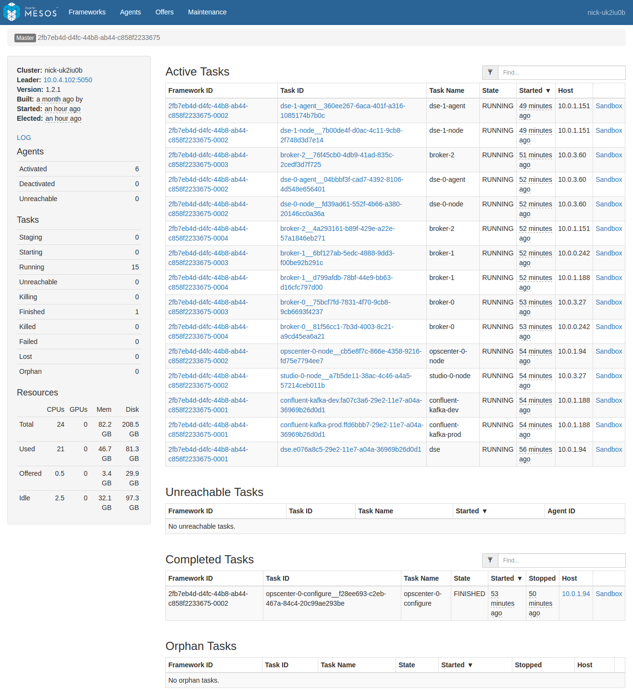](img/ops-guide-all-tasks.png)

The `Sandbox` link for one of these tasks shows a list of files from within the task itself. For example, here's a sandbox view of a `broker-2` task from the above list:

[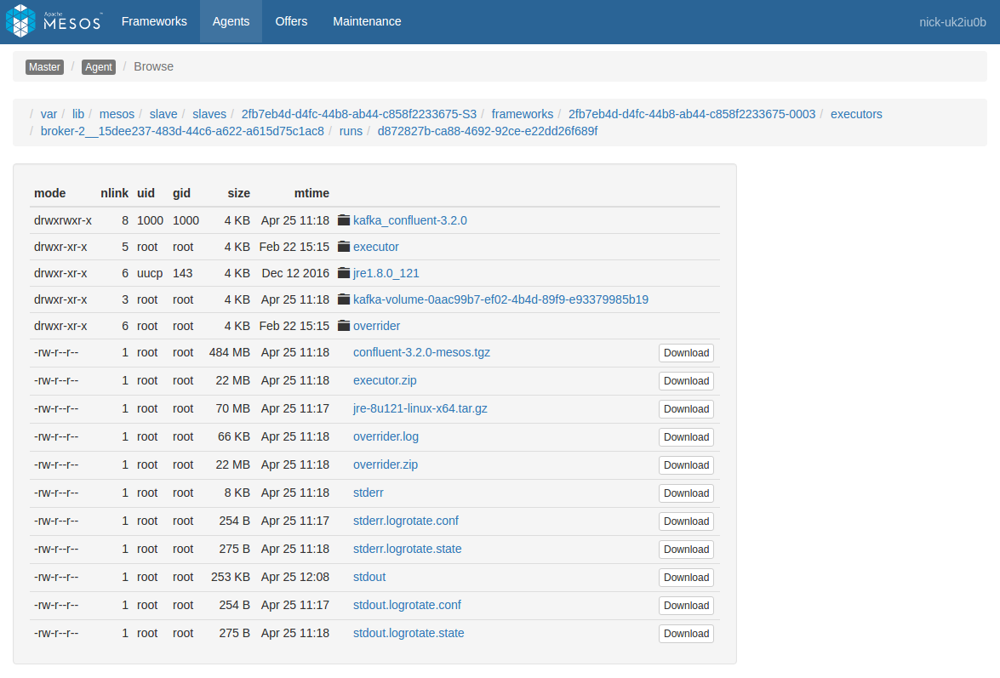](img/ops-guide-task-sandbox.png)

If the task is based on a Docker image, this list will only show the contents of `/mnt/sandbox`, and not the rest of the filesystem. If you need to view filesystem contents outside of this directory, you will need to use `dcos task exec` or `nsenter` as described below under [Running Commands](#running-commands-within-containers).

In the above task list there are multiple services installed, resulting in a pretty large list. The list can be filtered using the text box at the upper right, but there may be duplicate names across services. For example there are two instances of `confluent-kafka` and they're each running a `broker-0`. As the cluster grows, this confusion gets proportionally worse. We want to limit the task list to only the tasks that are relevant to the service being diagnosed. To do this, click "Frameworks" on the upper left to see a list of all the installed frameworks (mapping to our services):

[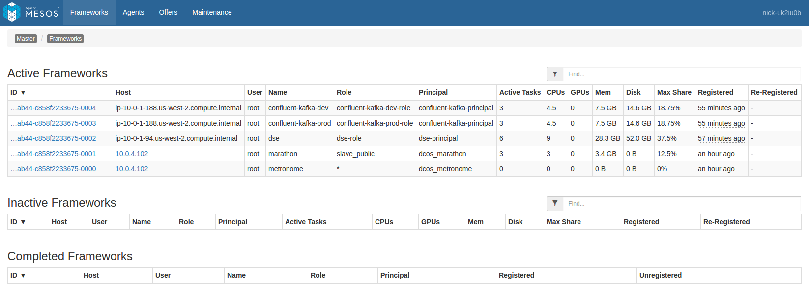](img/ops-guide-frameworks-list.png)

We then need to decide which framework to select from this list. This depends on what task we want to view:

### Scheduler logs

If the issue is one of deployment or management, e.g. a service is 'stuck' in initial deployment, or a task that previously went down isn't being brought back at all, then the Scheduler logs will likely be the place to find out why.

From Mesos's perspective, the Scheduler is being run as a Marathon app. Therefore we should pick `marathon` from this list and then find our Scheduler in the list of tasks.

[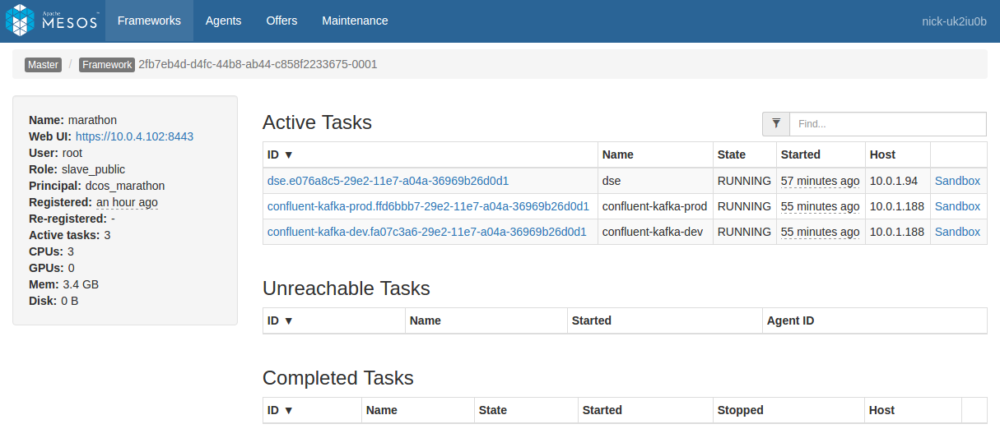](img/ops-guide-framework-tasks-marathon.png)

Scheduler logs can be found either via the main Mesos frontpage in small clusters (possibly using the filter box at the top right), or by navigating into the list of tasks registered against the `marathon` framework in large clusters. In SDK services, the Scheduler is typically given the same name as the service. For example a `kafka-dev` service's Scheduler would be named `kafka-dev`. We click the `Sandbox` link to view the Sandbox portion of the Scheduler filesystem, which contains files named `stdout` and `stderr`. These files respectively receive the stdout/stderr output of the Scheduler process, and can be examined to see what the Scheduler is doing.

[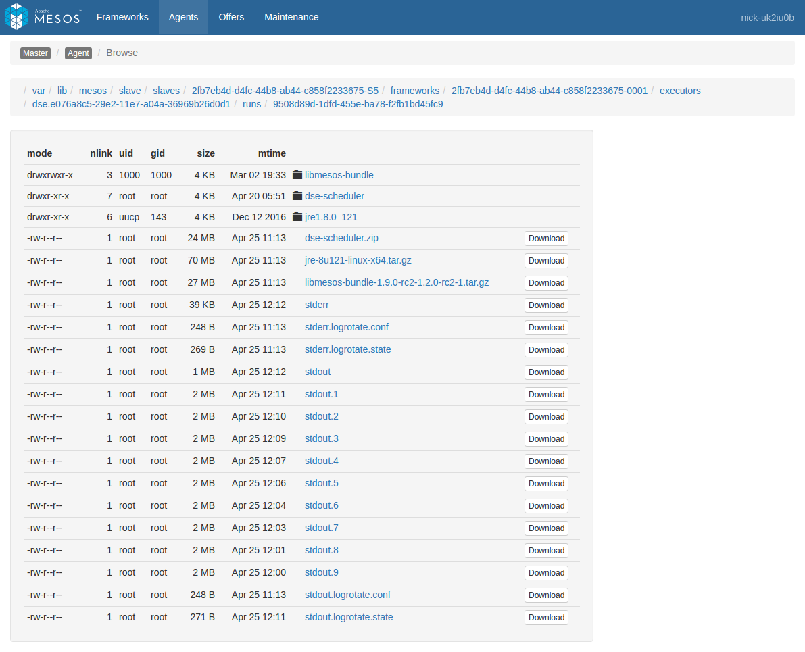](img/ops-guide-scheduler-sandbox.png)

For a good example of the kind of diagnosis you can perform using SDK Scheduler logs, see the below use case of [Tasks not deploying / Resource starvation](#tasks-not-deploying--resource-starvation).

### Task logs

When the issue being diagnosed has to do with the service tasks, e.g. a given task is crash looping, the task logs will likely provide more information. The tasks being run as a part of a service are registered against a framework matching the service name. Therefore we should pick `<service-name>` from this list to view a list of tasks specific to that service.

[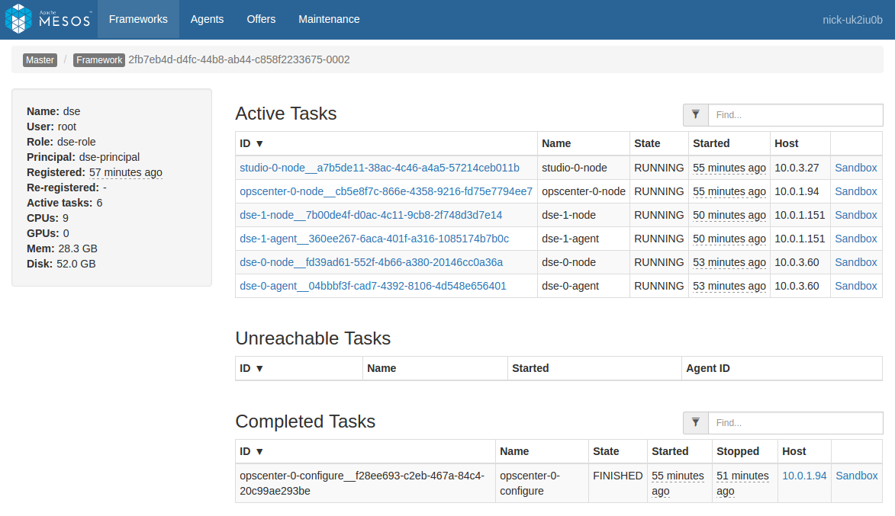](img/ops-guide-framework-tasks-service.png)

In the above list we see separate lists of Active and Completed tasks:
- Active tasks are still running. These give a picture of the current activity of the service.
- Completed tasks have exited for some reason, whether successfully or due to a failure. These give a picture of recent activity of the service. **Note:** Older completed tasks will be automatically garbage collected and their data may no longer be available here.

Either or both of these lists may be useful depending on the context. Click on the `Sandbox` link for one of these tasks and then start looking at sandbox content. Files named `stderr` and `stdout` hold logs produced both by the SDK Executor process (a small wrapper around the service task) as well as any logs produced by the task itself. These files are automatically paginated at 2MB increments, so older logs may also be examined until they are automatically pruned. For an example of this behavior, see the [scheduler sandbox](img/ops-guide-scheduler-sandbox.png) linked earlier.

[](img/ops-guide-task-sandbox.png)

### Mesos Agent logs

Occasionally, it can also be useful to examine what a given Mesos agent is doing. The Mesos Agent handles deployment of Mesos tasks to a given physical system in the cluster. One Mesos Agent runs on each system. These logs can be useful for determining if there's a problem at the system level that is causing alerts across multiple services on that system.

Navigate to the agent you want to view either directly from a task by clicking the "Agent" item in the breadcrumb when viewing a task (this will go directly to the agent hosting the task), or by navigating through the "Agents" menu item at the top of the screen (you will need to select the desired agent from the list).

In the Agent view, you'll see a list of frameworks with a presence on that Agent. In the left pane you'll see a plain link named "LOG". Click that link to view the agent logs.

[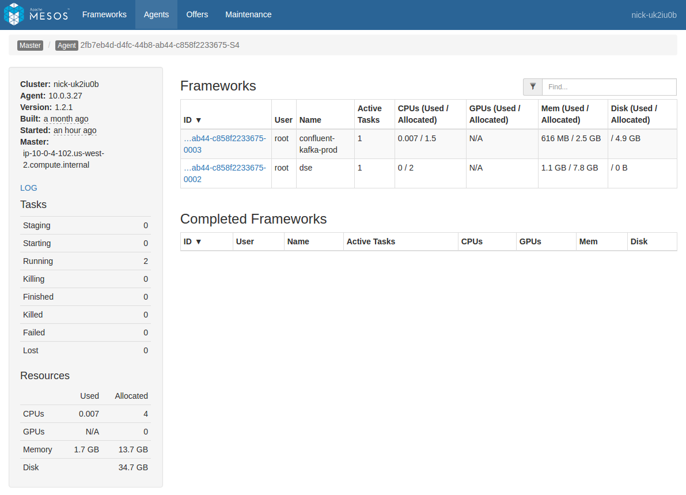](img/ops-guide-agent.png)

### Logs via the CLI

You can also access logs via the [DC/OS CLI](https://dcos.io/docs/latest/usage/cli/install/) using the `dcos task log` command. For example, lets assume the following list of tasks in a cluster:

```bash
$ dcos task
NAME                  HOST        USER  STATE  ID
broker-0              10.0.0.242  root    R    broker-0__81f56cc1-7b3d-4003-8c21-a9cd45ea6a21
broker-0              10.0.3.27   root    R    broker-0__75bcf7fd-7831-4f70-9cb8-9cb6693f4237
broker-1              10.0.0.242  root    R    broker-1__6bf127ab-5edc-4888-9dd3-f00be92b291c
broker-1              10.0.1.188  root    R    broker-1__d799afdb-78bf-44e9-bb63-d16cfc797d00
broker-2              10.0.1.151  root    R    broker-2__4a293161-b89f-429e-a22e-57a1846eb271
broker-2              10.0.3.60   root    R    broker-2__76f45cb0-4db9-41ad-835c-2cedf3d7f725
[...]
```

In this case we have two overlapping sets of brokers from two different Kafka installs. Given these tasks, we can do several different things by combining task filters, file selection, and the `--follow` argument:

```bash
$ dcos task log broker                # get recent stdout logs from all six 'broker-#' instances
$ dcos task log broker-0              # get recent stdout logs from two 'broker-0' instances
$ dcos task log broker-0__75          # get recent stdout logs from the 'broker-0' instance on 10.0.3.27
$ dcos task log --follow broker-0__75 # 'tail -f' the stdout logs from that broker instance
$ dcos task log broker-0__75 stderr   # get recent stderr logs from that broker instance
```

## Running Commands within containers

An extremely useful tool for diagnosing task state is the ability to run arbitrary commands _within_ the task. The available tools for doing this depend on the version of DC/OS you're using:

### DC/OS >= 1.9

DC/OS 1.9 introduced the `task exec` command as a convenient frontend to `nsenter`, which is described below.

#### Prerequisites

- SSH keys for accessing your cluster configured (i.e. via `ssh-add`). SSH is used behind the scenes to get into the cluster.

- A [recent version of the DC/OS CLI](https://dcos.io/docs/latest/usage/cli/install/) with support for the `task exec` command.

#### Using `dcos task exec`

Once you're set up, running commands is very straightforward. For example, let's assume the list of tasks from the CLI logs section above, where there's two `broker-0` tasks, one named `broker-0__81f56cc1-7b3d-4003-8c21-a9cd45ea6a21` and another named `broker-0__75bcf7fd-7831-4f70-9cb8-9cb6693f4237`. Unlike with `task logs`, we can only run `task exec` on one command at a time, so if two tasks match the task filter then we see the following error:

```bash
$ dcos task exec broker-0 echo hello world
There are multiple tasks with ID matching [broker-0]. Please choose one:
	broker-0__81f56cc1-7b3d-4003-8c21-a9cd45ea6a21
	broker-0__75bcf7fd-7831-4f70-9cb8-9cb6693f4237
```

Therefore we need to be more specific:

```bash
$ dcos task exec broker-0__75 echo hello world
hello world
$ dcos task exec broker-0__75 pwd
/
```

We can also run interactive commands using the `-it` flags (short for `--interactive --tty`):

```bash
$ dcos task exec --interactive --tty broker-0__75 /bin/bash
broker-container# echo hello world
hello world
broker-container# pwd
/
broker-container# exit
```

While you could technically change the container filesystem using `dcos task exec`, any changes will be destroyed if the container restarts.

### DC/OS <= 1.8

DC/OS 1.8 and earlier do not support `dcos task exec`, but `dcos node ssh` and `nsenter` may be used instead to get the same thing, with a little more effort.

First, run `dcos task` to get the list of tasks (and their respective IPs), and cross-reference that with `dcos node` to get the list of agents (and their respective IPs). For example:

```bash
$ dcos task
NAME                  HOST        USER  STATE  ID
broker-0              10.0.1.151  root    R    broker-0__81f56cc1-7b3d-4003-8c21-a9cd45ea6a21
broker-0              10.0.3.27   root    R    broker-0__75bcf7fd-7831-4f70-9cb8-9cb6693f4237
$ dcos node
 HOSTNAME       IP                         ID
10.0.0.242  10.0.0.242  2fb7eb4d-d4fc-44b8-ab44-c858f2233675-S0
10.0.1.151  10.0.1.151  2fb7eb4d-d4fc-44b8-ab44-c858f2233675-S1
10.0.1.188  10.0.1.188  2fb7eb4d-d4fc-44b8-ab44-c858f2233675-S2
...
```

In this case we're interested in the `broker-0` on `10.0.1.151`. We can see that `broker-0`'s Mesos Agent has an ID of `2fb7eb4d-d4fc-44b8-ab44-c858f2233675-S1`. Let's SSH into that machine using `dcos node ssh`:

```bash
$ dcos node ssh --master-proxy --mesos-id=2fb7eb4d-d4fc-44b8-ab44-c858f2233675-S1
agent-system$
```

Now that we're logged into the host Agent machine, we need to find a relevant PID for the `broker-0` container. This can take some guesswork:

```bash
agent-system$ ps aux | grep -i confluent
...
root      5772  0.6  3.3 6204460 520280 ?      Sl   Apr25   2:34 /var/lib/mesos/slave/slaves/2fb7eb4d-d4fc-44b8-ab44-c858f2233675-S0/frameworks/2fb7eb4d-d4fc-44b8-ab44-c858f2233675-0004/executors/broker-0__1eb65420-535e-477b-9ac1-797e79c15277/runs/f5377eac-3a87-4080-8b80-128434e42a25/jre1.8.0_121//bin/java ... kafka_confluent-3.2.0/config/server.properties
root      6059  0.7 10.3 6203432 1601008 ?     Sl   Apr25   2:43 /var/lib/mesos/slave/slaves/2fb7eb4d-d4fc-44b8-ab44-c858f2233675-S0/frameworks/2fb7eb4d-d4fc-44b8-ab44-c858f2233675-0003/executors/broker-1__8de30046-1016-4634-b43e-45fe7ede0817/runs/19982072-08c3-4be6-9af9-efcd3cc420d3/jre1.8.0_121//bin/java ... kafka_confluent-3.2.0/config/server.properties
...
```

As we can see above, there appear to be two likely candidates, one on PID 5772 and the other on PID 6059. The one on PID 5772 has mention of `broker-0` so that's probably the one we want. Lets run the `nsenter` command using PID 6059:

```bash
agent-system$ sudo nsenter --mount --uts --ipc --net --pid --target 6059
broker-container#
```

Looks like we were successful! Now we can run commands inside this container to verify that it's the one we really want, and then proceed with the diagnosis.

## Querying the Scheduler

The Scheduler exposes several HTTP endpoints that provide information on any current deployment as well as the Scheduler's view of its tasks. For a full listing of HTTP endpoints, see the [API reference](http://mesosphere.github.io/dcos-commons/swagger-api/). The Scheduler endpoints most useful to field diagnosis come from three sections:

- __Plan__: Describes any work that the Scheduler is currently doing, and what work it's about to do. These endpoints also allow manually triggering Plan operations, or restarting them if they're stuck.
- __Pods__: Describes the tasks that the Scheduler has currently deployed. The full task info describing the task environment can be retrieved, as well as the last task status received from Mesos.
- __State__: Access to other miscellaneous state information such as service-specific properties data.

For full documentation of each command, see the [API Reference](https://mesosphere.github.io/dcos-commons/swagger-api/). Here is an example of invoking one of these commands against a service named `hello-world` via `curl`:

```bash
$ export AUTH_TOKEN=$(dcos config show core.dcos_acs_token)
$ curl -k -H "Authorization: token=$AUTH_TOKEN" https://<dcos_url>/service/hello-world/v1/plans/deploy
```

These endpoints may also be conveniently accessed using the SDK CLI after installing a service. See `dcos <svcname> -h` for a list of all commands. These are wrappers around the above API.

For example, let's get a list of pods using the CLI, and then via the HTTP API:

```bash
$ dcos beta-dse --name=dse pods list
[
  "dse-0",
  "dse-1",
  "dse-2",
  "opscenter-0",
  "studio-0"
]
$ curl -k -H "Authorization: token=$(dcos config show core.dcos_acs_token)" <dcos-url>/service/dse/v1/pods
[
  "dse-0",
  "dse-1",
  "dse-2",
  "opscenter-0",
  "studio-0"
]
```

The `-v` (or `--verbose`) argument allows you to view and diagnose the underlying requests made by the CLI:

```bash
$ dcos beta-dse --name=dse -v pods list
2017/04/25 15:03:43 Running DC/OS CLI command: dcos config show core.dcos_url
2017/04/25 15:03:44 HTTP Query: GET https://yourcluster.com/service/dse/v1/pods
2017/04/25 15:03:44 Running DC/OS CLI command: dcos config show core.dcos_acs_token
2017/04/25 15:03:44 Running DC/OS CLI command: dcos config show core.ssl_verify
[
  "dse-0",
  "dse-1",
  "dse-2",
  "opscenter-0",
  "studio-0"
]
2017/04/25 15:03:44 Response: 200 OK (-1 bytes)
```

## Zookeeper/Exhibitor

**Break glass in case of emergency: This should only be used as a last resort. Modifying anything in ZK directly may cause your service to behave in inconsistent, even incomprehensible ways.**

DC/OS comes with Exhibitor, a commonly used frontend for viewing Zookeeper. Exhibitor may be accessed at `<dcos-url>/exhibitor`. A given SDK service will have a node named `dcos-service-<svcname>` visible here. This is where the Scheduler puts its state, so that it isn't lost if the Scheduler is restarted. In practice it's far easier to access this information via the Scheduler API (or via the service CLI) as described earlier, but direct access using Exhibitor can be useful in situations where the Scheduler itself is unavailable or otherwise unable to serve requests.

[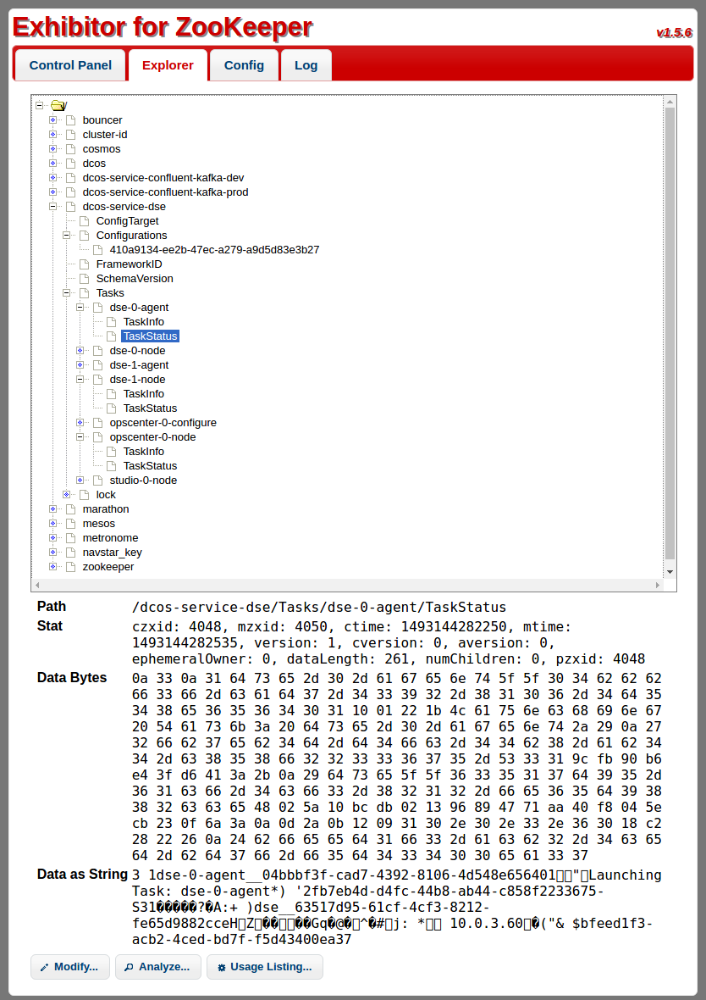](img/ops-guide-exhibitor-view-taskstatus.png)

# Common operations

This guide has so far focused on describing the components, how they work, and how to interact with them. At this point we'll start looking at how that knowledge can be applied to a running service.

## Initial service configuration

The DC/OS package format allows packages to define user-visible install options. To ensure consistent installs, we recommend exporting the options you use into an `options.json` file, which can then be placed in source control and kept up to date with the current state of the cluster. Keeping these configurations around will make it easy to duplicate or reinstall services using identical configurations.

Use this CLI command to see what options are available for a given package:

```bash
$ dcos package describe elastic --config
{
  "properties": {
    "coordinator_nodes": {
      "description": "Elasticsearch coordinator node configuration properties",
      "properties": {
        "count": {
          "default": 1,
          "description": "Number of coordinator nodes to run",
          "minimum": 0,
          "type": "integer"
        },
        "cpus": {
          "default": 1.0,
          "description": "Node cpu requirements",
          "type": "number"
        },
        ...
      }
    }
    "service": {
      "description": "DC/OS service configuration properties",
      "properties": {
        ...
        "name": {
          "default": "elastic",
          "description": "The name of the Elasticsearch service instance",
          "type": "string"
        },
        ...
        "user": {
          "default": "core",
          "description": "The user that runs the Elasticsearch/Kibana services and owns the Mesos sandbox.",
          "type": "string"
        }
      }
    }
  }
}
...
```

Given the above example, let's build an `elastic-prod-options.json` that customizes the above values:

```json
{
  "coordinator_nodes": {
    "count": 3,
    "cpus": 2.0
  },
  "service": {
    "name": "elastic-prod",
    "user": "elastic"
  }
}
```

Now that we have `elastic-prod-options.json`, we can install a service instance that uses it as follows:

```bash
$ dcos package install --options=elastic-prod-options.json elastic
```

Once we know the configuration is good, we can add it to our source control for tracking.

## Updating service configuration

Above, we described how a configuration update is handled. Now we will quickly show the steps to perform such an update.

Configuration updates are performed by updating the process environment of the Scheduler. The Scheduler runs as a Marathon application, so we can perform the change there.

First, we can go to `<dcos-url>/marathon` and find the Scheduler App in Marathon. In this case we'll use `dse`:

[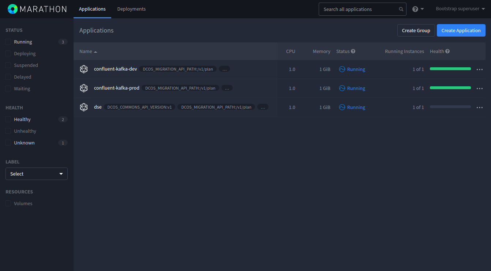](img/ops-guide-marathon-app-list.png)

Click on the `dse` app and then the `Configuration` tab. Here, we see an `Edit` button on the right hand side of the screen:

[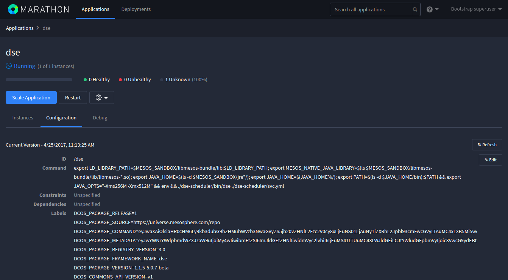](img/ops-guide-marathon-config-section.png)

Clicking that button brings up a popup window. In the window, go to the `Environment Variables` section in the left menu. Here we see a list of the Scheduler's environment variables. For the sake of this demo we will increase an `OPSCENTER_MEM` value from `4000` to `5000`, thereby increasing the RAM quota for the OpsCenter task in this service:

[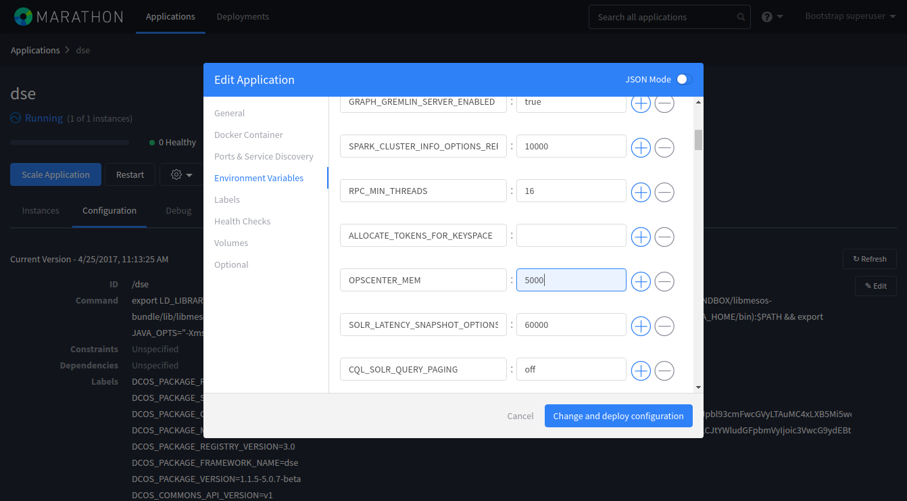](img/ops-guide-marathon-config-env.png)

After clicking `Change and deploy`, the following will happen:
- Marathon will restart the Scheduler so that it picks up our change.
- The Scheduler will detect that the OpsCenter task's configuration has changed. The OpsCenter task will be restarted with the change applied. In this case, with allocated RAM increased from 4000 to 5000 MB.

We can see the result by looking at the Mesos task list. At the top we see the new `dse` Scheduler and new OpsCenter instance. At the bottom we see the previous `dse` Scheduler and OpsCenter instance which were replaced due to our change:

[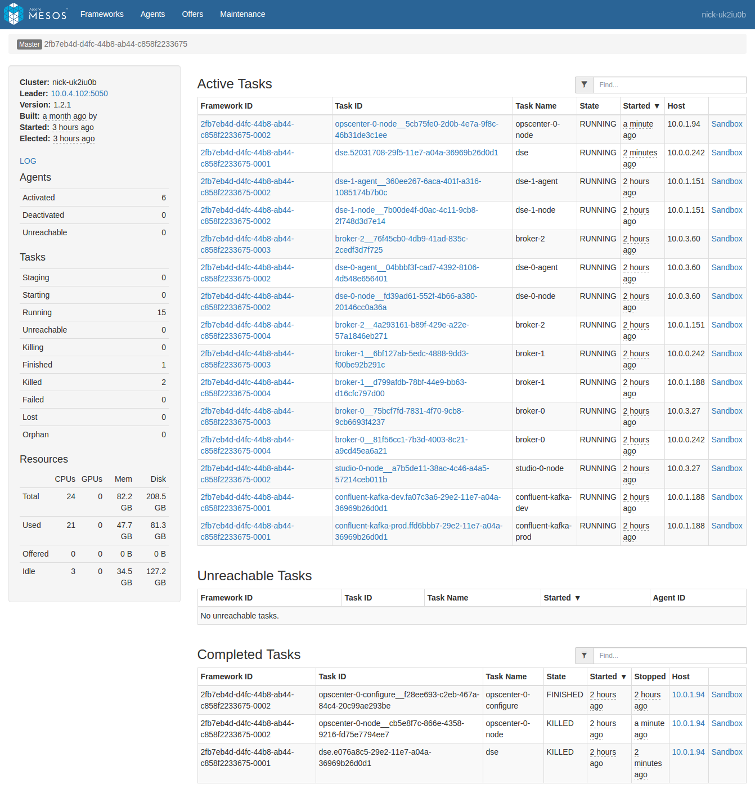](img/ops-guide-mesos-tasks-reconfigured.png)

If we look at the Scheduler logs, we can even see where it detected the change. The `api-port` value is random on each Scheduler restart, so it tends to always display as 'different' in this log:

```
INFO  2017-04-25 20:26:08,343 [main] com.mesosphere.sdk.config.DefaultConfigurationUpdater:printConfigDiff(215): Difference between configs:
--- ServiceSpec.old
+++ ServiceSpec.new
@@ -3,5 +3,5 @@
   "role" : "dse-role",
   "principal" : "dse-principal",
-  "api-port" : 18446,
+  "api-port" : 15063,
   "web-url" : null,
   "zookeeper" : "master.mesos:2181",
@@ -40,5 +40,5 @@
             "type" : "SCALAR",
             "scalar" : {
-              "value" : 4000.0
+              "value" : 5000.0
             },
             "ranges" : null,
```

The steps above apply to any configuration change: the Scheduler is restarted, detects the config change, and then launches and/or restarts any affected tasks to reflect the change. When multiple tasks are affected, the Scheduler will follow the deployment Plan used for those tasks to redeploy them. In practice this typically means that each task will be deployed in a sequential rollout, where task `N+1` is only redeployed after task `N` appears to be healthy after being relaunched with the new configuration.

### Add a node

Adding a task node to the service is just another type of configuration change. In this case, we're looking for a specific config value in the package's `config.json`, and then mapping that configuration value to the relevant environment variable in the Scheduler. In the case of the above `dse` service, we need to increase the Scheduler's `DSE_NODE_POD_COUNT` from `3` (the default) to `4`. After the change, the Scheduler will deploy a new DSE node instance without changing the preexisting nodes.

### Finding the correct environment variable

The correct environment variable for a given setting can vary depending on the service. For instance, some services have multiple types of nodes, each with separate count settings. If you want to increase the number of nodes, it would take some detective work to find the correct environment variable.

For example, let's look at the most recent release of `confluent-kafka` as of this writing. The number of brokers is configured using a [`count` setting in the `brokers` section](https://github.com/mesosphere/universe/blob/98a21f4f3710357a235f0549c3caabcab66893fd/repo/packages/C/confluent-kafka/16/config.json#L133):

```json
{
  "...": "...",
  "count": {
    "description":"Number of brokers to run",
    "type":"number",
    "default":3
  },
  "...": "..."
}
```

To see where this setting is passed when the Scheduler is first launched, we can look at the adjacent [`marathon.json.mustache` template file](https://github.com/mesosphere/universe/blob/98a21f4f3710357a235f0549c3caabcab66893fd/repo/packages/C/confluent-kafka/16/marathon.json.mustache#L34). Searching for `brokers.count` in `marathon.json.mustache` reveals the environment variable that we should change:

```json
{
  "...": "...",
  "env": {
    "...": "...",
    "BROKER_COUNT": "{{brokers.count}}",
    "...": "..."
  },
  "...": "..."
}
```

This method can be used mapping any configuration setting (applicable during initial install) to its associated Marathon environment variable (applicable during reconfiguration).

## Restart a pod

Restarting a pod keeps it in the current location and leaves data in any persistent volumes as-is. Data outside of those volumes is reset via the restart. Restarting a pod may be useful if an underlying process is broken in some way and just needs a kick to get working again. For more information see [Recovery](#recovery-plan).

Restarting a pod can be done either via the CLI or via the underlying Scheduler API. Both forms use the same [API](http://mesosphere.github.io/dcos-commons/swagger-api/). In these examples we list the known pods, and then restart the one named `dse-1`, which contains tasks named `dse-1-agent` and `dse-1-node`:

Via the CLI:

```bash
$ dcos beta-dse --name=dse pods list
[
  "dse-0",
  "dse-1",
  "dse-2",
  "opscenter-0",
  "studio-0"
]
$ dcos beta-dse --name=dse pods restart dse-1
{
  "pod": "dse-1",
  "tasks": [
    "dse-1-agent",
    "dse-1-node"
  ]
}
```

Via the HTTP API directly:

```bash
$ curl -k -H "Authorization: token=$(dcos config show core.dcos_acs_token)" <dcos-url>/service/dse/v1/pods
[
  "dse-0",
  "dse-1",
  "dse-2",
  "opscenter-0",
  "studio-0"
]
$ curl -k -X POST -H "Authorization: token=$(dcos config show core.dcos_acs_token)" <dcos-url>/service/dse/v1/pods/dse-1/restart
{
  "pod": "dse-1",
  "tasks": [
    "dse-1-agent",
    "dse-1-node"
  ]
}
```

All tasks within the pod are restarted as a unit. The response lists the names of the two tasks that were members of the pod.

## Replace a pod

Replacing a pod discards all of its current data and moves it to a new random location in the cluster. As of this writing, you can technically end up replacing a pod and have it go back where it started. Replacing a pod may be useful if an agent machine has gone down and is never coming back, or if an agent is about to undergo downtime.

Pod replacement is not currently done automatically by the SDK, as making the correct decision requires operator knowledge of cluster status. Is a node really dead, or will it be back in a couple minutes? However, operators are free to build their own tooling to make this decision and invoke the replace call automatically. For more information see [Recovery](#recovery-plan).

As with restarting a pod, replacing a pod can be done either via the CLI or by directly invoking the HTTP API. The response lists all the tasks running in the pod which were replaced as a result:

```bash
$ dcos beta-dse --name=dse pods replace dse-1
{
  "pod": "dse-1",
  "tasks": [
    "dse-1-agent",
    "dse-1-node"
  ]
}
```

```bash
$ curl -k -X POST -H "Authorization: token=$(dcos config show core.dcos_acs_token)" http://yourcluster.com/service/dse/v1/pods/dse-1/replace
{
  "pod": "dse-1",
  "tasks": [
    "dse-1-agent",
    "dse-1-node"
  ]
}
```

# Troubleshooting

This section goes over some common pitfalls and how to fix them.

## Tasks not deploying / Resource starvation

When the Scheduler is performing offer evaluation, it will log its decisions about offers it has received. This can be useful in the common case of determining why a task is failing to deploy.

In this example we have a newly-deployed `dse` Scheduler that isn't deploying the third `dsenode` task that we requested. This can often happen if our cluster doesn't have any machines with enough room to run the task.

If we look at the Scheduler's logs in `stdout` (or `stderr` in older SDK versions), we find several examples of offers that were insufficient to deploy the remaining node. It's important to remember that _offers will regularly be rejected_ due to not meeting the needs of a deployed task and that this is _completely normal_. What we're looking for is a common theme across those rejections that would indicate what we're missing.

From scrolling through the scheduler logs, we see a couple of patterns. First, there are failures like this, where the only thing missing is CPUs. The remaining task requires 2 CPUs but this offer apparently didn't have enough:

```
INFO  2017-04-25 19:17:13,846 [pool-8-thread-1] com.mesosphere.sdk.offer.evaluate.OfferEvaluator:evaluate(69): Offer 1: failed 1 of 14 evaluation stages:
  PASS(PlacementRuleEvaluationStage): No placement rule defined
  PASS(ExecutorEvaluationStage): Offer contains the matching Executor ID
  PASS(ResourceEvaluationStage): Offer contains sufficient 'cpus': requirement=type: SCALAR scalar { value: 0.5 }
  PASS(ResourceEvaluationStage): Offer contains sufficient 'mem': requirement=type: SCALAR scalar { value: 500.0 }
  PASS(LaunchEvaluationStage): Added launch information to offer requirement
  FAIL(ResourceEvaluationStage): Failed to satisfy required resource 'cpus': name: "cpus" type: SCALAR scalar { value: 2.0 } role: "dse-role" reservation { principal: "dse-principal" labels { labels { key: "resource_id" value: "" } } }
  PASS(ResourceEvaluationStage): Offer contains sufficient 'mem': requirement=type: SCALAR scalar { value: 8000.0 }
  PASS(MultiEvaluationStage): All child stages passed
    PASS(PortEvaluationStage): Offer contains sufficient 'ports': requirement=type: RANGES ranges { range { begin: 9042 end: 9042 } }
    PASS(PortEvaluationStage): Offer contains sufficient 'ports': requirement=type: RANGES ranges { range { begin: 9160 end: 9160 } }
    PASS(PortEvaluationStage): Offer contains sufficient 'ports': requirement=type: RANGES ranges { range { begin: 7000 end: 7000 } }
    PASS(PortEvaluationStage): Offer contains sufficient 'ports': requirement=type: RANGES ranges { range { begin: 7001 end: 7001 } }
    PASS(PortEvaluationStage): Offer contains sufficient 'ports': requirement=type: RANGES ranges { range { begin: 8609 end: 8609 } }
    PASS(PortEvaluationStage): Offer contains sufficient 'ports': requirement=type: RANGES ranges { range { begin: 8182 end: 8182 } }
    PASS(PortEvaluationStage): Offer contains sufficient 'ports': requirement=type: RANGES ranges { range { begin: 7199 end: 7199 } }
    PASS(PortEvaluationStage): Offer contains sufficient 'ports': requirement=type: RANGES ranges { range { begin: 21621 end: 21621 } }
    PASS(PortEvaluationStage): Offer contains sufficient 'ports': requirement=type: RANGES ranges { range { begin: 8983 end: 8983 } }
    PASS(PortEvaluationStage): Offer contains sufficient 'ports': requirement=type: RANGES ranges { range { begin: 7077 end: 7077 } }
    PASS(PortEvaluationStage): Offer contains sufficient 'ports': requirement=type: RANGES ranges { range { begin: 7080 end: 7080 } }
    PASS(PortEvaluationStage): Offer contains sufficient 'ports': requirement=type: RANGES ranges { range { begin: 7081 end: 7081 } }
  PASS(VolumeEvaluationStage): Offer contains sufficient 'disk'
  PASS(VolumeEvaluationStage): Offer contains sufficient 'disk'
  PASS(VolumeEvaluationStage): Offer contains sufficient 'disk'
  PASS(VolumeEvaluationStage): Offer contains sufficient 'disk'
  PASS(LaunchEvaluationStage): Added launch information to offer requirement
  PASS(ReservationEvaluationStage): Added reservation information to offer requirement
```

If we scroll up from this rejection summary, we find a message describing what the agent had offered in terms of CPU:

```
INFO  2017-04-25 19:17:13,834 [pool-8-thread-1] com.mesosphere.sdk.offer.MesosResourcePool:consumeUnreservedMerged(239): Offered quantity of cpus is insufficient: desired type: SCALAR scalar { value: 2.0 }, offered type: SCALAR scalar { value: 0.5 }
```

Understandably, our Scheduler is refusing to launch a DSE node on a system with 0.5 remaining CPUs when the DSE node needs 2.0 CPUs.

Another pattern we see is a message like this, where the offer is being rejected for several reasons:

```
INFO  2017-04-25 19:17:14,849 [pool-8-thread-1] com.mesosphere.sdk.offer.evaluate.OfferEvaluator:evaluate(69): Offer 1: failed 6 of 14 evaluation stages:
  PASS(PlacementRuleEvaluationStage): No placement rule defined
  PASS(ExecutorEvaluationStage): Offer contains the matching Executor ID
  FAIL(ResourceEvaluationStage): Failed to satisfy required resource 'cpus': name: "cpus" type: SCALAR scalar { value: 0.5 } role: "dse-role" reservation { principal: "dse-principal" labels { labels { key: "resource_id" value: "" } } }
  PASS(ResourceEvaluationStage): Offer contains sufficient 'mem': requirement=type: SCALAR scalar { value: 500.0 }
  PASS(LaunchEvaluationStage): Added launch information to offer requirement
  FAIL(ResourceEvaluationStage): Failed to satisfy required resource 'cpus': name: "cpus" type: SCALAR scalar { value: 2.0 } role: "dse-role" reservation { principal: "dse-principal" labels { labels { key: "resource_id" value: "" } } }
  FAIL(ResourceEvaluationStage): Failed to satisfy required resource 'mem': name: "mem" type: SCALAR scalar { value: 8000.0 } role: "dse-role" reservation { principal: "dse-principal" labels { labels { key: "resource_id" value: "" } } }
  FAIL(MultiEvaluationStage): Failed to pass all child stages
    FAIL(PortEvaluationStage): Failed to satisfy required resource 'ports': name: "ports" type: RANGES ranges { range { begin: 9042 end: 9042 } } role: "dse-role" reservation { principal: "dse-principal" labels { labels { key: "resource_id" value: "" } } }
    FAIL(PortEvaluationStage): Failed to satisfy required resource 'ports': name: "ports" type: RANGES ranges { range { begin: 9160 end: 9160 } } role: "dse-role" reservation { principal: "dse-principal" labels { labels { key: "resource_id" value: "" } } }
    FAIL(PortEvaluationStage): Failed to satisfy required resource 'ports': name: "ports" type: RANGES ranges { range { begin: 7000 end: 7000 } } role: "dse-role" reservation { principal: "dse-principal" labels { labels { key: "resource_id" value: "" } } }
    FAIL(PortEvaluationStage): Failed to satisfy required resource 'ports': name: "ports" type: RANGES ranges { range { begin: 7001 end: 7001 } } role: "dse-role" reservation { principal: "dse-principal" labels { labels { key: "resource_id" value: "" } } }
    FAIL(PortEvaluationStage): Failed to satisfy required resource 'ports': name: "ports" type: RANGES ranges { range { begin: 8609 end: 8609 } } role: "dse-role" reservation { principal: "dse-principal" labels { labels { key: "resource_id" value: "" } } }
    FAIL(PortEvaluationStage): Failed to satisfy required resource 'ports': name: "ports" type: RANGES ranges { range { begin: 8182 end: 8182 } } role: "dse-role" reservation { principal: "dse-principal" labels { labels { key: "resource_id" value: "" } } }
    FAIL(PortEvaluationStage): Failed to satisfy required resource 'ports': name: "ports" type: RANGES ranges { range { begin: 7199 end: 7199 } } role: "dse-role" reservation { principal: "dse-principal" labels { labels { key: "resource_id" value: "" } } }
    FAIL(PortEvaluationStage): Failed to satisfy required resource 'ports': name: "ports" type: RANGES ranges { range { begin: 21621 end: 21621 } } role: "dse-role" reservation { principal: "dse-principal" labels { labels { key: "resource_id" value: "" } } }
    FAIL(PortEvaluationStage): Failed to satisfy required resource 'ports': name: "ports" type: RANGES ranges { range { begin: 8983 end: 8983 } } role: "dse-role" reservation { principal: "dse-principal" labels { labels { key: "resource_id" value: "" } } }
    FAIL(PortEvaluationStage): Failed to satisfy required resource 'ports': name: "ports" type: RANGES ranges { range { begin: 7077 end: 7077 } } role: "dse-role" reservation { principal: "dse-principal" labels { labels { key: "resource_id" value: "" } } }
    FAIL(PortEvaluationStage): Failed to satisfy required resource 'ports': name: "ports" type: RANGES ranges { range { begin: 7080 end: 7080 } } role: "dse-role" reservation { principal: "dse-principal" labels { labels { key: "resource_id" value: "" } } }
    FAIL(PortEvaluationStage): Failed to satisfy required resource 'ports': name: "ports" type: RANGES ranges { range { begin: 7081 end: 7081 } } role: "dse-role" reservation { principal: "dse-principal" labels { labels { key: "resource_id" value: "" } } }
  FAIL(VolumeEvaluationStage): Failed to satisfy required volume 'disk': name: "disk" type: SCALAR scalar { value: 10240.0 } role: "dse-role" disk { persistence { id: "" principal: "dse-principal" } volume { container_path: "dse-data" mode: RW } } reservation { principal: "dse-principal" labels { labels { key: "resource_id" value: "" } } }
  PASS(VolumeEvaluationStage): Offer contains sufficient 'disk'
  PASS(VolumeEvaluationStage): Offer contains sufficient 'disk'
  FAIL(VolumeEvaluationStage): Failed to satisfy required volume 'disk': name: "disk" type: SCALAR scalar { value: 10240.0 } role: "dse-role" disk { persistence { id: "" principal: "dse-principal" } volume { container_path: "solr-data" mode: RW } } reservation { principal: "dse-principal" labels { labels { key: "resource_id" value: "" } } }
  PASS(LaunchEvaluationStage): Added launch information to offer requirement
  PASS(ReservationEvaluationStage): Added reservation information to offer requirement
```

In this case, we see that none of the ports our DSE task needs are available on this system (not to mention the lack of sufficient CPU and RAM). This will typically happen when we're looking at an agent that we've already deployed to. The agent in question here is likely running either `dsenode-0` or `dsenode-1`, where we had already reserved those ports ourselves.

We're seeing that none of the remaining agents in the cluster have room to fit our `dsenode-2`. To resolve this, we need to either add more agents to the DC/OS cluster or we need to reduce the requirements of our service to make it fit. In the latter case, be aware of any performance issues that may result if resource usage is reduced too far. Insufficient CPU quota will result in throttled tasks, and insufficient RAM quota will result in OOMed tasks.

This is a good example of the kind of diagnosis you can perform by simply skimming the SDK Scheduler logs.

## Accidentially deleted Marathon task but not service

A common user mistake is to remove the Scheduler task from Marathon, which doesn't do anything to uninstall the service tasks themselves. If you do this, you have two options:

### Uninstall the rest of the service

If you really wanted to uninstall the service, you just need to complete the normal `package uninstall` + `janitor.py` steps described under [Uninstall](#uninstall).

### Recover the Scheduler

If you want to bring the Scheduler back, you can do a `dcos package install` using the options that you had configured before. This will re-install a new Scheduler that should match the previous one (assuming you got your options right), and it will resume where it left off. To ensure that you don't forget the options your services are configured with, we recommend keeping a copy of your service's `options.json` in source control so that you can easily recover it later. See also [Initial configuration](#initial-service-configuration).

## 'Framework has been removed'

Long story short, you forgot to run `janitor.py` the last time you ran the service. See [Uninstall](#uninstall) for steps on doing that. In case you're curious, here's what happened:

1. You ran `dcos package uninstall`. This destroyed the scheduler and its associated tasks, _but didn't clean up its reserved resources_.
1. Later on, you tried to reinstall the service. The Scheduler came up and found an entry in ZooKeeper with the previous framework ID, which would have been cleaned up by `janitor.py`. The Scheduler tried to re-register using that framework ID.
1. Mesos returned an error because it knows that framework ID is no longer valid. Hence the confusing 'Framework has been removed' error.

## Stuck deployments

You can sometimes get into valid situations where a deployment is being blocked by a repair operation or vice versa. For example, say you were rolling out an update to a 500 node Cassandra cluster. The deployment gets paused at node #394 because it's failing to come back, and, for whatever reason, we don't have the time or the inclination to `pods replace` it and wait for it to come back.

In this case, we can use `plan` commands to force the Scheduler to skip node #394 and proceed with the rest of the deployment:

```bash
$ dcos cassandra plan show deploy
{
  "phases": [
    {
      "id": "aefd33e3-af78-425e-ad2e-6cc4b0bc1907",
      "name": "cassandra-phase",
      "steps": [
        ...
        { "id": "f108a6a8-d41f-4c49-a1c0-4a8540876f6f", "name": "node-393:[node]", "status": "COMPLETE" },
        { "id": "83a7f8bc-f593-452a-9ceb-627d101da545", "name": "node-394:[node]", "status": "PENDING" }, # stuck here
        { "id": "61ce9d7d-b023-4a8a-9191-bfa261ace064", "name": "node-395:[node]", "status": "PENDING" },
        ...
      ],
      "status": "IN_PROGRESS"
    },
    ...
  ],
  "errors": [],
  "status": "IN_PROGRESS"
}
$ dcos plan force deploy cassandra-phase node-394:[node]
{
  "message": "Received cmd: forceComplete"
}
```

After forcing the `node-394:[node]` step, we can then see that the Plan shows it in a `COMPLETE` state, and that the Plan is proceeding with `node-395`:

```
$ dcos cassandra plan show deploy
{
  "phases": [
    {
      "id": "aefd33e3-af78-425e-ad2e-6cc4b0bc1907",
      "name": "cassandra-phase",
      "steps": [
        ...
        { "id": "f108a6a8-d41f-4c49-a1c0-4a8540876f6f", "name": "node-393:[node]", "status": "COMPLETE" },
        { "id": "83a7f8bc-f593-452a-9ceb-627d101da545", "name": "node-394:[node]", "status": "COMPLETE" },
        { "id": "61ce9d7d-b023-4a8a-9191-bfa261ace064", "name": "node-395:[node]", "status": "PENDING" },
        ...
      ],
      "status": "IN_PROGRESS"
    },
    ...
  ],
  "errors": [],
  "status": "IN_PROGRESS"
}
```

If we want to go back and fix the deployment of that node, we can simply force the scheduler to treat it as a pending operation again:

```
$ dcos plan restart deploy cassandra-phase node-394:[node]
{
  "message": "Received cmd: restart"
}
```

Now, we see that the step is again marked as `PENDING` as the Scheduler again attempts to redeploy that node:

```
$ dcos cassandra plan show deploy
{
  "phases": [
    {
      "id": "aefd33e3-af78-425e-ad2e-6cc4b0bc1907",
      "name": "cassandra-phase",
      "steps": [
        ...
        { "id": "f108a6a8-d41f-4c49-a1c0-4a8540876f6f", "name": "node-393:[node]", "status": "COMPLETE" },
        { "id": "83a7f8bc-f593-452a-9ceb-627d101da545", "name": "node-394:[node]", "status": "PENDING" },
        { "id": "61ce9d7d-b023-4a8a-9191-bfa261ace064", "name": "node-395:[node]", "status": "COMPLETE" },
        ...
      ],
      "status": "IN_PROGRESS"
    },
    ...
  ],
  "errors": [],
  "status": "IN_PROGRESS"
}
```

This example shows how steps in the deployment Plan (or any other Plan) can be manually retriggered or forced to a completed state by querying the Scheduler. This doesn't come up often, but it can be a useful tool in certain situations.

**Note:** The `dcos plan` commands will also accept UUID `id` values instead of the `name` values for the `phase` and `step` arguments. Providing UUIDs avoids the possibility of a race condition where we view the plan, then it changes structure, then we change a plan step that isn't the same one we were expecting (but which had the same name).

## Deleting a task in ZK to forcibly wipe that task

If the scheduler is still failing after `pods replace <name>` to clear a task, a last resort is to use [Exhibitor](#zookeeperexhibitor) to delete the offending task from the Scheduler's ZK state, and then to restart the Scheduler task in Marathon so that it picks up the change. After the Scheduler restarts, it will do the following:
- Automatically unreserve the task's previous resources with Mesos because it doesn't recognize them anymore (via the Resource Cleanup operation described earlier).
- Automatically redeploy the task on a new agent.

**Note:** This operation can easily lead to a completely broken service. __Do this at your own risk.__ [Break glass in case of emergency](img/ops-guide-exhibitor-delete-task.png)

## OOMed task

Your tasks can be killed from an OOM if you didn't give them sufficient resources. This will manifest as sudden `Killed` messages in [Task logs](#task-logs), sometimes consistently but often not. To verify that the cause is an OOM, the following places can be checked:
- Check [Scheduler logs](#scheduler-logs) (or `dcos <svcname> pods status <podname>)` to see TaskStatus updates from mesos for a given failed pod.
- Check [Agent logs](#mesos-agent-logs) directly for mention of the Mesos Agent killing a task due to excess memory usage.

After you've been able to confirm that the problem is indeed an OOM, you can solve it by either [updating the service configuration](#updating-service-configuration) to reserve more memory, or configuring the underlying service itself to use less memory (assuming the option is available).
