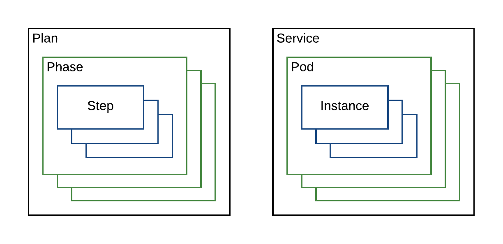

<!-- Generate TOC. Both lines are required: https://kramdown.gettalong.org/converter/html.html#toc -->
* TOC GOES HERE AUTOMATICALLY
{:toc}

<!--  disable mustache templating in this file: retain templated examples as-is -->

This operations guide describes how to manage stateful DC/OS services which have been based on the DC/OS SDK. For information about building DC/OS SDK services, look at the [Developer Guide](developer-guide.html).

# A Brief Overview of How Things Work

Before we get into performing specific operations, we should look into the parts of a DC/OS SDK service, how they work, and their respective roles within the larger system. Next we'll look at how those components come together in common scenarios.

## Components

The following components are key to deploying and maintaining the service, each with its own separate responsibilities. Here's a quick overview of how those components come together to deploy and manage a stateful service on DC/OS:

- Packaging

  DC/OS packages follow [Universe schema](https://github.com/mesosphere/universe), which defines how packages expose customization options at initial installation. When a package is installed to the cluster, the packaging service (named 'Cosmos') create a Marathon app containing a rendered version of the `marathon.json.mustache` template provided by the package. In an SDK service, this Marathon app is the Scheduler for the service.

- Scheduler

  The Scheduler is effectively the 'management layer' of the service. It handles launching the service nodes and keeping them running. It also exposes endpoints allowing end users to diagnose and control the service. The Scheduler itself is kept online by the cluster's 'init system', named Marathon. The Scheduler itself is effectively a Java application which is configured via environment variables provided by Marathon.

- Marathon

  Marathon is the 'init system' of the DC/OS cluster. Marathon launches tasks in the cluster and keeps them running. Where Mesos is concerned, Marathon is effectively itself another Scheduler running its own tasks. Marathon is more general than SDK Schedulers, and mainly focuses on tasks which don't require managing local persistent state. SDK services rely on Marathon to run the Scheduler, and to provide it with a configuration via environment variables. The Scheduler is in turn responsible for maintaining its own service tasks, without any direct involvement by Marathon.

- Mesos

  Mesos is the foundation of the DC/OS cluster. Everything launched within the cluster is allocated and managed by Mesos. A typical Mesos cluster has one or three Masters which manage available resources for the entire cluster. In DC/OS the machines running the Mesos Masters will typically run other cluster services as well, such as Marathon and Cosmos, as local system processes. Separately from the Master machines are the Agent machines, which are where in-cluster processes are run. For more information on Mesos architecture, see the [Apache Mesos docs](https://mesos.apache.org/documentation/latest/architecture/).

- Zookeeper

  DC/OS comes with Zookeeper installed by default, typically with one instance per DC/OS master. Zookeeper is a common foundation for DC/OS system components like Marathon and Mesos. The same Zookeeper instance is also used by SDK Schedulers for storing persistent state across restarts (under ZK nodes named `dcos-service-<svcname>`). This allows Schedulers to be killed at any time and continue where they left off. Note that while Zookeeper itself is currently required, any persistent configuration storage (such as etcd) could fit this role. However Zookeeper is a convenient default because it's always present in DC/OS clusters.

## Deployment

The SDK internally treats "Deployment" as moving from one state to another state. By this definition, "Deployment" applies to many scenarios:
- When a service is first installed, deployment is moving from a null configuration to a deployed configuration.
- When the deployed configuration is changed by editing an environment variable in the Scheduler, deployment is moving from an initial running configuration to a new proposed configuration.

In this section we'll describe how each of these scenarios is handled by the Scheduler:

### Initial Install

The flow for deploying a new service works as follows:

1. First, the steps handled by the DC/OS cluster itself:
  1. The user runs `dcos package install <pkg>` in the DC/OS CLI, or clicks `Install` for a given package in the DC/OS Dashboard.
  1. A request is sent to the Cosmos packaging service to deploy the requested package, along with a set of configuration options.
  1. Cosmos creates a Marathon app definition by rendering the package's `marathon.json.mustache` with the configuration options provided in the request. In the case of an SDK service, this app represents the service's Scheduler. Cosmos queries Marathon to create the app.
  1. Marathon launches the service's Scheduler somewhere in the cluster, using the rendered app definition provided by Cosmos.
  1. The service Scheduler is launched. From this point onwards, the deployment is being handled by the SDK.

The service Scheduler's `main()` function is run like any other Java application. At this point the Scheduler has the following state to bootstrap from:
- `svc.yml` template representing the service configuration.
- Environment variables provided by Marathon, to be applied onto the `svc.yml` template.
- Any custom logic implemented by the service developer in their Main function (we'll be assuming this is left with defaults for the purposes of this explanation)

1. The Scheduler uses the above pieces to bootstrap itself into a running service as follows:
  1. The `svc.yml` template is rendered using the environment variables provided by Marathon.
  1. The rendered `svc.yml` "Service Spec" contains the host/port for the Zookeeper instance which the Scheduler uses for persistent configuration/state storage. The default is `master.mesos:2181`, but may be manually configured to use a different Zookeeper instance. The Scheduler always stores its information under a ZK node named `dcos-service-<svcname>`.
  1. The scheduler connects to that Zookeeper instance and checks to see if it's previously stored a Mesos Framework ID for itself.
    - If the Framework ID is present, the Scheduler will attempt to reconnect to Mesos using that ID. This may result in a "Framework has been removed" error if Mesos doesn't recognize that Framework ID, indicating an incomplete uninstall.
    - If the Framework ID is not present, the Scheduler will attempt to register with Mesos as a Framework. Assuming this is successful, the resulting Framework ID is then immediately stored.
1. Now that the Scheduler has registered as a Mesos Framework, it is able to start interacting with Mesos and receiving offers. When this begins, Schedulers using the SDK will begin running the [Offer Cycle](#offer-cycle) and deploying the service. See that section for more information.
  1. The Scheduler retrieves its deployed task state from Zookeeper and finds that there are tasks which should be launched (all of the tasks, in fact, as this is the first launch).
  1. The Scheduler proceeds to deploy those missing tasks through the Mesos offer cycle, using a [Deployment Plan](#plans) to determine the ordering of that deployment.
1. Once the Scheduler has launched the missing tasks, its current configuration should match the desired configuration defined by the "Service Spec" extracted from `svc.yml`.
  1. The Scheduler will tell Mesos to suspend sending new offers as there's nothing to be done.
  1. The Scheduler effectively idles until it receives an RPC from Mesos notifying of a task status change, or an RPC from an end user against one of its HTTP APIs, or until it's killed by Marathon as the result of a configuration change.

### Reconfiguration

The flow for reconfiguring a running service works as follows:

1. First, the steps handled by the DC/OS cluster itself:
  1. The user edits the Scheduler's environment variables, either via the DC/OS Dashboard's Services section, or via Marathon directly (at `yourcluster.com/marathon`).
  1. Marathon kills the current Scheduler and launches a new Scheduler with the updated environment variables.

As with initial install above, the Scheduler is re-launched with the same three pieces it had before:
- `svc.yml` template
- New environment variables
- Custom logic implemented by the service developer (if any)

In addition, the Scheduler now has a fourth piece:
- Preexisting state in Zookeeper

As such, the Scheduler deployment is slightly different before as it is now comparing its current state to a non-empty prior state and determining what needs to be changed.

1. After the Scheduler has rendered its `svc.yml` against the new environment variables, it has two Service Specs, reflecting two different configurations:
  1. The Service Spec that was just rendered, reflecting the config change.
  1. The prior Service Spec (or "Target Configuration") which was previously stored in ZK.
1. The Scheduler will automatically compare the changes between the old and new Service Specs:
  1. Change validation: Certain changes such as editing volumes and scale-down are not currently supported, as they are both complicated and dangerous to get wrong.
    - If an invalid change is detected, the scheduler will emit an error message and refuse to proceed until the user has reverted the change by relaunching the Scheduler app in Marathon with the prior config.
    - Otherwise, the new configuration is stored in ZK as the new Target Configuration and the change deployment proceeds as described below.
  1. Change deployment: The Scheduler effectively produces a `diff` between the current state and some future state, including all of the Mesos calls (reserve, unreserve, launch, destroy, etc...) needed to get there. For example, if the number of tasks has been increased, then the Scheduler will launch the correct number of new tasks. If a task configuration setting has been changed, the Scheduler will deploy that change to the relevant affected tasks by relaunching them. Tasks which aren't affected by the configuration change will be left as-is.

## Offer Cycle

The Offer Cycle is a core concept of Mesos, and often a source of confusion when running services on Mesos. In short, Mesos will periodically notify subscribed Schedulers of resources in the cluster, and the Schedulers are expected to either accept the offered resources or decline them. In this structure, Schedulers never have a complete picture of the cluster, they only know about what's being explicitly offered to them. This allows Mesos the option of only advertising certain resources to specific Schedulers, without requiring any changes on the Scheduler's end.

Schedulers written using the SDK perform the following operations as Offers are received from Mesos:

  1. Task Reconciliation: Mesos is the source of truth for what's running in the system, and Task Reconciliation is a way for Mesos to convey the status of all tasks being managed by the service. The Scheduler will request a Task Reconciliation during initial startup, and Mesos will then send the current status of that Scheduler's tasks. This allows the Scheduler to catch up with any potential status changes to its tasks that occurred after the Scheduler was last running. A common pattern in Mesos is to jealously guard most of what it knows about tasks, so this only contains status information, and not general task information. As such the Scheduler keeps its own copy of what it knows about tasks in Zookeeper. During an initial deployment this process is very fast as no tasks have been launched yet.
  1. Offer Acceptance: Once the Scheduler has finished Task Reconciliation, it will start evaluating the resource offers it receives to determine if any match the requirements of the next task(s) to be launched. At this point, users on small clusters may find that the Scheduler isn't launching tasks. This is generally because the Scheduler isn't able to find offered machines with enough room to fit the tasks. Add more/bigger nodes, or reduce the requirements of the service.
  1. Resource Cleanup: The Offers provided by Mesos will include reservation information if those resources were previously reserved by the Scheduler. The Scheduler will automatically request that any unrecognized but reserved resources be automatically unreserved. This can come up in a few situations, for example if an agent machine went away for several days and then came back, it's resources may still be considered reserved by Mesos while the Scheduler has already moved on and doesn't know about it anymore. At this point the Scheduler will automatically clean up those resources.

Note that SDK Schedulers will automatically notify Mesos to stop sending offers, or suspend offers, when the Scheduler doesn't have any work to do. For example, once a service deployment has completed, the Scheduler will request that offers be suspended. If the Scheduler is later notified that a task has exited via a status update, the Scheduler will resume offers in order to redeploy that task back where it was. This is done by waiting for the Offer which matches that task's reservation, and then launching the task against those resources once more.

## Recovery

In addition to sending Offers as described above, Mesos will periodically send Task Status updates which notify the Scheduler about the state of its tasks. Task Status updates can be sent during startup to let the scheduler know when a task has started running, or know when the task has exited successfully, or when the cluster has lost contact with the machine hosting that task. As such the Scheduler needs to decide whether a given status update indicates a task which needs to be relaunched. When this is the case, the Scheduler will simply wait on the Offer cycle. We've mentioned the [Deployment Plan](#plans) earlier, but the Scheduler has many Plans for various operations, some included by default and others defined for custom service-specific behavior. Another common/default Plan is the Recovery Plan, which handles bringing back tasks which have failed. The Recovery Plan listens for offers which may be used to bring back those tasks, and then relaunches tasks against those offers.

In practice there are two types of recovery, permanent and temporary. The difference is mainly an issue of whether the task being recovered should stay on the same machine, and the side effects that result from that:

- Temporary recovery:
  - Hiccup in the task or the host machine.
  - Recovery involves relaunching the task on the same machine as before.
  - Recovery occurs automatically.
  - Any data in the task's persistent volumes survives the outage.
  - May be manually triggered by a `pods restart` command.
- Permanent recovery:
  - Permanent failure of the host machine, no reason to stick around.
  - Recovery involves discarding any persistent volumes that the task once had on the host machine.
  - Recovery only occurs in response to a manual `pods replace` command (or operators may build their own tooling to invoke the replace command).

Per above, triggering a permanent recovery is a destructive operation, as it discards any prior persistent volumes. This is desirable when the operator knows that the previous machine isn't coming back. For safety's sake this destructive operation is currently not triggered automatically by the SDK itself.

## Persistent Volumes

While CPU and Memory are pretty easy to understand, persistent volumes are a bit more complicated. Indeed the added complexity of dealing with persistent volumes is one of the reasons why the SDK exists as opposed to just using Marathon in all situations. SDK services currently treat volumes as tied to specific agent machines, as one might have in a datacenter with local drives in each system. While e.g. EBS or SAN volumes could be re-mounted and reused across machines, this isn't yet supported in the SDK.

Volumes are advertised as resources by Mesos, and Mesos offers multiple types of persistent volumes. The SDK supports two of these types: MOUNT volumes and ROOT volumes.

- ROOT volumes:
  - Uses a shared filesystem tree.
  - Shares I/O with anything else on that filesystem.
  - Supported by default in new deployments, doesn't require additional configuration.
  - Space reservations can exactly fit the requirements of the service.
- MOUNT volumes:
  - Uses a dedicated partition.
  - Dedicated I/O for the partition.
  - Requires additional (but straightforward) configuration when setting up the DC/OS cluster.
  - Reservations are all-or-nothing; mount volumes cannot be further subdivided between services.

The last point about all-or-nothing is important, as it means that if multiple services are deployed with MOUNT volumes, then they can quickly be unable to densely colocate within the cluster, unless many MOUNT volumes are created on each agent. Let's look at the following deployment scenario across three DC/OS agent machines, each with two enabled MOUNT volumes labeled A and B:

- Agent 1: A B
- Agent 2: A B
- Agent 3: A B

Now we install a service X with two nodes that each use one mount volume. The service consumes volume A on agents 1 and 3:

- Agent 1: X B
- Agent 2: A B
- Agent 3: X B

Now a service Y is installed with two nodes that each use two mount volumes. The service consumes volume A and B on agent 2, but then is stuck without being able to deploy anything else:

- Agent 1: X B
- Agent 2: Y Y
- Agent 3: X B

# Diagnosis tools

## Querying the Scheduler

- Plan
- State

## Logging

Given the above information about the components, here's how you can tell what's going on:

- Scheduler logs (stdout/stderr)
- Executor and task logs (stdout/stderr)
- Mesos agent logs (diagnose e.g. `Killed` => OOM)

## Debugging, Running Commands

- `dcos task exec`
- `nsenter --target $PID --mount --uts --ipc --net --pid`

## Metrics

Largely out of scope but supported by some services, see day2ops docs

## Zookeeper/Exhibitor

**Note: This should only be used as a last resort (i.e. break glass in case of emergency). Changes made here may cause your service to behave in inconsistent, even incomprehensible ways.**

DC/OS comes with Exhibitor pre-installed by default, accessible at http://yourcluster.com/exhibitor . A given SDK service will have a `dcos-service-<svcname>` visible here. This is where the Scheduler puts its state.

- Overview of node paths within exhibitor

# Performing common operations

## Configuration update

## Add a node

## Restart a node

## Move/replace a node

# Getting out of common scenarios

## Tasks not deploying / Resource starvation

## Accidentially deleted Marathon task but not service

## 'Framework has been removed'

## Unable to deploy due to recovery needed (or was it vice versa?)

Give example scenario and show how to get out of it

## Deleting a task in ZK to clear that task

What situation(s) does this solve?

# DC/OS Component Overview

The four major components are Mesos, Marathon, Universe, and Zookeeper. These components have different responsibilities and must cooperate. To develop a service, you should have a high level understanding of these components and their responsibilities.

## Mesos

DC/OS is modeled on an operating system with Mesos as its kernel. Mesos provides an abstraction to enable consumption of the resources a datacenter provides.  In a typical case, these resources are CPU, memory, disk space, and ports. Tasks are launched in the datacenter and consume particular subsets of resources. The programs that can receive resource offers and launch tasks that consume are called **frameworks**. The component of a framework that receives offers and launches tasks is called the **scheduler**.

Mesos determines which frameworks should be offered resources at any given time. It sends update events regarding the status of those tasks. These events include *staging, running, failed*,* *etc.  To learn more about Mesos, consult the  "[Mesos Advanced Course](https://open.mesosphere.com/advanced-course/)".

## Marathon

The scheduler is the  entity that can launch tasks on DC/OS.  The role of Marathon is to launch Mesos tasks and to restart them if they crash.  In the context of the SDK, the tasks that Marathon launches are schedulers.  These schedulers in turn launch the tasks necessary for the operation of a DC/OS service. Therefore, if a scheduler crashes, it is Marathon’s responsibility to restart the scheduler.

If we consider Mesos to be DC/OS’ kernel, then Marathon is its init system. It launches and keeps up the software that should be running on the operating system.

Marathon is itself a Mesos framework. Some of the tasks it launches are the schedulers written with the SDK described here. Use an application or pod definition to tell. Application and pods definitions are declarative JSON representations of a task or tasks that Marathon should run.To learn more, consult the [Marathon documentation](https://mesosphere.github.io/marathon/).

## Universe

A package specification provides a uniform way to define Marathon applications.  Those packages are stored in the Universe so end-users can easily install these DC/OS services in their datacenters..

Every DC/OS service must provide a package definition in the format expected by the Universe. [Learn more about creating Universe packages](https://github.com/mesosphere/universe).

## Zookeeper

Several DC/OS components, including Mesos and Marathon, require a persistent metadata store. Zookeeper fulfills this role for those components as well as for services written using the SDK. As noted previously, any service written using the SDK is a Mesos scheduler. In order to accurately communicate with Mesos, every scheduler must keep a record of the the state of its tasks. Zookeeper provides persistent storage for this information.

Although all SDK services written today store metadata in Zookeeper, this is an implementation detail. The [ConfigStore](https://github.com/mesosphere/dcos-commons/blob/master/sdk/scheduler/src/main/java/com/mesosphere/sdk/config/ConfigStore.java) and [StateStore](https://github.com/mesosphere/dcos-commons/blob/master/sdk/scheduler/src/main/java/com/mesosphere/sdk/state/StateStore.java) interfaces are generic and unopinionated about the backing persistent metadata store.

They store the desired configuration of a service and all relevant information regarding Mesos tasks, respectively, but the precise format or location of the underlying data may be customized.  For example, the data may be stored in Zookeeper, but in a different format, or the data may be stored in a different persistent storage like etcd.  The defaults should be reasonable for most developers, however. Support for optional customization via drop-in replacement is a common pattern throughout the SDK.


# Introduction to DC/OS Service Definitions

At the highest level of abstraction, a DC/OS service breaks down into *which* tasks to launch and *how* to launch them. The [ServiceSpec](https://github.com/mesosphere/dcos-commons/blob/master/sdk/scheduler/src/main/java/com/mesosphere/sdk/specification/ServiceSpec.java) defines what a service is and [Plan](#plans)[s] define how to control it in deployment, update, and failure scenarios. The [ServiceSpec](https://github.com/mesosphere/dcos-commons/blob/master/sdk/scheduler/src/main/java/com/mesosphere/sdk/specification/ServiceSpec.java) and [Plan](#plans)[s] are [packaged](#packaging) so that the service can be deployed on a DC/OS cluster from Universe.

<a name="service-spec"></a>
## ServiceSpec

There are two ways to generate a valid `ServiceSpec`: creating a YAML file or writing Java code. Both produce a valid implementation of the Java `ServiceSpec` interface.  A `ServiceSpec` may be used to launch one or more instances of the same service within a DC/OS cluster.

For example, one could write a `ServiceSpec` that describes a DC/OS service that deploys a Kafka cluster. One could then install one or more instances of a Kafka cluster in a DC/OS cluster. A `ServiceSpec` is in this sense similar to a class definition, which may be used to create many objects that are instances of the class.

### Annotated Example of a `ServiceSpec`

This simple YAML definition of a DC/OS service that prints "hello world" to stdout in a container sandbox every 1000 seconds.

```yaml
name: "hello-world"
scheduler:
  principal: "hello-world-principal"
  api-port: {{PORT_API}}
pods:
  hello-world-pod:
    count: 1
    tasks:
      hello-world-task:
        goal: RUNNING
        cmd: "echo hello world && sleep 1000"
        cpus: 0.1
        memory: 512
```

* **name**:  This is the name of an instance of a DC/OS service. No two instances of any service may have the same name in the same cluster.

* **scheduler**: The Scheduler manages the service and keeps it running. This section contains settings which apply to the Scheduler. The `scheduler` section may be omitted to use reasonable defaults for all of these settings.

    * **principal**: This is the Mesos principal used when registering the framework. In secure Enterprise clusters, this principal must have the necessary permission to perform the actions of a scheduler. This setting may be omitted in which case it defaults to `<svcname>-principal`.

    * **api-port**: By default, a DC/OS service written with the SDK provides a number of REST API endpoints that may be used to examine the state of a service as well as alter its operation. In order to expose the endpoints, you must define on which port the HTTP server providing those endpoints should listen. You can also add custom service-specific endpoints.  Learn more in the [Defining a Target Configuration section](#define-target-config). This setting may be omitted in which case it defaults to the `PORT_API` envvar provided by Marathon.

* **Pods**: A pod can be defined most simply as a set of tasks.

* **hello-world-pod**: This is the name of a type of a pod. You can choose any name for a pod type  In this example, we have one kind of pod defined and its name is `hello-world-pod`.

* **count**: The number of instances of the pod.

* **tasks**: The list of tasks in the pod.

* **hello-world-task**: In this example, the single pod definition is composed of a single task. The name of this task is "hello-world-task".

* **goal**: Every task must have a goal state. There are two possible goal states: `RUNNING` and `FINISHED`. `RUNNING` indicates that a Task should always be running, so if it exits, it should be restarted. `FINISHED` indicates that if a task finishes successfully it does not need to be restarted.

* **cmd**: The command to run to start a task. Here, the task will print "hello world" to stdout and sleep for 1000 seconds. Because its goal state is `RUNNING`, it will be started again upon exit.

* **cpus**: This entry defines how many CPUs will be allocated to the task’s container.  For discussion of how resources are isolated and allocate [see the Mesos documentation here](http://mesos.apache.org/documentation/latest/containerizer/).

* **memory**: This entry defines how much memory will be allocated to the task’s container.


### Summary

A set of pods defines *what* your service is. Pods are composed of task definitions.

In the example, we have only defined types of pods and tasks. When the service is deployed and instantiated into instances of these types, we get a Mesos task like the following:

<table>
  <tr>
    <td>Task Name</td>
    <td>Task ID</td>
    <td>Task Status</td>
  </tr>
  <tr>
    <td>hello-world-pod-0-hello-world-task</td>
    <td>hello-world-pod-0-hello-world-task__c111c97e-7236-4fea-b06f-0216c93b853b</td>
    <td>TASK_RUNNING</td>
  </tr>
</table>


Since a single pod instance was requested via the *count* element, only a single task was launched. Its index (0) was injected into the task name and ID. If we had defined a count higher than one, more tasks with incremental indices would have been launched.

<a name="plans"></a>
## Plans

In the simple example above, it is obvious *how* to deploy this service.  It consists of a single task that launches . For more complex services with multiple pods, the SDK allows the definition of *plans* to orchestrate the deployment of tasks.

The example below defines a service with two types of pods, each of which deploys two instances.

```yaml
name: "hello-world"
pods:
  hello-pod:
    count: 2
    tasks:
      hello-task:
        goal: RUNNING
        cmd: "echo hello && sleep 1000"
        cpus: 0.1
        memory: 512
  world-pod:
    count: 2
    tasks:
      world-task:
        goal: RUNNING
        cmd: "echo world && sleep 1000"
        cpus: 0.1
        memory: 512
```

There are a number of possible deployment strategies: In parallel or serially, and with or without one pod type waiting for the other’s successful deployment before deploying.

By default, the SDK will deploy all instances of pods serially.  In the example above, the default deployment order would be:

1. hello-pod-0-hello-task

1. hello-pod-1-hello-task

1. world-pod-0-world-task

1. world-pod-1-world-task

Each pod’s task must reach its goal of `RUNNING` before the next pod is launched. This is the simplest and safest possible approach as a default deployment strategy.

However, this default deployment strategy does not provide the flexibility you need to write rich services. The SDK therefore also allows you to define *plans* that orchestrate task deployment.

In this section we focus on using plans to define the initial deployment of a service. However, you can also use plans to orchestrate configuration updates, software upgrades, and recovery from complex, service-specific failure scenarios.

As an example, let’s consider the scenario where we wish to deploy the hello-pods in parallel, wait for them to reach a `RUNNING` state and then deploy the world-pods serially.  We could amend our YAML file to look like the following:

```yaml
name: "hello-world"
pods:
  hello-pod:
  count: 2
  tasks:
    hello-task:
      goal: RUNNING
      cmd: "echo hello && sleep 1000"
      cpus: 0.1
      memory: 512
  world-pod:
    count: 2
    tasks:
      hello-task:
        goal: RUNNING
        cmd: "echo world && sleep 1000"
        cpus: 0.1
        memory: 512
plans:
  deploy:
    strategy: serial
    phases:
      hello-phase:
        strategy: parallel
        pod: hello-pod
      world-phase:
        strategy: serial
        pod: world-pod
```

A plan is a simple three layer hierarchical structure.  A plan is composed of phases, which in turn are composed of steps.  Each layer may define a strategy for how to deploy its constituent elements. The strategy at the highest layer defines how to deploy phases. Each phase’s strategy defines how to deploy steps. The default strategy if none is specified is serial.



A phase encapsulates a pod type and a step encapsulates an instance of a pod.  So in this case we have two phases: hello-phase and world-phase.  They are clearly associated with their particular pod definitions from the ServiceSpec. In the example above, we do not need to specifically define steps to accomplish our deployment strategy goal, so they are omitted.

The hello-phase of the example has two elements: a strategy and a pod.

```yaml
plans:
  deploy:
    strategy: serial
    phases:
      hello-phase:
        strategy: parallel
        pod: hello-pod
      world-phase:
        strategy: serial
        pod: world-pod
```

The pod parameter references the pod definition earlier in the `ServiceSpec`. The strategy declares how to deploy the instances of the pod. Here, they will be deployed in parallel. The world-phase section is identical, except that its elements will be deployed serially.

The strategy associated with the deployment plan as a whole is serial, so the phases should be deployed one at a time. This dependency graph illustrates the deployment.


The dependency of the `world-pod` phase on the `hello-pod` phase serializes those two phases as described at the top level strategy element. Since both `hello` steps depend on a the` hello-pod` phase, and not each other, they are executed in parallel. The second `world-pod` instance depends on the first, so they are launched serially.

More powerful custom plans can also be written. Consider the case in which a pod requires an initialization step to be run before the main task of a pod is run. One could define the tasks for such a pod as follows:

```yaml
name: "hello-world"
pods:
  hello:
    count: 2
    resource-sets:
      hello-resources:
        cpus: 1.0
        memory: 256
        volume:
          path: hello-data
          size: 5000
          type: ROOT
    tasks:
      init:
        goal: FINISHED
        cmd: "./init"
        resource-set: hello-resources
      main:
        goal: RUNNING
        cmd: "./main"
        resource-set: hello-resources
```

By default a the plan generated from such a service definition would only deploy the `main` task because when the `init` task should be run is undefined.  In order to run the init task and then the main task for each instance of the `hello` pod one could write a plan as follows:

```yaml
plans:
  deploy:
    strategy: serial
    pod: hello
    steps:
      - default: [[init], [main]]
```

This plan indicates that by default, every instance of the hello pod should have two steps generated: one representing the `init` task and another representing the `main` task. The ServiceSpec indicates that two `hello` pods should be launched so the following tasks would be launched by steps serially:

1. hello-0-init
1. hello-0-main
1. hello-1-init
1. hello-1-main

Consider the case where the init task should only occur once for the first pod, and all subsequent pods should just launch their `main` task. Such a plan could be written as follows:

```yaml
plans:
  deploy:
    strategy: serial
    pod: hello
    steps:
      - 0: [[init], [main]]
      - default: [[main]]
```

This plan would result in steps generating the following tasks:

1. hello-0-init
1. hello-0-main
1. hello-1-main

You can learn more about the full capabilities of plans [here](#plan-execution) and [here](#custom-plans-java).

<a name="packaging"></a>
## Packaging

A DC/OS service must provide a package definition in order to be installed on a DC/OS cluster. At a minimum, a package definition is composed of four files: `marathon.json.mustache`, `config.json`, `resource.json`, and `package.json`. [Examples of all these files](https://github.com/mesosphere/dcos-commons/tree/master/frameworks/helloworld/universe) are provided in the example helloworld DC/OS service.  A detailed explanation of the format and purpose of each of these files is [available here](https://github.com/mesosphere/universe#creating-a-package).

### Universe Package Files At-a-Glance

For a fully detailed explanation of service packaging [see here](https://dcos.io/docs/1.8/development/create-package/); below we provide a brief introduction to the required files.

* `marathon.json.mustache` -   A mustache-templated file that provides a Marathon application definition.  Its mustache elements are rendered by the values present in the config.json and resource.json files.

* `Resource.json` -  A list of URIs of all downloaded elements.This list allows your service to be deployed in datacenters without Internet access.

* `command.json` - This file contains elements specific to a CLI for your service if you want to provide one.

* `package.json` - This file contains metadata of interest to the Universe, including the minimum version of DC/OS on which the service may be deployed.

The SDK provides utilities for building a package definition and deploying it to a DC/OS cluster for development purposes.  An example build.sh script constructs a package and provides instructions for the deployment.  The helloworld framework’s build.sh script provides the following output:

```bash
$ ./build.sh aws
<snip>
Install your package using the following commands:
dcos package repo remove hello-world-aws
dcos package repo add --index=0 hello-world-aws https://infinity-artifacts.s3.amazonaws.com/autodelete7d/hello-world/20161212-160559-ATLFk70vPlo45X4a/stub-universe-hello-world.zip
dcos package install --yes hello-world
```

The build.sh script takes an optional argument of aws or local:

* `./build.sh aws`: The package definition and build artifacts are uploaded to an S3 bucket in AWS. If you would like to override the S3 bucket location where the packages are uploaded, please add S3_BUCKET environment variable with the bucket name. For example:

```bash
$ export S3_BUCKET=my_universe_s3_bucket
```

* `./build.sh local`: The package definition and build artifacts are served by a local HTTP server.

Executing the final command, `dcos package install --yes hello-world` deploys the service to a DC/OS cluster.

# Basic Operations

You can perform three fundamental operations on any instance of a DC/OS service: install, update, and uninstall.  With the exception of uninstall, they all follow a fundamental design principle.

All services written with the SDK determine what actions to take based on a target configuration they are trying to reach.  The `ServiceSpec` defines the target configuration. When installing for the first time, a service is going from nothing to the target configuration. When performing a configuration update, a service is going from the current configuration to the target configuration. A software update is identical to a configuration update except that that the software artifacts to be deployed are changed, not just the configuration. The path a service takes to a new target configuration is always defined by a plan.

The following events occur to select a target configuration and move a service from its current configuration to the target.

1. Define a target configuration

    a. Deploy a Marathon application definition for your service’s scheduler

    b. The scheduler renders the `ServiceSpec` and Plan definitions in the service’s YAML definition.

1. Plan Execution

    a. The scheduler compares previous and current `ServiceSpec`s:

       i. Validate the `ServiceSpec`

       ii. Determine scenario (install, update or no change)

    b. The plan is chosen and executed

These steps are discussed in more detail below.

<a name="define-target-config"></a>

## Defining a Target Configuration

We previously described how a DC/OS service’s scheduler is a Marathon application.  Marathon applications define a particular declarative application definition, and DC/OS services constructed with the SDK define another, the `ServiceSpec`s and plans.

This nested structure of declarative interfaces requires two layers of template rendering. First, the Marathon application definition must be rendered at initial install time from the combination of the marathon.json.mustache, config.json, and resource.json files. Then, the service’s YAML template is rendered using the environment variables presented to the scheduler. Let’s walk through the [checked-in helloworld example](https://github.com/mesosphere/dcos-commons/tree/master/frameworks/helloworld).  Pay particular attention to the templated values surrounded in curly braces, as in `{{value}}`.

helloworld has a [marathon.json.mustache template](https://github.com/mesosphere/dcos-commons/blob/master/frameworks/helloworld/universe/marathon.json.mustache) which, in part, looks as follows:

```
{
    "env": {
        "FRAMEWORK_NAME": "{{service.name}}",
        "HELLO_COUNT": "{{hello.count}}",
        "HELLO_CPUS": "{{hello.cpus}}",
        "...": "..."
    },
    "uris": [
        "{{resource.assets.uris.scheduler-zip}}",
        "..."
    ],
    "portDefinitions": [
        {
            "port": 0,
            "protocol": "tcp",
            "name": "api",
            "labels": { "VIP_0": "/api.{{service.name}}:80" }
        }
    ],
    "...": "..."
}
```

The [config.json](https://github.com/mesosphere/dcos-commons/blob/master/frameworks/helloworld/universe/config.json) file is in part:

```
{
    "type":"object",
    "properties":{
        "service":{
            "type":"object",
            "description": "DC/OS service configuration properties",
            "properties":{
                "name" : {
                    "description":"The name of the service instance",
                    "type":"string",
                    "default":"hello-world"
                },
                "...": "..."
            }
        },
        "hello":{
            "type":"object",
            "description":"Hello Pod configuration properties",
            "properties":{
                "cpus":{
                    "description":"Hello Pod cpu requirements",
                    "type":"number",
                    "default":0.1
                },
                "count":{
                    "description":"Number of Hello Pods to run",
                    "type":"integer",
                    "default":1
                },
                "...": "..."
            }
        }
    }
}
```

The [resource.json](https://github.com/mesosphere/dcos-commons/blob/master/frameworks/helloworld/universe/resource.json) file is in part:

```
{
  "assets": {
    "uris": {
      "scheduler-zip": "{{artifact-dir}}/hello-world-scheduler.zip",
      "...": "..."
    }
  },
  "...": "..."
}
```

The `marathon.json.mustache` template pulls values from `config.json` and `resource.json` and creates an initial Marathon application definition. This application definition can be deployed on Marathon, which installs a DC/OS service’s scheduler. You can [override the initial config.json values when installing via the command line](https://docs.mesosphere.com/latest/usage/managing-services/config/).

**Important:** The environment variable field of the Marathon application definition defines values specific to the helloworld service.

The following is the typical flow of configuration values as represented by environment variables:


Once Marathon deploys your scheduler, the service’s YAML specification can be rendered by the environment variables you provided. The helloworld’s service definition is in part:

```yaml
// ...
pods:
    hello:
        count: {{HELLO_COUNT}}
        tasks:
            server:
                // ...
                cpus: {{HELLO_CPUS}}
                // ...
```

The port definition in `marathon.json.mustache` makes the `PORT0` environment variables available to the scheduler. The `HELLO_COUNT` and `HELLO_CPUS` environment variables are provided by the env field of the Marathon application definition, which is provided by the rendered `marathon.json.mustache` template.

<a name="rendered-spec"></a>
The final rendered `ServiceSpec` is:

```yaml
name: "hello-world"
pods:
  hello:
    count: 1
    tasks:
      server:
        goal: RUNNING
        cmd: "echo hello >> hello-container-path/output && sleep 1000"
        cpus: 0.1
        memory: 256
        volume:
          path: "hello-container-path"
          type: ROOT
          size: 50
```

<a name="plan-execution"></a>
## Plan Execution

### Plan Acceptance or Rejection

Once a proposed target configuration has been defined in the form of a `ServiceSpec`, and, optionally, a deployment plan, the scheduler must decide  what course of action to take. At the outset, a scheduler may choose to accept or reject a proposed target configuration. When a scheduler rejections a proposed target configuration the target configuration does  not change and the previous target configuration remains the target. The scheduler may reject a target configuration because it is malformed, or violates a business logic or other constraint.

### Executing a Plan

Once a proposed target configuration is accepted as the target configuration, the scheduler must determine which plan to execute to reach the target. By default, if no overriding deployment plan is provided, the pods defined in the `ServiceSpec` will be rolled out serially.

There are two fundamental plan execution scenarios: **install** and **update**.  Let’s first walk through the deployment of the [hello world service](https://github.com/mesosphere/dcos-commons/blob/master/frameworks/helloworld/src/main/dist/svc.yml) in the install case.

### Install

Recall the [rendered `ServiceSpec` from above](#rendered-spec). A single pod containing a single task is defined generating the following plan:

```
{
    "phases": [{
        "id": "8ee5b023-066e-4ef7-a2c9-5fdfc00a50e5",
        "name": "hello",
        "steps": [{
            "id": "2e3dde39-3ea3-408b-8e00-3346bef93054",
            "status": "COMPLETE",
            "name": "hello-0:[server]",
            "message": "DefaultStep: 'hello-0:[server]' has status: 'COMPLETE'."
        }],
        "status": "COMPLETE"
    }],
    "errors": [],
    "status": "COMPLETE"
}
```

Each pod is deployed with a phase, so we have a single phase named after the pod "hello".  Each instance of a pod is deployed with a step within that phase. Since there is a single pod instance, we have a single step named “hello-0:[server]”.  The name of the step indicates that it is deploying instance 0 of the pod “hello” with a single task named “server”.

Every element of the plan has an associated status with the following possible values: PENDING, PREPARED, STARTING, COMPLETE, WAITING, and ERROR.

Normally, steps progress through statuses in the following order:

PENDING → PREPARED → STARTING → COMPLETE

The status of a phase or a plan is determined by examination of the step elements.  A step may enter an ERROR state when its construction is malformed or whenever the service author determines it to be appropriate. The WAITING state occurs when the operator of the service indicates that an element should be paused. An operator might want to pause a deployment for a multitude of reasons, including unexpected failures during an update.

### Update

In the update case, a scheduler goes from one target configuration to the next. The two examples below show how pods are only restarted to consume new configuration information when that information is relevant to the pod.

#### Vertical Scale Example

This example updates the target configuration we defined in the install above. The new target configuration below increases the amount of CPU consumed by the server task.

In the marathon.json.mustache template we defined an environment variable named HELLO_CPUS. Below, we update this value in Marathon from 0.1 to 0.2.

```
{
    "id": "/hello-world",
    "env": {
        "HELLO_CPUS": "0.2",
        "HELLO_COUNT": "1",
        "SLEEP_DURATION": "1000",
        "...": "..."
    },
    "...": "..."
}
```

This will result in restarting the scheduler and re-rendering the `ServiceSpec` template. The new template is shown below. Note that the value of `cpus` has changed to 0.2.

```yaml
name: "hello-world"
pods:
  hello:
    count: 1
    tasks:
      server:
        goal: RUNNING
        cmd: "echo hello >> hello-container-path/output && sleep 1000"
        cpus: 0.2
        memory: 256
        volume:
          path: "hello-container-path"
          type: ROOT
          size: 50
```

A new plan is then generated and execution begins:

```
{
    "phases": [{
        "id": "ce7bf2e6-857d-4188-a21c-6469c2db92fb",
        "name": "hello",
        "steps": [{
            "id": "c47bf620-9cd7-4bae-b9d0-f56ca00e26ce",
            "status": "STARTING",
            "name": "hello-0:[server]",
            "message": "DefaultStep: 'hello-0:[server]' has status: 'STARTING'."
        }],
        "status": "STARTING"
    }],
    "errors": [],
    "status": "STARTING"
}
```

In this case, we have changed the resources consumed for a running task. In order for it to consume new resources, the task must be killed and restarted consuming more resources. When in the PREPARED state, the task has been killed and will be restarted as soon as appropriate resources are available.

#### Horizontal Scale Example

In the previous example, the change in target configuration affected currently running tasks, so they had to be restarted. In this example, we are changing the number of pod instances to be launched, which should have no effect on currently running pods and therefore will not trigger a restart. The example below changes HELLO_COUNT to 2, adding an additional instance of the hello pod.

```
{
    "id": "/hello-world",
    "env": {
        "HELLO_CPUS": "0.2",
        "HELLO_COUNT": "2",
        "SLEEP_DURATION": "1000",
        "...": "..."
    },
    "...": "..."
}
```

This generates the following Plan:

```
{
    "phases": [{
        "id": "25e741c8-a775-481e-9247-d9073002bb3d",
        "name": "hello",
        "steps": [{
            "id": "6780372e-9154-419b-91c4-e0347ca961af",
            "status": "COMPLETE",
            "name": "hello-0:[server]",
            "message": "DefaultStep: 'hello-0:[server]' has status: 'COMPLETE'."
        }, {
            "id": "6e519f31-8e2d-41ea-955d-85fdd7e1d624",
            "status": "PENDING",
            "name": "hello-1:[server]",
            "message": "DefaultStep: 'hello-1:[server]' has status: 'PENDING'."
        }],
        "status": "STARTING"
    }],
    "errors": [],
    "status": "STARTING"
}
```

The step associated with instance 0 of the hello pod is never restarted and its step is initialized as COMPLETE.  Another step has been generated for instance 1. Once it has completed, the service will have transitioned from its previous configuration to the new target configuration.

### Rollback

A special rollback operation is not defined. To roll back a given deployment, deploy the previous configuration as the new target.

### Software Upgrade

Like rollback, a special software upgrade operation is not defined. To perform an upgrade, just specify a new target configuration. When performing an upgrade, you are probably creating a target configuration that refers to new URIs with new software to launch tasks. This target configuration change is rolled out like any other update.

### API

#### View

You can view the deployment plan via a REST endpoint your scheduler provides. The plans shown in the examples above were accessed by:

```bash
$ curl -k -H "Authorization: token=$AUTH_TOKEN" http://<dcos_url>/service/hello-world/v1/plans/deploy
```

#### Interrupt

You can interrupt the execution of a plan by issuing a `POST` request to the appropriate endpoint:

```bash
$ curl -k -X POST -H "Authorization: token=$AUTH_TOKEN" http://<dcos_url>/service/hello-world/v1/plans/deploy/interrupt
```

Interrupting a plan stops any steps that were not being processed from being processed in the future. Any steps that were actively being processed at the time of an interrupt call will continue.

The interrupt may also be issued against a specific phase within the plan:

```bash
$ curl -k -X POST -H "Authorization: token=$AUTH_TOKEN" http://<dcos_url>/service/hello-world/v1/plans/deploy/interrupt?phase=data-nodes
```

Interrupting a phase of a plan only stops the steps within that phase, without affecting other phases.

#### Continue

Continue plan execution by issuing a `POST` request to the continue endpoint:

```bash
$ curl -k -X POST -H "Authorization: token=$AUTH_TOKEN" http://<dcos_url>/service/hello-world/v1/plans/deploy/continue
```

Continue may also be issued on a per-phase basis:

```bash
$ curl -k -X POST -H "Authorization: token=$AUTH_TOKEN" http://<dcos_url>/service/hello-world/v1/plans/deploy/continue?phase=data-nodes
```

# Service Discovery

There are two service discovery options that are relevant to the SDK: mesos-dns and VIPs.  Mesos-dns provides a stable, predictable address for individual Mesos tasks.  VIPs provide a load balancing mechanism across multiple instances of a class of tasks.

## [Mesos-DNS](https://github.com/mesosphere/mesos-dns)

All tasks launched in DC/OS receive a DNS address. It is of the form:

```
<task-name>.<framework-name>.mesos
```

So a service defined as follows:

```yaml
name: "hello-world"
pods:
  hello:
    count: 1
    tasks:
      server:
        goal: RUNNING
        cmd: "echo hello >> hello-container-path/output && sleep 1000"
        cpus: 0.2
        memory: 256
        volume:
          path: "hello-container-path"
          type: ROOT
          size: 50
```

would generate a single task named "hello-0-server".  The framework’s name is "hello-world".  The Mesos-DNS address for this task would be "hello-0-server.hello-world.mesos". Tasks may also specify their own prefixes for the first component of their mesos-dns names using the `discovery` section in each task definition. In the following example, two tasks within the same pod share a prefix:

```yaml
name: "hello-world"
pods:
  hello:
    count: 1
    resource-sets:
      pod-resources:
        cpus: 0.2
        memory: 256
        volume:
          path: "hello-container-path"
          type: ROOT
          size: 50
    tasks:
      init:
        goal: FINISHED
        resource-set: pod-resources
        cmd: "echo init >> hello-container-path/output && sleep 1000"
        discovery:
          prefix: hello
      server:
        goal: RUNNING
        resource-set: pod-resources
        cmd: "echo hello >> hello-container-path/output && sleep 1000"
        discovery:
          prefix: hello
```

In this case, while running, both the `init` and `server` tasks would be addressable at "hello-0.hello-world.mesos", with the "-0" being added automatically to indicate which pod instance to route to. Tasks belonging to different pods may not share the same prefix, and YAML validation will fail if this is found to be the case.

**Important:** As with resource sets, only a single process at point in time may use a given prefix, meaning that `init` may not run at the same time as `server`. A complete service definition would have a deploy plan that ensures this.

## [VIP](https://github.com/dcos/minuteman)

You can also perform service discovery by defining named virtual IP addresses. VIPs load balance, so every task associated with the same prefix and external port pair will be part of a load-balanced set of tasks.

```yaml
name: "hello-world"
pods:
  hello:
    count: 1
    tasks:
      server:
        goal: RUNNING
        cmd: "echo hello >> hello-container-path/output && sleep 1000"
        cpus: 0.2
        memory: 256
        ports:
            http:
                protocol: tcp
                port: 8080
                vip:
                    prefix: server-lb
                    port: 80
                    advertise: true
```

Defining a VIP is additional information that can be applied to a port. VIPs are defined by a prefix, an internal port, and an external port. The internal port in this example is 8080 and the external port is 80. The prefix is automatically expanded to become an address of the form:

```
<prefix>.<framework-name>.l4lb.thisdcos.directory
```

In the example above, a server task can be accessed through the address:

```
server-lb.hello-world.l4lb.thisdcos.directory:80
```

# Testing

The SDK provides assistance for writing both unit and integration tests.

## Unit tests

Unit tests enable you to make sure that changes to your dependencies do not result in breaking changes to your frameworks. The SDK uses the standard JUnit testing system. The hello-world framework provides [some example unit tests](https://github.com/mesosphere/dcos-commons/blob/master/frameworks/helloworld/src/test/java/com/mesosphere/sdk/helloworld/scheduler/HelloWorldServiceSpecTest.java).

**Important:** In order to avoid unintentional execution of other framework tests, you must include [a test filter similar to the one defined by the hello-world framework](https://github.com/mesosphere/dcos-commons/blob/master/frameworks/helloworld/build.gradle#L40-L45).

Unit tests that follow the pattern described above will be automatically run on all pull requests, and test failures will block merges. Unit tests can be manually executed either through standard IDE test integrations or through standard gradle commands.

* All tests: `gradlew check`

* Individual framework: `gradlew check -p frameworks/<framework-name>`

## Integration tests

Within the context of the SDK, integration tests validate expected service behavior in a DC/OS cluster. The library that provides the majority of the functionality required to write such tests is called [shakedown](https://github.com/dcos/shakedown). Shakedown provides capabilities that make it easy to perform service operations such as install, uninstall, configuration update, software upgrade, rollback, and pod restart. As with unit tests, these tests are run against every pull request and a failure blocks merges. The hello-world framework provides [some example integration tests](https://github.com/mesosphere/dcos-commons/blob/master/frameworks/helloworld/integration/tests/test_sanity.py).

You can run integration tests manually using the [test.sh](https://github.com/mesosphere/dcos-commons/blob/master/test.sh) script.  If you have a particular DC/OS cluster on which to run tests, we recommend overriding the CLUSTER_URL environment variable. If you need to run a subset of the integration test suite during test or framework development, we recommend setting the TEST_TYPES environment variable appropriately.  For example, you could mark a test as follows:

```python
@pytest.mark.special
def test_upgrade_downgrade():
    pass # ...
```

If the following command was entered in the shell:

```bash
$ export TEST_TYPES="special"
```

Then, only tests marked special would be executed.  A one line example is as follows:

```bash
$ CLUSTER_URL=http://my-dcos-cluster/ TEST_TYPES=special ./test.sh
```

# Advanced DC/OS Service Definition

## `ServiceSpec` (YAML)

The most basic set of features present in the YAML representation of the `ServiceSpec` are [presented above](#service-spec). The remaining features are introduced below.

### Containers

Each pod runs inside a single container. The `ServiceSpec` specifies the Docker image to run for that container, the virtual network memberships, and the POSIX resource limits for every task that runs inside that container. In the example below, the soft limit for number of open file descriptors for any task in the "hello" pod is set to 1024, and the hard limit to 2048:

```yaml
name: "hello-world"
pods:
  hello:
    count: 1
    image: ubuntu
    networks:
      dcos: {}
    rlimits:
      RLIMIT_NOFILE:
        soft: 1024
        hard: 2048
    tasks:
      server:
        goal: RUNNING
        cmd: "echo hello"
        cpus: 1.0
        memory: 256
```

Currently an empty YAML dictionary is passed as the body for each network definition under `networks`, since we only support joining virtual networks by name, but in the future it will be possible to specify port mappings and other information in a network definition.

**Note:** Your framework must be run as the root user in order to raise rlimits beyond the default for a process. For a full list of which rlimits are supported, refer to [the Mesos documentation on rlimits](https://github.com/apache/mesos/blob/master/docs/posix_rlimits.md).

### Placement Rules

Pods specifications may be configured with placement rules which describe where and how those pods may be deployed in the cluster. This setting supports all [Marathon-style placement operators](https://mesosphere.github.io/marathon/docs/constraints.html), using either of the following formats: `["field", "operator"[, "parameter"]]`, or `field:operator[:parameter]`. If you require placement logic that isn’t offered by the default Marathon-style placement operators, you should consider using [PlacementRules in Java](#placement-rules).

We recommend exposing placement constraints as templated out configuration settings, so that they may be easily customized by end-users. For example, your YAML specification may contain the following:

```yaml
name: "hello-world"
pods:
  hello:
    count: 3
    placement: {{HELLO_PLACEMENT}}
    tasks:
      server:
        goal: RUNNING
        cmd: "echo hello"
        cpus: 1.0
        memory: 256
```


In this example your configuration would expose a `HELLO_PLACEMENT` configuration setting with some default value. You may then provide a default value for that setting, such as `"hostname:UNIQUE"` to ensure that no two hello instances are on the same agent at a time, or `“rack_id:LIKE:rack-foo-.*”` to ensure that hello instances are only placed on agents with a `rack_id` that starts with `“rack-foo-”`. Multiple placement rules may be ANDed together by separating them with a comma, e.g. `“hostname:UNIQUE,rack_id:LIKE:rack-foo-.*”`.

<a name="resource-sets"></a>
### Resource Sets

A Mesos task is always a process that consumes some resources. In the example below, the server task is a command that prints "hello" to a file while consuming 1.0 CPUs, 256 MB of memory, and 50 MB of disk space for its volume.

```yaml
name: "hello-world"
pods:
  hello:
    count: 1
    tasks:
      server:
        goal: RUNNING
        cmd: "echo hello >> hello-container-path/output && sleep 1000"
        cpus: 1.0
        memory: 256
        volume:
          path: "hello-container-path"
          type: ROOT
          size: 50
```

An equivalent way to define the same task is as follows:

```yaml
name: "hello-world"
pods:
  hello:
    count: 1
    resource-sets:
      hello-resources:
        cpus: 1.0
        memory: 256
        volume:
          path: "hello-container-path"
          type: ROOT
          size: 50
    tasks:
      server:
        goal: RUNNING
        cmd: "echo hello >> hello-container-path/output && sleep 1000"
        resource-set: hello-resources/
```

In this case, the resources are declared separately from the server task in a resource set named `hello-resources`. They are referenced by a `resource-set` element in the task definition. A task continues to be defined as the combination of a process to run and resources to consume. This alternate formulation provides you with increased  flexibility:  you can now define multiple processes that can consume the same resources.

**Important:** At any given point in time, only a single process may be consuming a given set of resources. **Resources may never be shared simultaneously by multiple tasks**.  Any attempt to launch a task consuming an already consumed resource-set will result in the killing of the task which is currently running and the launch of the new task.

This alternative formulation of tasks is useful when several tasks should be sequenced in the same container and have a cumulative effect on data in a volume. For example, if you want to initialize something before running the long running server task, you could write the following:

```yaml
name: "hello-world"
pods:
  hello:
    count: 1
    resource-sets:
      hello-resources:
        cpus: 1.0
        memory: 256
        volume:
          path: "hello-container-path"
          type: ROOT
          size: 50
    tasks:
      initialize:
        goal: FINISHED
        cmd: "echo initialize >> hello-container-path/output"
        resource-set: hello-resources
      server:
        goal: RUNNING
        cmd: "echo hello >> hello-container-path/output && sleep 1000"
        resource-set: hello-resources
```

Both tasks now refer to the same resource set. However, since they cannot consume this resource simultaneously we must impose an ordering. We want to run the initialize task, allow it to finish, and then start the long running server task, which produces the following output in the hello-container-path/output file:

```
initialize
hello
```

Provide an ordering by specifying a custom deployment plan. The final YAML file would be:

```yaml
name: "hello-world"
pods:
  hello:
    count: 1
    resource-sets:
      hello-resources:
        cpus: 1.0
        memory: 256
        volume:
          path: "hello-container-path"
          type: ROOT
          size: 50
    tasks:
      initialize:
        goal: FINISHED
        cmd: "echo initialize >> hello-container-path/output"
        resource-set: hello-resources
      server:
        goal: RUNNING
        cmd: "echo hello >> hello-container-path/output && sleep 1000"
        resource-set: hello-resources
plans:
  deploy:
    phases:
      hello-deploy:
        strategy: serial
        pod: hello
        steps:
          - default: [[initialize], [server]]
```

The plan defined above, the instance of the hello pod with index 0 should first have the initialize task run, followed by the server task. Because they refer to the same resource set and their commands print to the same file in the same volume, the sequencing of tasks has a cumulative effect on the container context. For a fully featured practical example of this pattern, [see the HDFS service here](https://github.com/mesosphere/dcos-commons/blob/master/frameworks/hdfs/src/main/dist/hdfs_svc.yml).

### Sidecar Plans

You can include arbitrary additional plans beyond the deploy plan.  These may be executed at runtime to performance, for example, maintenance operations like backup.  Below we have an example describing how to declare a sidecar plan.

```yaml
name: "hello-world"
pods:
  hello:
    count: 1
    resource-sets:
      hello-resources:
        cpus: 1
        memory: 256
      sidecar-resources:
        cpus: 0.1
        memory: 256
    tasks:
      server:
        goal: RUNNING
        cmd: "echo hello >> output && sleep $SLEEP_DURATION"
        resource-set: hello-resources
        env:
          SLEEP_DURATION: 1000
      sidecar:
        goal: FINISHED
        cmd: "echo $PLAN_PARAMETER1 $PLAN_PARAMETER2 >> output"
        resource-set: sidecar-resources
plans:
  sidecar-example:
    strategy: serial
    phases:
      sidecar-deploy:
        strategy: parallel
        pod: hello
        tasks: [sidecar]
```

The command definition for the sidecar task includes environment variables, `PLAN_PARAMETER1` and `PLAN_PARAMETER2`, that are not defined elsewhere in the service definition. You can supply these parameters when the plan is initiated.  The parameters will be propagated to the environment of every task launched by the plan.

To initiate the plan, execute an HTTP POST request against the `/v1/plans/sidecar-example/start` endpoint with the header `Content-Type: application/json` set and a JSON body consisting of environment variable name/value pairs. For example:

```bash
$ curl -k -X POST -H "Authorization: token=$AUTH_TOKEN" -H "Content-Type: application/json" --data '{"PLAN_PARAMETER1": "sidecar", "PLAN_PARAMETER2": "plan"}' http://<dcos_url>/service/hello-world/v1/plans/sidecar-example/start
```

You can also use the DC/OS CLI:
```bash
$ dcos $FRAMEWORK_NAME plan start sidecar-example PLAN_PARAMETER1=sidecar,PLAN_PARAMETER2=plan
```

When no parameters are specified, the body of the POST request must be an empty JSON object (`{}`). Supply default values with standard Bash syntax. In the above case, you can declare the default value of `PLAN_PARAMETER1` to be `sidecar` by changing the task's command string to `echo ${PLAN_PARAMETER1:-sidecar} >> output`.

Monitor sidecar plan progress like any other plan: by issuing GET requests against the `/v1/plans/sidecar-example` endpoint.

Because the sidecar task is defined inside the hello pod, it will run inside the hello pod when the sidecar-example plan is started.  This gives it access to all the resources in the hello pod, including any persistent volumes that may be present.  In this way, a backup plan could be constructed and executed on demand.

### URIs

You can include an arbitrary list of URIs to download before launching a task or before launching a pod. The Mesos fetcher automatically extracts and caches the URIs. To attach URIs to the context of a task, modify the YAML as below:

```yaml
name: "hello-world"
pods:
  hello:
    count: 1
    tasks:
      server:
        goal: RUNNING
        cmd: "echo hello"
        cpus: 1.0
        memory: 256
        uris:
          - https://foo.bar.com/package.tar.gz
          - https://foo.bar.com/bundle.tar.gz
```

To add URIs to a pod, modify the YAML as below:

```yaml
name: "hello-world"
pods:
  hello:
    count: 1
    uris:
      - https://foo.bar.com/package.tar.gz
      - https://foo.bar.com/bundle.tar.gz
    tasks:
      server:
        goal: RUNNING
        cmd: "echo hello"
        cpus: 1.0
        memory: 256
```

URIs included in a pod are accessible to all its tasks.

### Configuration Templates

It is common for a service to require configuration files to be present in the context of a task.  The SDK provides a method for defining and placing task-specific configuration files. A configuration file is template that can be dynamically rendered by environment variables. Add a configuration file to a task in the following way:

```yaml
name: "hello-world"
pods:
  hello:
    count: 1
    tasks:
      server:
        goal: RUNNING
        cmd: "echo hello && sleep 1000"
        cpus: 0.1
        memory: 256
        configs:
          config.xml:
            template: "config.xml.mustache"
            dest: etc/config.xml
```

The template content may be templated using the [mustache format](https://mustache.github.io/mustache.5.html). Any templated parameters in the file may be automatically populated with environment variables within the task, by including the `bootstrap` utility in your tasks. See [Bootstrap Tool](#bootstrap) for more information. at the beginning of the task.

For example, say you had a container with the following environment variables:

```bash
PORT_FOO=1984
FRAMEWORK_NAME=mysvc
```

And a `config.xml.mustache` template like this:

```xml
<config>
  <port>{{PORT_FOO}}</port>
  <service>{{FRAMEWORK_NAME}}</service>
  <!-- ... -->
</config>
```

When the `bootstrap` helper is run, it would automatically create a populated version of that file in `etc/config.xml`:

```xml
<config>
  <port>1984</port>
  <game>mysvc</game>
  <!-- ... -->
<config>
```

To be clear, the config templating provided by the `bootstrap` tool may be applied to _any text format_, not just XML as in this example. This makes it a powerful tool for handling any config files your service may need. Read more about setting this up in the [Bootstrap Tool](#bootstrap) section.

### Task Environment

While some environment variables are included by default in each task as a convenience, you may also specify custom environment variables yourself.

You can define the environment of a task in a few different ways. In the YML `ServiceSpec`, it can be defined in the following way.

```yaml
name: "hello-world"
pods:
  hello:
    count: 1
    tasks:
      server:
        goal: RUNNING
        cmd: "echo hello && sleep 1000"
        cpus: 0.1
        memory: 256
        env:
          FOO: bar
          BAZ: {{BAZ}}
```

As in any other case, environment variables may be templated values. Schedulers written using the SDK also detect particular formats of environment. To inject a common set of environment variables into the contexts of all tasks, you can add environment variables to the scheduler’s context in the form below:

    TASKCFG_ALL_<KEY>: <VALUE>

For example:

    TASKCFG_ALL_FOO: BAR → FOO: BAR

To inject environment variables into the contexts of all instances of a particular pod type, define environment variables of the form below to the scheduler’s context.

    TASKCFG_<POD-NAME>_<KEY>: <VALUE>

For example:

    TASKCFG_HELLO_BAZ: BAZ → BAZ: BAZ

<a name="bootstrap"></a>
### Task Bootstrap

The `cmd` in each task defines what's run for the lifetime of that task. A common problem when defining tasks is providing some sort of initial configuration, waiting for hosts to resolve, and other up-front work.

The `bootstrap` utility executable is available for running at the start of your tasks to perform these common task operations, including:

- Logging `env` (useful for debugging)
- Rendering any `configs` provided in the task definition and writing the result to the configured `dest`s.
- Waiting for the task's own hostname to be resolvable, or optionally wait for other custom hostnames to be resolvable, before exiting

These operations may be enabled, disabled, and customized via `bootstrap`s commandline arguments in your `cmd`. See the [source code](https://github.com/mesosphere/dcos-commons/blob/master/sdk/bootstrap/main.go) for more details on what specific options are available.

Including `bootstrap` in your tasks is a manual but straightforward operation. First, you should to add it to the package definition (`resources.json` and `marathon.json.mustache`), then include it in the service definition (`svc.yml`):

`resources.json`:

```json
{
  "assets": {
    "uris": {
      "...": "...",
      "bootstrap-zip": "{{artifact-dir}}/bootstrap.zip",
      "...": "..."
    }
  }
}
```

`marathon.json.mustache`:

```json
{
  "id": "{{service.name}}",
  "cpus": 1.0,
  "mem": 2048,
  "env": {
    "BOOTSTRAP_URI": "{{resource.assets.uris.bootstrap-zip}}",
    "...": "..."
  }
}
```

`svc.yml`:

```yaml
name: "hello-world"
pods:
  hello:
    count: 1
    uris:
      - {{BOOTSTRAP_URI}} # fetch/unpack bootstrap.zip into this pod
    tasks:
      server:
        goal: RUNNING
        cmd: "./bootstrap && echo hello && sleep 1000" # run 'bootstrap' before 'hello'
        cpus: 0.1
        memory: 256
        configs:
          config.xml:
            template: "config.xml.mustache"
            dest: etc/config.xml
```

Now the `bootstrap` executable will automatically be run at the start of `hello` tasks. By default it will first print the `env`, then will handle rendering the `config.xml.mustache` template to `etc/config.xml`, then wait for the hello task's hostname to be locally resolvable.

### Health Checks

If a task is unhealthy, the scheduler will kill and restart it.  You may define a health check for a task by adding a `health-check` parameter to its `TaskSpec`:

```yaml
name: "hello-world"
pods:
  hello:
    count: 1
    tasks:
      server:
        goal: RUNNING
        cmd: "echo hello && sleep 1000"
        cpus: 0.1
        memory: 256
      health-check:
        cmd: "./check-up"
        interval: 5
        grace-period: 30
        max-consecutive-failures: 3
        delay: 0
        timeout: 10
```

The interval, grace-period, delay, and timeout elements are denominated in seconds. If the maximum consecutive number of failures is exceeded, the task will be killed.

### Readiness Checks

Use a readiness check when a task must perform some initialization before subsequent steps run.  By default, a [step](#plans) will be `COMPLETE` when its task reaches its goal state (`RUNNING` or `COMPLETED`), but if the task has a **readiness check**, its step won't be `COMPLETE` until its readiness check passes.  You may define a readiness check for a task by adding a `readiness-check` parameter to its `TaskSpec`:

```yaml
name: "hello-world"
pods:
  hello:
    count: 1
    tasks:
      server:
        goal: RUNNING
        cmd: "echo hello && sleep 1000"
        cpus: 0.1
        memory: 256
      readiness-check:
        cmd: "./readiness-check"
        interval: 5
        delay: 0
        timeout: 10
```

The interval, delay, and timeout elements are denominated in seconds.

### Volumes

Persistent volumes allow data to be stored on disks and survive.

```yaml
name: "hello-world"
pods:
  hello:
    count: 3
    tasks:
      server:
        goal: RUNNING
        cmd: "echo hello >> hello-container-path/output && sleep $SLEEP_DURATION"
        cpus: 1.0
        memory: 256
        volume:
          path: "hello-container-path"
          type: ROOT
          size: 5000
```

The path is relative to the sandbox path if not preceded by a leading "/". The sandbox path is always available in the environment variable MESOS_SANDBOX.  The different between ROOT and MOUNT volumes is [documented here](http://mesos.apache.org/documentation/latest/multiple-disk/). The PATH type is not currently supported.

<a name="proxy"></a>
### Proxy

The proxy allows you to expose more than one endpoint through Admin Router. The proxy is only supported on DC/OS 1.9 and newer clusters. An example of a correct proxy implementation can be found in the proxylite framework in this repository.

**Important:** Read through all these instructions before you begin.

```yaml
web-url: http://proxylite-0-server.{{FRAMEWORK_NAME}}.mesos:{{PROXYLITE_PORT}}
pods:
  proxylite:
    image: mesosphere/proxylite:2.1.0
    count: 1
    tasks:
      server:
        goal: RUNNING
        cmd: "/proxylite/run.sh"
        cpus: {{PROXYLITE_CPUS}}
        memory: {{PROXYLITE_MEM}}
        ports:
          proxylite:
            env-key: PORT_PROXYLITE
            port: {{PROXYLITE_PORT}}
        env:
          ROOT_REDIRECT: "/example"
          EXTERNAL_ROUTES: "/v1,/example"
          INTERNAL_ROUTES: "http://{{FRAMEWORK_NAME}}.marathon.mesos:{{PORT0}}/v1,http://example.com:80"
```


1. Delete these 3 labels from your marathon application definition:
    * `DCOS_FRAMEWORK_NAME`
    * `DCOS_SERVICE_PORT_INDEX`
    * `DCOS_SERVICE_SCHEME`

1. Add `ROOT_REDIRECT` to your service definition.

    * `ROOT_REDIRECT` sets a redirect from `/` (a.k.a. the root path) to a path of your choosing. For example, `/example` redirects `<adminrouter>/service/{{FRAMEWORK_NAME}}` to `<adminrouter>/service/{{FRAMEWORK_NAME}}/example`

1. Add `EXTERNAL_ROUTES` and `INTERNAL_ROUTES` to your service definition.

    * The `EXTERNAL_ROUTES` and `INTERNAL_ROUTES` have a 1:1 mapping (they are both comma-separated lists).

    * For example, in the declaration above, if you navigate to `<adminrouter>/service/{{FRAMEWORK_NAME}}/v1/plan`, you’ll get redirected to `http://{{FRAMEWORK_NAME}}.marathon.mesos:{{PORT0}}/v1/plan`

1. Things to watch out for:
    *  No trailing slashes in `EXTERNAL_ROUTES` or `INTERNAL_ROUTES`.
    * The external route is *replaced* with the internal route.
        - It’s easy to think that the internal route is appended onto the external route (or is related in some other way) but that is *not the case*.
        - For example, in the above declaration, "/v1" is replaced with “/v1”, so nothing changes. However one might use `http://{{FRAMEWORK_NAME}}.marathon.mesos:{{PORT0}}` as the internal route, and in that case “/v1” is replaced with “”, and “/v1/plan” would be replaced with “/plan” which would result in incorrect behavior.
    * When the proxy starts up, it will crash if the DNS address is not resolvable (this happens when the proxy comes up before the task that it is proxying is up). This is not an issue in and of itself, as the proxy will simply be relaunched.

      You can avoid this relaunch by instructing the proxylite task to wait for the DNS to resolve for the task that it is proxying. For example:

      ```yaml
      cmd: "./bootstrap -resolve-hosts=ui-0-server.{{FRAMEWORK_NAME}}.mesos && /proxylite/run.sh"
      ```

### Proxy Fallback

Applications may not work properly behind adminrouter. In that case, one may use [Repoxy](https://gist.github.com/nlsun/877411115f7e3b885b5e9daa8821722f).

## `ServiceSpec` (Java)

The YAML-based `ServiceSpec` is flexible and powerful, but once a service moves beyond purely declarative requirements, its static nature becomes a barrier to development. The `ServiceSpec` as defined in YAML is actually just a convenience for generating a Java implementation of the [`ServiceSpec` interface](https://github.com/mesosphere/dcos-commons/blob/master/sdk/scheduler/src/main/java/com/mesosphere/sdk/specification/ServiceSpec.java), which is arbitrarily modifiable by users of the SDK.

All of the interfaces of the `ServiceSpec` have default implementations. For example, the `ServiceSpec` interface is implemented by the [`DefaultServiceSpec`](https://github.com/mesosphere/dcos-commons/blob/master/sdk/scheduler/src/main/java/com/mesosphere/sdk/specification/DefaultServiceSpec.java). The default interface implementations also provide convenient fluent style construction. For example a `DefaultServiceSpec` can be constructed in the following way:

```java
DefaultServiceSpec.newBuilder()
    .name(FRAMEWORK_NAME)
    .role(ROLE)
    .principal(PRINCIPAL)
    .apiPort(8080)
    .zookeeperConnection("foo.bar.com")
    .pods(Arrays.asList(pods))
    .build();
```

The same pattern holds for all components of the `ServiceSpec`. [Resource sets](#resource-sets) are one area of difference between Java and YAML `ServiceSpec` definitions. While the YAML interface allows specification with implicitly defined resource sets, the Java interface is more strict and requires explicit use of resource sets when implementing a [TaskSpec](https://github.com/mesosphere/dcos-commons/blob/master/sdk/scheduler/src/main/java/com/mesosphere/sdk/specification/TaskSpec.java).

<a name="placement-rules"></a>
### Placement Rules

The physical location of tasks in Mesos clusters has important implications for the availability and robustness to data loss of stateful services. You can control the placement of pods by adding placement rules to PodSpecs.

You can add placement constraints to a PodSpec that has already been defined either through YAML or Java. This Java interface allows full customization of placement logic, whereas the [YAML interface](#placement-rules) only supports specifying Marathon-style constraints. Note that the two will automatically be ANDed together if they are both provided. This allows users to specify their own deployment constraints on top of any hardcoded service constraints.

One common placement constraint is to avoid placing pods of the same type together in order to avoid correlated failures. If, for example, you want to deploy all pods of type "hello" on different Mesos agents, extend the PodSpec as follows:

```java
PodSpec helloPodSpec = DefaultPodSpec.newBuilder(helloPodSpec)
        .placementRule(TaskTypeRule.avoid("hello"))
        .build();
```

This is equivalent to specifying a "hostname:UNIQUE" Marathon constraint in your YAML specification. Let’s look at a more complicated placement rule and how multiple rules may be composed. If, for example, pods of type “hello” should avoid both pods of the same type and colocate with those of “world” type, this could be expressed as:


```java
PodSpec helloPodSpec = DefaultPodSpec.newBuilder(helloPodSpec)
        .placementRule(
                new AndRule(
                        TaskTypeRule.avoid("hello"),
                        TaskTypeRule.colocateWith("world")))
        .build();
```

In addition to the AndRule, OrRule and NotRule are also available to complete the necessary suite of boolean operators. Many placement rules for common scenarios are already provided by the SDK. Consult the com.mesosphere.sdk.offer.constrain package to find the list of placement rules currently available. [A practical example is also available in the HDFS framework](https://github.com/mesosphere/dcos-commons/blob/50e54727/frameworks/hdfs/src/main/java/com/mesosphere/sdk/hdfs/scheduler/Main.java#L52-L69).

<a name="custom-plans-java"></a>
## Custom Plans (Java)

The YAML-based definition of plans is limited to defining custom deployment plans. You can use of the appropriate [Java plan interface](https://github.com/mesosphere/dcos-commons/blob/master/sdk/scheduler/src/main/java/com/mesosphere/sdk/scheduler/plan/Plan.java) for arbitrary flexibility in plan construction, be it for service deployment or any other purpose by [s](https://github.com/mesosphere/dcos-commons/blob/master/sdk/scheduler/src/main/java/com/mesosphere/sdk/scheduler/plan/Plan.java). Default implementations of all interfaces are provided. [DefaultPlan](https://github.com/mesosphere/dcos-commons/blob/master/sdk/scheduler/src/main/java/com/mesosphere/sdk/scheduler/plan/DefaultPlan.java), [DefaultPhase](https://github.com/mesosphere/dcos-commons/blob/master/sdk/scheduler/src/main/java/com/mesosphere/sdk/scheduler/plan/DefaultPhase.java), and [DefaultStep](https://github.com/mesosphere/dcos-commons/blob/master/sdk/scheduler/src/main/java/com/mesosphere/sdk/scheduler/plan/DefaultStep.java) will be of interest to advanced service authors.

<a name="internals"></a>
### Internals

Understanding plan execution can help you take advantage of the full capabilities of creating custom plans.


There are at least two plans defined at any given time for a scheduler: a deploy plan and a recovery plan.

**Plan managers** determine what steps in a plan should be executed.

A **plan coordinator** passes relevant information between plan managers so they understand what work other plan managers are doing to avoid contention. The output of the plan coordinator is a set of steps that are candidates for execution.

The **plan scheduler** attempts to match offers from Mesos with the needs of each candidate step. If a step’s requirements are met, Mesos operations are performed. The operations performed are also reported to the steps so they can determine what state transitions to make.

The state transitions of steps determine the overall progress of plans as they are the leaf elements of the Plan → Phase → Step hierarchy.

<table>
  <tr>
    <td>State</td>
    <td>Meaning</td>
  </tr>
  <tr>
    <td>Pending</td>
    <td>No operations have been performed.</td>
  </tr>
  <tr>
    <td>Prepared</td>
    <td>Any tasks/pods that needed to be killed have been killed.</td>
  </tr>
  <tr>
    <td>Starting</td>
    <td>Operations have been performed, but their status has not yet been reported by Mesos.</td>
  </tr>
  <tr>
    <td>Complete</td>
    <td>The desired work has been accomplished.</td>
  </tr>
  <tr>
    <td>Waiting</td>
    <td>Outside intervention has occurred blocking processing.</td>
  </tr>
  <tr>
    <td>Error</td>
    <td>An error has occurred in construction or execution.</td>
  </tr>
</table>


Typically, a step transitions through states as follows: Pending → Prepared → Starting → Complete. There are no enforced restrictions on state transitions. However, there are conventional meanings to states that determine the behavior of plan execution. The most important concept here is the InProgress meta-state. By default, if a step is prepared or starting, it is determined to be InProgress. This state is the core of the anti-contention mechanism between plans. If a step is in progress, by default, no other plan will attempt to execute steps pertaining to the same pod instance

Steps in the pending or prepared states undergo offer evaluation. That is, matching against Mesos offers is attempted. There is no need for offer evaluation in any of the other states.

### Strategy

Fundamentally, the execution of a plan is the execution of steps in some order. The component that determines this ordering is a strategy. Every element of a plan has a strategy that determines the deployment order of its child elements. A plan has a strategy that determines the deployment order of phases. A phase, in turn, has has a strategy that determines the deployment order of steps.

### Example

In general, a step encapsulates an instance of a pod and the tasks to be launched in that pod.  We recommend using the DefaultStepFactory to generate steps. The DefaultStepFactory consults the ConfigStore and StateStore and creates a step with the appropriate initial status. For example, if a pod instance has never been launched before, the step will start in a pending state. However, if a pod instance is already running and its goal state is RUNNING, its initial status will be COMPLETE.

You could generate three steps in the following way:

```java
StepFactory stepFactory = new DefaultStepFactory(configStore, stateStore);

List<Step> steps = new ArrayList<>();
steps.add(stepFactory.getStep(podInstance0, tasksToLaunch0));
steps.add(stepFactory.getStep(podInstance1, tasksToLaunch1));
steps.add(stepFactory.getStep(podInstance2, tasksToLaunch2));
```

Then steps can be grouped in a phase with an accompanying strategy.

```java
Phase phase = new DefaultPhase(
        "phase-name",
        steps,
        new SerialStrategy<>(),
        Collections.emptyList()); // No errors
```

The phase defined above will execute its steps in a serial order. The phase can be added to a plan.

```java
Plan customPlan = new DefaultPlan(
        "plan-name",
        Arrays.asList(phase),
        new ParallelStrategy<>());
```

In the plan above, a parallel strategy is defined so all phases will be executed simultaneously. There is only one phase in this case. Once a plan is defined, it must be added to the PlanCoordinator/PlanManager system [described above](#internals).

The easiest way to do this is to extend the DefaultService provided by the SDK.

```java
public class CustomService extends DefaultService {
    public CustomService(File yamlFile, Plan customPlan) throws Exception {
        RawServiceSpecification rawServiceSpecification =
                YAMLServiceSpecFactory.generateRawSpecFromYAML(yamlFile);
        DefaultServiceSpec defaultServiceSpec =
                YAMLServiceSpecFactory.generateServiceSpec(rawServiceSpecification);

        serviceSpec = defaultServiceSpec;
        init();
        plans = generatePlansFromRawSpec(rawServiceSpecification);
        plans.add(customPlan);

        register(serviceSpec, plans);
    }
}
```

All plans provided in the register call will be executed.
