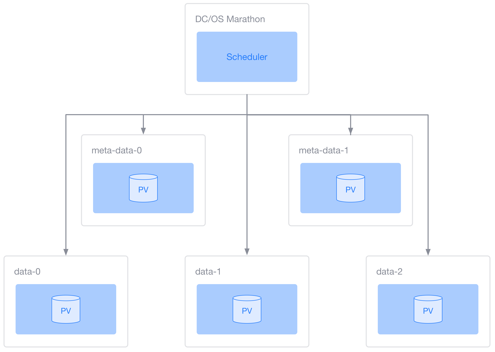

# Overview

Mesos is a powerful resource allocator, but writing a production
stateful service can be complex, tedious, and error-prone.  The DC/OS
Stateful Service SDK provides a much higher level interface for
writing stateful services.  A stateful service complete with
persistent volumes, fault tolerance, and configuration management can
be written in about 100 lines of code.  This SDK is the product of
Mesosphere's experience writing production stateful services such as
DC/OS Apache Kafka, DC/OS Apache Cassandra, and DC/OS Apache HDFS.

To see a full description of the value provided by the SDK, please
read about the [features](#features).

# Introduction

In this tutorial, we'll build a fictional but illustrative example
service named `data-store`.  It is composed of `meta-data` nodes and
`data` nodes.  This is meant to model a service with a small number of
coordinating masters, and a large number of dependent workers.  Each
task will run a dummy command that writes some data to a file, then
sleeps.

The goal state for this fictional `data-store` is to keep two
`meta-data` and N `data` nodes running, where initially N = 3.
`meta-data` nodes must come up before `data` nodes.  The service will
scale by starting more `data` nodes.

We'll include code snippets inline in this tutorial, and the final
source code is available at
http://github.com/mesosphere/sdk-reference-framework.

## Architecture



A DC/OS Sercive is composed of **schedulers** and **executors**.  The
scheduler is run by Marathon, which supervises the scheduler,
restarting it upon failure.  The executors are started and supervised
by the scheduler.  If specified in the `ServiceSpecification`, the
executors will contain a **persistent volume**, which is a folder or
mount point on the agent that persists even after a task fails.

In this tutorial, `data-store` is the scheduler, and `meta-data-{0,1}`
and `data-{0-1}` are the executors.

## Requirements
- JDK 8
- Gradle 3.1 (recommended)
- AWS account with S3 upload permissions
- [`aws` CLI](https://aws.amazon.com/cli/)

# Create a Project

The Java library for The DC/OS Stateful Services SDK is
`dcos-commons`.  Java projects using `dcos-commons` can use any Java
build system, but for this tutorial, we'll assume you're using Gradle.

First, we create our `build.gradle` file:

```
group 'com.mesosphere.sdk'
version '1.0-SNAPSHOT'

apply plugin: 'java'
apply plugin: 'application'

repositories {
    mavenLocal()
    mavenCentral()
    maven {
        url "http://downloads.mesosphere.com/maven/"
    }
}

dependencies {
    compile "mesosphere:dcos-commons:0.7.10-SNAPSHOT"
    compile "org.slf4j:slf4j-simple:1.7.21"
}

task wrapper(type: Wrapper) {
    gradleVersion = '3.1'
}

mainClassName = 'com.mesosphere.sdk.reference.scheduler.Main'
```

# Define a Service

The first step to running a service is to create a
`ServiceSpecification`.  This defines the behavior of our service.

A `ServiceSpecification` is mostly a list of `TaskSet`s.
The tasks defined in this list are launched in order.  We can use this
ordering to define tiers of services.  In this example, we want all
`meta-data` nodes to come up before any `data` node:

```java
private static final String TASK_METADATA_NAME = "meta-data";
private static final int TASK_METADATA_COUNT = Integer.valueOf(System.getenv("METADATA_COUNT"));
private static final double TASK_METADATA_CPU = Double.valueOf(System.getenv("METADATA_CPU"));
private static final double TASK_METADATA_MEM_MB = Double.valueOf(System.getenv("METADATA_MEM"));
private static final double TASK_METADATA_DISK_MB = Double.valueOf(System.getenv("METADATA_DISK"));
private static final String TASK_METADATA_URI = System.getenv("METADATA_URI");
private static final String TASK_METADATA_CMD = "bash meta-data";

private static final String TASK_DATA_NAME = "data";
private static final int TASK_DATA_COUNT = Integer.valueOf(System.getenv("DATA_COUNT"));
private static final double TASK_DATA_CPU = Double.valueOf(System.getenv("DATA_CPU"));
private static final double TASK_DATA_MEM_MB = Double.valueOf(System.getenv("DATA_MEM"));
private static final double TASK_DATA_DISK_MB = Double.valueOf(System.getenv("DATA_DISK"));
private static final String TASK_DATA_URI = System.getenv("DATA_URI");
private static final String TASK_DATA_CMD = "bash data";

private static ServiceSpecification getServiceSpecification() {
    return new ServiceSpecification() {
        @Override
        public String getName() {
            return SERVICE_NAME;
        }

        @Override
        public List<TaskSet> getTaskSets() {
            return Arrays.asList(
                    DefaultTaskSet.create(
                            TASK_METADATA_COUNT,
                            TASK_METADATA_NAME,
                            getCommand(TASK_METADATA_CMD, TASK_METADATA_URI),
                            getResources(TASK_METADATA_CPU, TASK_METADATA_MEM_MB),
                            getVolumes(TASK_METADATA_DISK_MB, TASK_METADATA_NAME),
                            Optional.empty()),
                    DefaultTaskSet.create(
                            TASK_DATA_COUNT,
                            TASK_DATA_NAME,
                            getCommand(TASK_DATA_CMD, TASK_DATA_URI),
                            getResources(TASK_DATA_CPU, TASK_DATA_MEM_MB),
                            getVolumes(TASK_DATA_DISK_MB, TASK_DATA_NAME),
                            Optional.empty()));
        }
    };
}
```

A `TaskSet` contains the bulk of the definition.  It
contains the command to run, the resources to run with, and the number
of tasks.  As you can see, it is common for DC/OS services to read
their config from environment variables.

At a minimum, the command must contain a `value`, which is the shell
command to invoke.  It will likely also contain one or more `URIs`
pointing to resources to download before execution.  In this example,
we're downloading the `metadata` and `data` binaries from an HTTP
server:

```java
private static Protos.CommandInfo getCommand(String cmd, String uri) {
    return Protos.CommandInfo.newBuilder()
              .addUris(Protos.CommandInfo.URI.newBuilder().setValue(uri))
              .setValue(cmd)
              .build();
}
```

Resurces are specified via `ResourceSpecification`s.  Tasks must run
with at least `cpus` and `mem` resources, though we may specify any
Mesos resource, including `ports`:

```java
private static Collection<ResourceSpecification> getResources(double cpu, double memMb) {
    return Arrays.asList(
            new DefaultResourceSpecification(
                    "cpus",
                    ValueUtils.getValue(ResourceUtils.getUnreservedScalar("cpus", cpu)),
                    ROLE,
                    PRINCIPAL),
            new DefaultResourceSpecification(
                    "mem",
                    ValueUtils.getValue(ResourceUtils.getUnreservedScalar("mem", memMb)),
                    ROLE,
                    PRINCIPAL));
}
```

In Mesos, `disk` is just another resource like `cpus` and `mem`.
However, stateful services must manage `disk` differently.  Rather
than simply accepting the resource like `cpus` or `mem`, the scheduler
must first create a
[volume](http://mesos.apache.org/documentation/latest/persistent-volume/)
from the disk resources so that it persists beyond the lifetime of the
task.  The `VolumeSpecification` is a high-level interface that
handles this for us:

```java
private static Collection<VolumeSpecification> getVolumes(double diskMb, String taskName) {
    VolumeSpecification volumeSpecification = new DefaultVolumeSpecification(
            diskMb,
            VolumeSpecification.Type.ROOT,
            taskName + CONTAINER_PATH_SUFFIX,
            ROLE,
            PRINCIPAL);

    return Arrays.asList(volumeSpecification);
}
```

Now that we have a `ServiceSpecification`, we must define an
application that runs it.  We do so by creating a `Service` object,
and registering the `ServiceSpecification`:

```java
public class Main {
    private static final int API_PORT = Integer.valueOf(System.getenv("PORT0"));
    public static void main(String[] args) throws Exception {
        new DefaultService(API_PORT).register(getServiceSpecification());
    }
}
```

`DefaultService` takes a single parameter, `apiPort`, defining which
port its HTTP server will bind to.  Upon registering the
`ServiceSpecification`, our service will start its HTTP server,
register as a Mesos framework, and start launching tasks.

# Deployment

Now that we've defined our service, let's build and install it.  The
first thing we'll need is a DC/OS cluster.

## Start cluster

Please visit https://dcos.io/install/ to learn several options for
installing a DC/OS cluster.

## Install the DC/OS CLI

The instructions you followed above for installing a DC/OS cluster
should have had you also install the DC/OS CLI.  If not, please do so
now by following [these instructions](https://dcos.io/install/).

## Install

Now that we have our cluster and CLI, we can install our service.
DC/OS services are deployed to users via DC/OS packages.  The first
step is to define our package.  A DC/OS package is a set of four
files.  You can learn more about the package format
[here](http://github.com/mesosphere/universe), but in summary, it
looks like this:

- **package.json**: Package metadata
- **marathon.json.mustache**: Marathon app definition.  The template is rendered with the values in config.json, resource.json,
and user provided config.
- **config.json**: JSON Schema defining the configuration for the app.
- **resource.json**: External resources.

The majority of the package definition resides in
**marathon.json.mustache**.  See the
[reference framework](https://github.com/mesosphere/sdk-reference-framework/tree/master/universe)
for an example.

Let's place these files in a directory in our project called
`universe/`.

Now we build our project:

```bash
$ ./gradlew distZip
```

Then we must build our DC/OS package.  DC/OS packages are stored in
*repos*.  The most common repo is the
[*Mesosphere Universe*](https://github.com/mesosphere/universe), which
is public, and is where we would publish our package once we wish to
share it with the world.  But for now, we just want to create a simple
repo containing our single package.

**NOTE:** The current workflow of creating a package *and* a repo is
  cumbersome.  We're sorry about this.  DC/OS 1.10, which is slated to
  be released in December 2016, will introduce the ability to install
  a package directly, rather than forcing you to wrap it in a repo.

```
~ $ cd /path/to/dcos-commons
dcos-commons $ ./tools/ci_upload.py \
      data-store \
      universe/ \
      reference-scheduler/build/distributions/scheduler.zip
```

`./ci_upload.py` uploads the artifact to S3, rewrites the package to
include links to the artifact, creates a repo containing that package,
and uploads that repo to S3.  The end result is a URL for a DC/OS
repo.

We now add this repo to our cluster:

```bash
$ dcos package repo add --index=0 dev-repo <repo_url>
```

Then install our package:

```bash
$ dcos package install data-store
```

If we visit "Services | data-store" in the DC/OS UI, we can
observe `data-store` deploying.

To verify that `data-store` has completed deploying, make the
following request.  To learn how to make requests to the HTTP API,
please read the [HTTP API](#http-api) section:

```
GET /v1/plan/status
```

If the deployment is complete, `plan.status` in the returned JSON
should equal "COMPLETE".  If it is, we should see two `meta-data`
tasks and three `data` tasks running in the DC/OS Services UI.

## Uninstall

To do a complete uninstall, we first uninstall our service using the
`dcos` cli.  This stops and tears down the framework.

```bash
$ dcos package uninstall data-store
```

However, there is still some persistent state lying around that we
need to git rid of, including Zookeeper state and persistent volumes.
Mesosphere has provided a docker image that will do this for us:

```bash
local $ AUTH_TOKEN=$(dcos config show core.dcos_acs_token)
local $ dcos node ssh --master-proxy --leader
cluster $ docker run mesosphere/janitor /janitor.py \
    -r data-store-role
    -p data-store-principal \
    -z dcos-service-data-store \
    --auth_token=$AUTH_TOKEN
```

For more information on the janitor image, see https://github.com/mesosphere/framework-cleaner.


# Update configuration

We saw in the Service Specification section that the service's
configuration is read in through environment variables.  You're free
to use any source of configuration, but DC/OS Services are typically
configured through environment variables.  To make a configuration
change, the user must modify the corresponding environment variable,
then restart the scheduler.  When the scheduler comes back up, it will
read its new configuration, and perform the necessary operations to
transition to the new state.

For example, say that we're happy with out `data-store` service, and
we'd like to grow the cluster to accept more traffic by increasing the
number of `data` nodes from 3 to 5.  This number is determined by the
`DATA_COUNT` environment variable exposed by the `data-store`
scheduler.  To modify it:

1) Go the the "Services | data-store" page on the DC/OS UI

2) Select "Edit"

3) Select the "Environment Variables" tab

4) Change the value of `DATA_COUNT` from 3 to 5

5) Click "Deploy Changes"

This will restart the scheduler with the updated environment.  When
the scheduler starts up, it detects that it is already running 3
`data` tasks, and starts 2 more in order to reach the goal state of 5.
We should observe two more tasks starting, `data-3` and `data-4`.

## Task Configuration management

While the above describes configuration of the scheduler itself via
environment variables, there's also a need for configuration of the
underlying service tasks themselves in a flexible way.

(Note: As of this writing, the following is still a work in progress,
but should be available in the next week or two.)

To simplify the common task of getting user-facing configuration to
service tasks, the developer may follow the following convention in
naming the environment variables for these configuration options:
`TASKCFG_<TASK_TYPE>_<NAME>`

For example, an option for tasks of type `index-mgr` could be named
`TASKCFG_INDEX_MGR_FOO`, while an option for tasks of type `data`
could be named `TASKCFG_DATA_FOO`. These configuration options will
automatically be forwarded to the environments of the matching tasks
as environment variables, with the `TASKCFG_<TASK_TYPE>_` prefixes
removed. A special prefix of `TASKCFG_ALL_<NAME>` may be used for
any options that should be passed to *every* task type.

A common need for service developers is an easy way to write
configuration files before launching tasks. To fulfill this need,
the developer may provide configuration file template(s) in their
TaskSet(s). These templates follow the [mustache](https://mustache.github.io/)
templating format, similar to what's used in DC/OS packaging. The
templates will be automatically rendered against the task's
environment (which is customized as described above), and then
each written to relative file paths specified by the developer.

# Restart tasks

When a task fails, the scheduler will attempt to restart the on the
same node, using the same persistent volume as the previous task.

However, we may need to manually restart tasks in two scenarios:

1) If an agent permanently fails, the scheduler will never receive an
offer containing the expected persistent volume, and will thus never
automatically restart the task.  We must restart it manually on a
different node.  This is called *replacing* the task.

2) If a task is stuck or performing poorly, or we just want to restart
it for debugging, we may need to restart the task manually on the same
node.

Both actions are performed using the same endpoint:

```
POST /v1/tasks/restart/<task-name>?replace={true|false}
```

If `replace=true`, this action will replace the task on a separate
node.  If `replace=false`, it will restart the task on the same node.

# Placement

The `DefaultScheduler` makes no intelligent placement decisions.  It
will run a task on first offer it gets which satisfies the resource
constraints for that task.

This behavior may be customized using *Placement Constraints*, which
are rules on how tasks should be placed in the cluster. These rules
are enforced by filtering the resource Offers returned by Mesos,
removing resources from the list when they don't pass the rules.

In practice, the developer can define placement constraints on a
per-task basis by customizing the return value of
`TaskSpecification.getPlacement()`:

```
public Optional<PlacementRuleGenerator> getPlacement() {
    // avoid systems which are running an "index" task:
    return Optional.of(TaskTypeGenerator.createAvoid("index"));
}
```

The developer can either use some of the common `PlacementRule`s
and/or `PlacementRuleGenerator`s implementations provided in the
[offer.constrain](https://github.com/mesosphere/dcos-commons/tree/master/src/main/java/org/apache/mesos/offer/constrain)
package, or implement their own to provide custom constraints
which can take advantage of anything present in the Mesos `Offers`
or in the other running `TaskInfo`s.

# Logs

The `stdout` and `stderr` streams for all tasks running in Mesos,
including the scheduler and executors, are captured and written to
files in that task's sandbox.  You can learn how to view these files
[here](https://docs.mesosphere.com/1.8/administration/logging/service-logs/)

All code in `dcos-commons`, including the `DefaultScheduler`, uses
`slf4j` to write logs to `stderr`.  To write our own logging code,
first create a `LOGGER`:

```java
private static final Logger LOGGER = LoggerFactory.getLogger(Main.class);
```

Then write to it:

```java
LOGGER.info("Starting reference scheduler with args: " + Arrays.asList(args));
```

The contents of `stdout` and `stderr` for the executors is entirely
dependent on the command specified in our `ServiceSpecification`.

# Tests

## Unit Tests

This is completely up to you.  `dcos-commons` itself contains unit
tests written with `junit` and `mockito`.

## Integration Tests

The [shakedown](http://github.com/shakedown) library is a tool for
writing integration tests for DC/OS services.  For an example, check
out the tests for DC/OS Kafka
[here](https://github.com/mesosphere/dcos-kafka-service/tree/master/integration/tests)

# Metrics

As of DC/OS 1.8, this section is only relevant to DC/OS Enterprise
Edition, but support has recently been [open-sourced](http://github.com/dcos/dcos-metrics)
and should soon be available in Open DC/OS. For more information,
see the [dcos-metrics](http://github.com/dcos/dcos-metrics) repository,
and stop by the #day2ops channel on [DC/OS Slack](https://chat.dcos.io).

DC/OS Metrics automatically provides all Mesos containers with a unique
UDP endpoint for outputting `statsd`-formatted metrics. The endpoint
is advertised via two container environment variables: `STATSD_UDP_HOST`
and `STATSD_UDP_PORT`. Any metrics sent to this advertised endpoint
will automatically be tagged with the originating container and
forwarded upstream to the cluster's metrics infrastructure. A
developer may take advantage of this endpoint both for their service
Scheduler as well as for the underlying service tasks themselves, i.e.
configuring them to emit to the locally-advertised endpoint as they are
launched. Keep in mind that the environment-advertised endpoint is
unique to each container and cannot be reused across containers.

The data sent to this endpoint should follow the standard `statsd`
text format, optionally with multiple newline-separated values
per UDP packet. [http://docs.datadoghq.com/guides/dogstatsd/#datagram-format](Datadog-extension)
tags are also supported, so the application may also include its own
custom tags:

```
memory.usage_mb:5|g
frontend.query.latency_ms:46|g|#shard_id:6,section:frontpage
```

See also:
- [dcos-metrics repo](https://github.com/dcos/dcos-metrics)
- [Sample StatsD emitter process](https://github.com/dcos/dcos-metrics/tree/master/examples/statsd-emitter)
- [Metrics configuration for Kafka](https://github.com/mesosphere/dcos-kafka-service/blob/30acc60676ba9362ddb9b74f208b36d257a78f93/kafka-config-overrider/src/main/java/com/mesosphere/dcos/kafka/config/Overrider.java#L163)
- [Metrics configuration for Cassandra](https://github.com/mesosphere/dcos-cassandra-service/blob/38360f9f78d7063824ad77f9871108fe5609e54d/cassandra-executor/src/main/java/com/mesosphere/dcos/cassandra/executor/metrics/MetricsConfig.java#L68)

# Service Discovery

We will likely need to advertise the network address of our service to
clients.  Mesos-DNS assigns every Mesos task a DNS address of the form
`<task-name>.<framework-name>.mesos`.  In our example (running 3 data
nodes), Mesos-DNS creates the following addresses:

```
meta-data-0.data-store.mesos
meta-data-1.data-store.mesos
meta-data-2.data-store.mesos
data-0.data-store.mesos
data-1.data-store.mesos
```

It also creates a DNS entry for the scheduler:

```
data-store.marathon.mesos
```

If the tasks listened on reserved port(s), clients would also need
these port(s) in order to establish a connection.  We can fetch these
port(s) along with the DNS entry for a task via the following
endpoint:

```bash
GET /v1/tasks/connection/{task-name}
```

```json
{
  "dns": "data-0.data-store.mesos",
  "ports": "4388"
}
```

If the task has multiple ports reserved, they will be displayed as a
comma-delimited sequence of ranges. e.g. `"8080,2000-3000"`.

# Secrets Management

This section is only relevant to DC/OS Enterprise Edition.

In a DC/OS Enterprise Edition cluster running in strict security mode,
all schedulers must authenticate with the Mesos master using DC/OS
service accounts.  For instructions on creating a service account,
read
[this][https://docs.mesosphere.com/1.8/administration/id-and-access-mgt/service-auth/]

Mesos schedulers authenticate to the master by providing a `principal`
and `secret`.  In DC/OS, the `principal` must be the DC/OS Service
Account ID, and the `secret` must be the private key.  To start the
scheduler with access to the private key, we must integrate with
Marathon's DC/OS secret support:

```javascript
{
  "env": {
    "DCOS_SERVICE_ACCOUNT_CREDENTIAL": {"secret": "serviceCredential"}
  },
  "secrets": {
    "serviceCredential": {
      "source": <secret_name>
    }
  }
}
```

This results in marathon launching the task with the
`DCOS_SERVICE_ACCOUNT_CREDENTIAL` environment variable set to the
contents of the service account's private key.  The Mesos agent looks
for this environment variable, and will inject it as the `secret` in
the scheduler's registration request.

# HTTP API

Services expose an HTTP API to support common operations.  There are
two ways to access this API.

The first is from clients running outside of DC/OS, such as from your
local machine.  These clients must authenticate.  For example:

```bash
curl -H "Authorization: token=$(dcos config show core.dcos_acs_token)" \
    "$(dcos config show core.dcos_url)service/data-store/v1/plan/status"
```

To learn more about DC/OS Authentication, please read the
[Managine Authentication](https://dcos.io/docs/1.8/administration/id-and-access-mgt/managing-authentication/)
section of the DC/OS documentation.

The second way to access the HTTP is from clients running inside the
DC/OS cluster.  These clients may bypass DC/OS authentication, and
access the scheduler directly:

```bash
curl "data-store.marathon.mesos:<port>/v1/plan/status"
```

Where <port> is the port you gave to the `DefaultService` constructor
in the [Define a Service](#define-a-service) section.

Several API endpoints are listed in this tutorial, and a full API is
forthcoming.

# Features

## Simple service definitions
Mesos offers resources to scheduler for launching tasks.  By being offered
resources rather than launching tasks against a fixed API, schedulers are
able to apply arbitrary logic to determine the set of resources
they consume.  Resource offers can be much more powerful and flexible
than a declarative task launching API.

However, the majority of schedulers, especially schedulers for
stateful services, only need a basic API, and for these cases, declarative
APIs are much simpler.  A simple scheduler needs to run N containers with
M memory and C cpu, along with some set of persistent volumes, ports, etc.

The DC/OS Stateful Services SDK provides such a simple, declarative
API built on top of Mesos resource offers.  You define your service
declaratively, and the SDK manages installing and supervising the
service using resource offers from Mesos.  You can think of this as
doing for stateful services what Marathon does for stateless services,
but as a library rather than an API, it still provides the
power to drop down to lower layers when needed.

## Multi-tier service support
Many stateful services are heterogeneous.  They have multiple tiers,
each running different processes.  For example, Apache HDFS is composed of
NameNodes, JournalNodes, and DataNodes.  These tiers are
interdependent.  JournalNodes start before NameNodes which start
before DataNodes.  To support a one-click install for users, as well
as safe recovery from failures, the scheduler must be aware of these
dependencies.

## Deployment strategies
Many stateful services have strict deployment requirements.  Some,
including for instance Apache Cassandra, require nodes to be added to
the cluster one at at time.  Others may permit parallel deployment.
The DC/OS Stateful Services SDK includes deployment strategies supporting
these different requirements.

## Configuration management
For any framework, at least two components must be configured: the
scheduler and the service.  Scheduler configuration includes things
like node count, deployment strategies, and security parameters.
Service configuration includes resource settings such memory, cpu,
ports, etc., as well as any configuration passed on to the underlying
service.

The DC/OS Stateful Services SDK includes logic for reading
configuration from an external source (default: environment
variables), detecting changes to the configuration, and redeploying
any affected tasks.  It also supports marking certain configuration
parameters as "unmodifiable", so that the user can't change them after
install time.  For example, the disk size of permanent volumes cannot
be modified because volume size is static.

## Upgrade support
From time to time, services must be upgraded from version N to version N+1.
Tasks must often be updated one at a time, and often depend on certain
administrative tasks like backup/restore.  An administrator may wish to pause,
continue, or abort an upgrade interactively.

## Fault tolerance
There are two component failures that any scheduler must defend
against: the scheduler and the service.

The scheduler and the Mesos master each store their own state for the
schedulers' tasks.  Assuming no failure, these states eventually
become consistent.  However, if the scheduler fails, it must perform
task reconciliation to reconcile its own state with that of master.
Further, it must maintain a WAL of task states to a highly available
durable store.

If the service fails, the scheduler must detect this and restart the task on
the same node so that it can use the existing persistent
volume.  If the node fails to come up for a certain amount of time,
the scheduler may need to restart the task on a different node.

## Administrative tasks
Services can require any number of administrative tasks.  A common
task is backup/restore.  The service must allocate resources on the
executor to perform this task, restart it upon failure, and coordinate
it across all executors.

## Persistent volumes
If there's one thing that stateful services have in common, it's that
they store state!  Schedulers must create persistent volumes that will
live beyond the life a single task to tolerate failure, and they must
reserve these volumes to prevent other frameworks from taking them.
