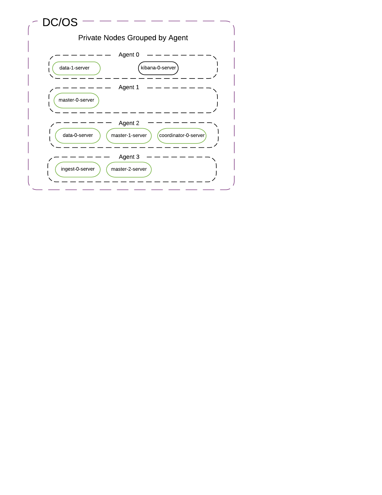
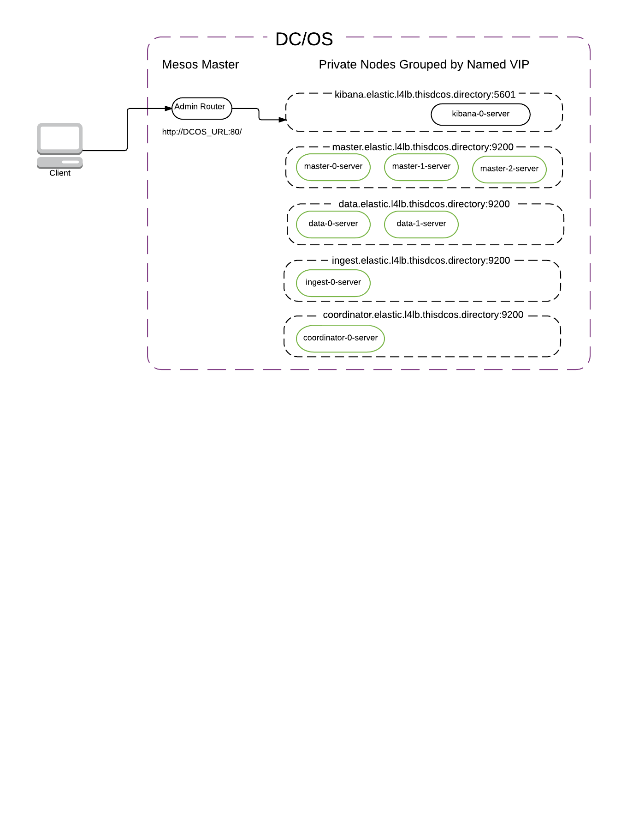

# Changing Configuration at Runtime

You can customize your cluster in-place when it is up and running. These are the general steps to follow:

1.  View your DC/OS dashboard at `http://$DCOS_URI/#/services/overview`
1.  In the list of `Applications`, click the name of the Elastic service to be updated.
1.  Within the Elastic instance details view, click the `Configuration` tab, then click `Edit`.
1.  In the dialog that appears, expand the `Environment Variables` section and update any field(s) to their desired value(s). For example, to increase the number of data nodes, edit the value for `DATA_NODE_COUNT`. Do not edit the value for `FRAMEWORK_NAME`, `MASTER_NODE_TRANSPORT_PORT`, or any of the disk type/size fields.
1.  Click `Change and deploy configuration` to apply any changes and cleanly reload the Elastic service scheduler. The Elastic cluster itself will persist across the change.

# Configuration guidelines

- Service name: This needs to be unique for each instance of the framework that is running. It is also used as your cluster name.
- Service user. This must be a non-root user that already exists on each agent. The default user for CoreOS-based clusters is core.
- Plugins: X-Pack will already be installed for you, but you can specify other plugins via a comma-separated list of plugin names (e.g., “analysis-icu”) or plugin URIs.
- CPU/RAM/Disk/Heap: These will be specific to your DC/OS cluster and your Elasticsearch use cases. Please refer to Elastic’s guidelines for configuration.
- Node counts: At least 1 data node is required for the cluster to operate at all. You do not need to use a coordinator node unless you are using Kibana. There is no maximum for node counts.
- If you are running Kibana, make sure you have exactly 1 proxylite task running. Pick an available port for it to listen on. If you are not running Kibana, do not run a proxylite task.
- Master transport port: You can pick whichever port works for your DC/OS cluster. The default is 9300. If you want multiple master nodes from different clusters on the same host, specify different master HTTP and transport ports for each cluster. If you want to ensure a particular distribution of nodes of one task type (e.g., master nodes spread across 3 racks, data nodes on one class of machines), specify this via the Marathon placement constraint.
- Serial vs Parallel deployment. By default, the Elastic framework tells Mesos to install and update everything in parallel. You can change this to serial in order to have each node installed one at a time.

It can be confusing to understand which parts of the Elastic cluster can be modified through the Mesosphere DC/OS framework at runtime, what gets specified initially and is immutable, and what gets modified directly through the Elasticsearch cluster update settings API. The most important settings are the immutable ones, so let’s start with those.

## Immutable settings (at cluster creation time via Elastic package UI or JSON options file via CLI)

- Service name (aka cluster name). Can be hyphenated, but not underscored.
- Master transport port.
- Disk sizes/types.

## Modifiable settings (at runtime via Marathon env vars):

- Plugins
- CPU
- RAM
- JVM Heap (do not exceed ½ available node RAM)
- Node counts (up, not down)
- Deployment/Upgrade strategy (serial/parallel). Note that serial deployment does not yet wait for the cluster to reach green before proceeding to the next node. This is a known limitation.

Any other modifiable settings are covered by the various Elasticsearch APIs (cluster settings, index settings, templates, aliases, scripts). It’s possible that some of the more common cluster settings will get exposed in future versions of the Elastic DC/OS framework.

# Viewing Plans via the CLI

You can view the deploy plan for the Elastic framework via the service URL: `http://$DCOS_URL/service/dcos-{{cluster-name}}/v1/plans`

# Topology

Each task in the cluster performs one and only one of the following roles: master, data, ingest, coordinator, kibana.

The default placement strategy distributes all instances of the same node task type to different agents. So no two master nodes would run on the same agent, but a data node might get placed onto an agent that is also running a master node.




No matter how big or small the cluster is, there will always be exactly 3 master-only nodes with `minimum_master_nodes = 2`.

## Default Topology (with minimum resources to run on 3 agents)

- 3 master-only nodes
- 2 data-only nodes
- 1 ingest-only node
- 1 Kibana node with X-Pack installed
- 1 coordinator node

The master/data/ingest/coordinator nodes are set up to only perform their one role. That is, master nodes do not store data, and ingest nodes do not store cluster state. This is how Elastic (the company) wants the clusters to look in order to support them commercially. It may seem like over-specialization for small clusters. But for medium and large clusters, it is a safer strategy. The predominant theme for this topology is “safety”. Down the road, we intend to offer a "staging" topology with a theme of “economy,” so you could install a simple 1, 2, or 3 node cluster with each node performing all roles.

## Minimal Topology

You can set up a minimal development/staging cluster without ingest nodes, coordinator nodes, or Kibana. You’ll still get 3 master nodes placed on 3 separate hosts. If you don’t care about replication, you can even use just 1 data node. By default, Elasticsearch creates indices with a replication factor of 1 (i.e., 1 primary shard + 1 replica), so with 1 data node, your cluster will be stuck in a ‘yellow’ state unless you change the replication factor.

Note that with X-Pack installed, the default monitoring behavior is to try to write to an ingest node every few seconds. Without an ingest node, you will see frequent warnings in your master node error logs. While they can be ignored, you can turn them off by disabling X-Pack monitoring in your cluster, like this:

```bash
curl -XPUT -u elastic:changeme master.elastic.l4lb.thisdcos.directory:9200/_cluster/settings -d '{
    "persistent" : {
        "xpack.monitoring.collection.interval" : -1
    }
}'
```
