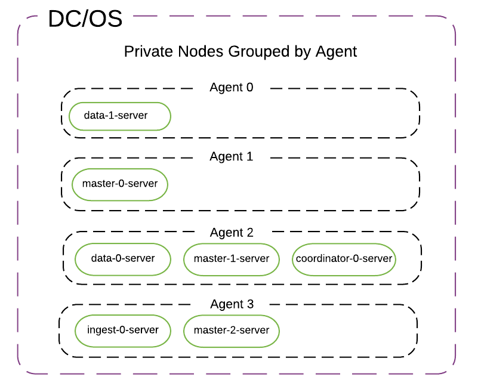
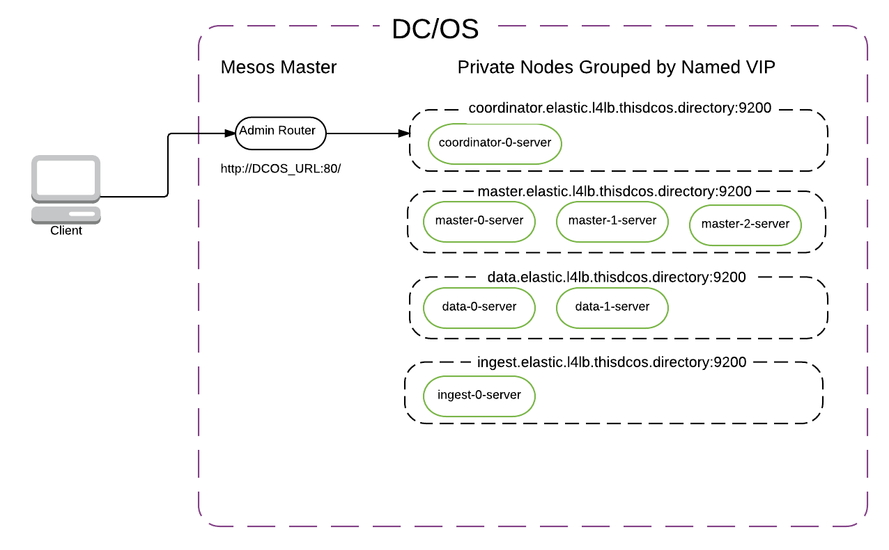

# Changing Configuration at Runtime

<!-- THIS CONTENT DUPLICATES THE DC/OS OPERATION GUIDE -->

The instructions below describe how to update the configuration for a running DC/OS service.

## Enterprise DC/OS 1.10

Enterprise DC/OS 1.10 introduces a convenient command line option that allows for easier updates to a service's configuration, as well as allowing users to inspect the status of an update, to pause and resume updates, and to restart or complete steps if necessary.

### Prerequisites

+ Enterprise DC/OS 1.10 or newer.
+ Service with a version greater than 2.0.0-x.
+ [The DC/OS CLI](https://docs.mesosphere.com/latest/cli/install/) installed and available.
+ The service's subcommand available and installed on your local machine.
  + You can install just the subcommand CLI by running `dcos package install --cli beta-elastic`.
  + If you are running an older version of the subcommand CLI that doesn't have the `update` command, uninstall and reinstall your CLI.
    ```bash
    dcos package uninstall --cli beta-elastic
    dcos package install --cli beta-elastic
    ```

### Preparing configuration

If you installed this service with Enterprise DC/OS 1.10, you can fetch the full configuration of a service (including any default values that were applied during installation). For example:

```bash
$ dcos beta-elastic describe > options.json
```

Make any configuration changes to this `options.json` file.

If you installed this service with a prior version of DC/OS, this configuration will not have been persisted by the the DC/OS package manager. You can instead use the `options.json` file that was used when [installing the service](#initial-service-configuration).

**Note:** You must specify all configuration values in the `options.json` file when performing a configuration update. Any unspecified values will be reverted to the default values specified by the DC/OS service. See the "Recreating `options.json`" section below for information on recovering these values.

#### Recreating `options.json` (optional)

If the `options.json` from when the service was last installed or updated is not available, you will need to manually recreate it using the following steps.

First, we'll fetch the default application's environment, current application's environment, and the actual template that maps config values to the environment:

1. Ensure you have [jq](https://stedolan.github.io/jq/) installed.
1. Set the service name that you're using, for example:
```bash
$ SERVICE_NAME=beta-elastic
```
1. Get the version of the package that is currently installed:
```bash
$ PACKAGE_VERSION=$(dcos package list | grep $SERVICE_NAME | awk '{print $2}')
```
1. Then fetch and save the environment variables that have been set for the service:
```bash
$ dcos marathon app show $SERVICE_NAME | jq .env > current_env.json
```
1. To identify those values that are custom, we'll get the default environment variables for this version of the service:
```bash
$ dcos package describe --package-version=$PACKAGE_VERSION --render --app $SERVICE_NAME | jq .env > default_env.json
```
1. We'll also get the entire application template:
```bash
$ dcos package describe $SERVICE_NAME --app > marathon.json.mustache
```

Now that you have these files, we'll attempt to recreate the `options.json`.

1. Use JQ and `diff` to compare the two:
```bash
$ diff <(jq -S . default_env.json) <(jq -S . current_env.json)
```
1. Now compare these values to the values contained in the `env` section in application template:
```bash
$ less marathon.json.mustache
```
1. Use the variable names (e.g. `{{service.name}}`) to create a new `options.json` file as described in [Initial service configuration](#initial-service-configuration).

### Starting the update

Once you are ready to begin, initiate an update using the DC/OS CLI, passing in the updated `options.json` file:

```bash
$ dcos beta-elastic update start --options=options.json
```

You will receive an acknowledgement message and the DC/OS package manager will restart the Scheduler in Marathon.

See [Advanced update actions](#advanced-update-actions) for commands you can use to inspect and manipulate an update after it has started.

### Open Source DC/OS, Enterprise DC/OS 1.9 and earlier

If you do not have Enterprise DC/OS 1.10 or later, the CLI commands above are not available. For Open Source DC/OS of any version, or Enterprise DC/OS 1.9 and earlier, you can perform changes from the DC/OS GUI.

<!-- END DUPLICATE BLOCK -->

These are the general steps to follow:

1.  View your DC/OS dashboard at `http://$DCOS_URI/#/services/overview`
1.  In the list of `Applications`, click the name of the Elastic service to be updated.
1.  Within the Elastic instance details view, click the `Configuration` tab, then click `Edit`.
1.  In the dialog that appears, expand the `Environment Variables` section and update any field(s) to their desired value(s). For example, to increase the number of data nodes, edit the value for `DATA_NODE_COUNT`. Do not edit the value for `FRAMEWORK_NAME`, `MASTER_NODE_TRANSPORT_PORT`, or any of the disk type/size fields.
1.  Click `Change and deploy configuration` to apply any changes and cleanly reload the Elastic service scheduler. The Elastic cluster itself will persist across the change.

# Configuration Guidelines

- Service name: This needs to be unique for each instance of the service that is running. It is also used as your cluster name.
- Service user: This must be a non-root user that already exists on each agent. The default user is `nobody`.
- X-Pack is not installed by default, but you can enable it. X-Pack comes with a 30-day trial license.
- Health check credentials: If you have X-Pack enabled, the health check will use these credentials for authorization. We recommend you create a specific Elastic user/password for this with minimal capabilities rather than using the default superuser `elastic`.  
- Plugins: You can specify other plugins via a comma-separated list of plugin names (e.g., “analysis-icu”) or plugin URIs.
- CPU/RAM/Disk/Heap: These will be specific to your DC/OS cluster and your Elasticsearch use cases. Please refer to Elastic’s guidelines for configuration.
- Node counts: At least 1 data node is required for the cluster to operate at all. You do not need to use a coordinator node. Learn about Elasticsearch node types [here](https://www.elastic.co/guide/en/elasticsearch/reference/current/modules-node.html). There is no maximum for node counts.
- Master transport port: You can pick whichever port works for your DC/OS cluster. The default is 9300. If you want multiple master nodes from different clusters on the same host, specify different master HTTP and transport ports for each cluster. If you want to ensure a particular distribution of nodes of one task type (e.g., master nodes spread across 3 racks, data nodes on one class of machines), specify this via the Marathon placement constraint.
- Serial vs Parallel deployment. By default, the DC/OS Elastic Service tells DC/OS to install and update everything in parallel. You can change this to serial in order to have each node installed one at a time.


## Immutable settings (at cluster creation time via Elastic package UI or JSON options file via CLI)

These setting cannot be changed after installation.

- Service name (aka cluster name). Can be hyphenated, but not underscored.
- Master transport port.
- Disk sizes/types.

## Modifiable settings (at runtime via Marathon env vars):

- Plugins
- CPU
- Memory
- JVM Heap (do not exceed ½ available node RAM)
- Node count (up, not down)
- Health check credentials
- X-Pack enabled/disabled
- Deployment/Upgrade strategy (serial/parallel). Note that serial deployment does not yet wait for the cluster to reach green before proceeding to the next node. This is a known limitation.

Any other modifiable settings are covered by the various Elasticsearch APIs (cluster settings, index settings, templates, aliases, scripts). It’s possible that some of the more common cluster settings will get exposed in future versions of the Elastic DC/OS Service.

# Viewing Plans via the CLI

You can view the deploy plan for the DC/OS Elastic Service via the service URL: `http://$DCOS_URL/service/$SERVICE_NAME/v1/plans`

# Topology

Each task in the cluster performs one and only one of the following roles: master, data, ingest, coordinator.

The default placement strategy specifies no constraint except that all the master nodes are distributed to different agents. You can specify further [Marathon placement constraints](http://mesosphere.github.io/marathon/docs/constraints.html) for each node type. For example, you can specify that data nodes are never colocated, or that ingest nodes are deployed on a rack with high-CPU servers.




No matter how big or small the cluster is, there will always be exactly 3 master-only nodes with `minimum_master_nodes = 2`.

## Default Topology (with minimum resources to run on 3 agents)

- 3 master-only nodes
- 2 data-only nodes
- 1 coordinator-only node
- 0 ingest-only node

The master/data/ingest/coordinator nodes are set up to only perform their one role. That is, master nodes do not store data, and ingest nodes do not store cluster state.

## Minimal Topology

You can set up a minimal development/staging cluster without ingest nodes, or coordinator nodes. You’ll still get 3 master nodes placed on 3 separate hosts. If you don’t care about replication, you can even use just 1 data node. By default, Elasticsearch creates indices with a replication factor of 1 (i.e., 1 primary shard + 1 replica), so with 1 data node, your cluster will be stuck in a ‘yellow’ state unless you change the replication factor.

Note that with X-Pack installed, the default monitoring behavior is to try to write to an ingest node every few seconds. Without an ingest node, you will see frequent warnings in your master node error logs. While they can be ignored, you can turn them off by disabling X-Pack monitoring in your cluster, like this:

```bash
$ curl -XPUT -u elastic:changeme master.elastic.l4lb.thisdcos.directory:9200/_cluster/settings -d '{
    "persistent" : {
        "xpack.monitoring.collection.interval" : -1
    }
}'
```
