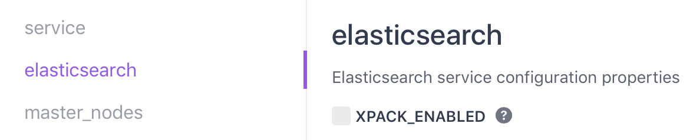

# Elastic X-Pack

[X-Pack](https://www.elastic.co/guide/en/x-pack/current/xpack-introduction.html) is an Elastic Stack extension that bundles security, alerting, monitoring, reporting, and graph capabilities into one easy-to-install package. X-Pack is a commercial product of Elastic that requires a license. By default, X-Pack is not installed as part of the DC/OS Elastic service. However, it's easy to enable X-Pack as part of the service configuration:

You must set the update strategy to `parallel` when you toggle X-Pack in order to force a full cluster restart.
Afterwards, you can set the update strategy back to `serial` for future updates.

You can toggle this setting at any time. This gives you the option of launching an Elastic cluster without X-Pack and then later enabling it. Or, you can run a cluster with X-Pack enabled to try out the commercial features and, if at the end of the 30-day trial period you don't wish to purchase a license, you can disable it without losing access to your data.

## License Expiration

If you uninstall the X-Pack plugin via the service configuration or you let your license expire, remember these two important points:

1. Your data is still there.
1. All data operations (read and write) continue to work.

[Graph](https://www.elastic.co/guide/en/x-pack/current/graph-getting-started.html), [Machine Learning](https://www.elastic.co/guide/en/x-pack/current/ml-getting-started.html), [Alerting and Notification](https://www.elastic.co/guide/en/x-pack/current/watcher-getting-started.html), [Monitoring](https://www.elastic.co/guide/en/x-pack/current/monitoring-getting-started.html), and [Security](https://www.elastic.co/guide/en/x-pack/current/security-getting-started.html) all operate with reduced functionality when X-Pack becomes unavailable.

Click [here](https://www.elastic.co/guide/en/x-pack/current/license-expiration.html) to learn more about how X-Pack license expiration is handled.
